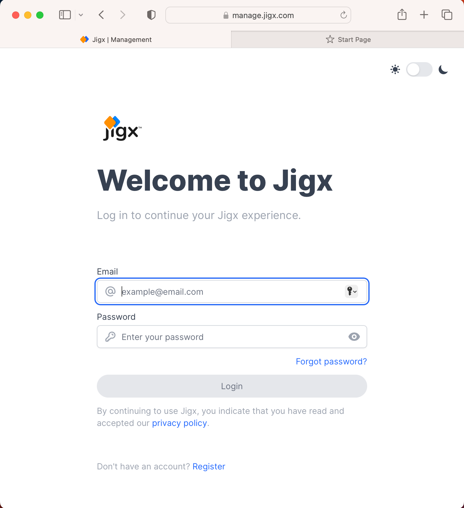
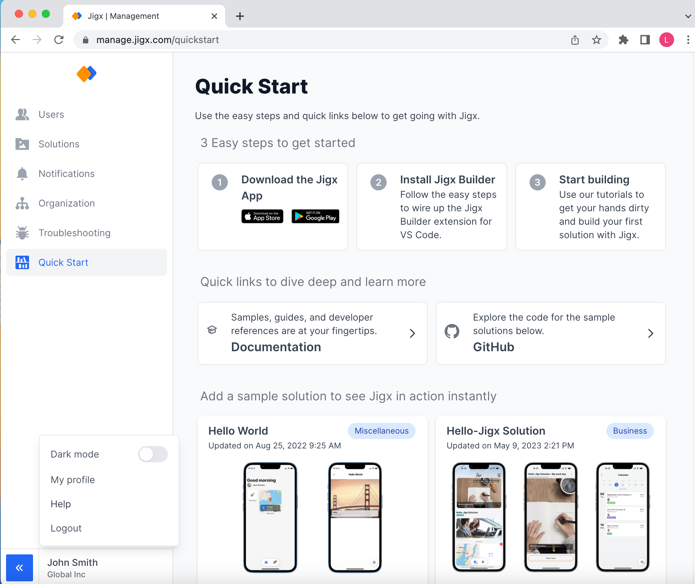

---
layout:
  width: wide
  title:
    visible: true
  description:
    visible: true
  tableOfContents:
    visible: true
  outline:
    visible: true
  pagination:
    visible: true
  metadata:
    visible: true
---

# Management Overview

Jigx Management can be found at [https://manage.jigx.com](https://manage.jigx.com) and is the central site for managing users, and solutions, sending push notifications, and viewing usage metrics of your organization.

## Log into Jigx Management

Your Jigx user account has to be in the ADMIN, OWNER, or CREATOR on a organization role level to be able to log into the Jigx Management. The user who signed up for Jigx is the initial OWNER of the organization and can manage user roles in the [Users](Users.md) section of the portal. You can assign roles to users in the [Users](Users.md) section of Jigx Management. See [Permissions - User Roles](<Permissions - User Roles.md>) to learn more about the different roles.

<figure><figcaption>
Login to management
</figcaption></figure>

## Log out of the Jigx Management

To logout of Jigx Management click on your name in the bottom left corner and select **Logout**.

## Switching between Light/Dark mode

To toggle between light and dark mode, click on your name in the bottom left corner and toggle the Dark mode switch on or off.

<figure><figcaption>
Light/Dark mode
</figcaption></figure>

## Your User Profile

Click on your name in the bottom left corner and select **My profile** to view and update your personal profile.

From your user profile you can access:

1. **User Solutions** - Displays Jigxsolutions that you are the owner or creator of. You can add or remove solutions to your profile.
2. **Troubleshooting** - Allows you to troubleshoot issues your solutions encounter in the last hour, day, week or month. Identify the solution using its correlation ID.
3. **Personal Access Token** - Create your personal access token.
