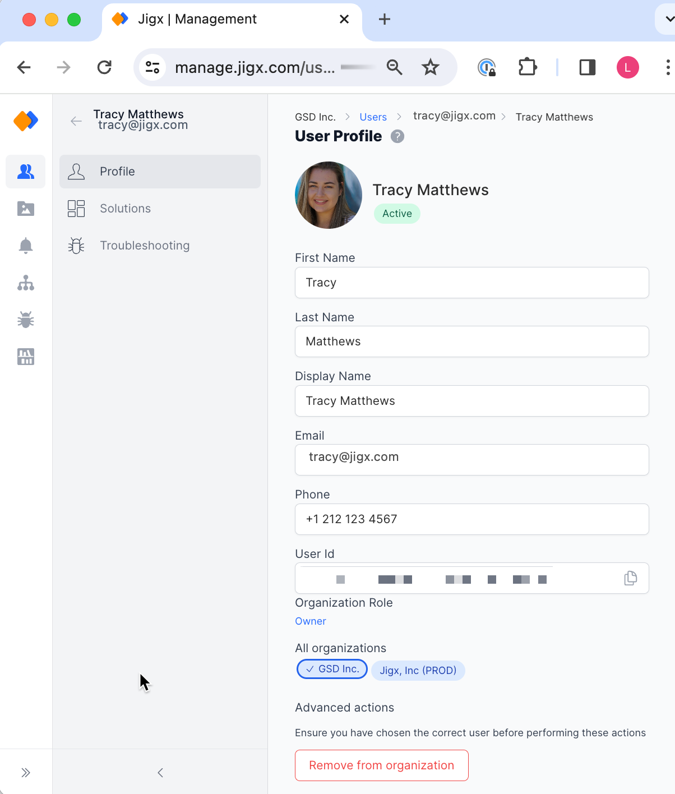
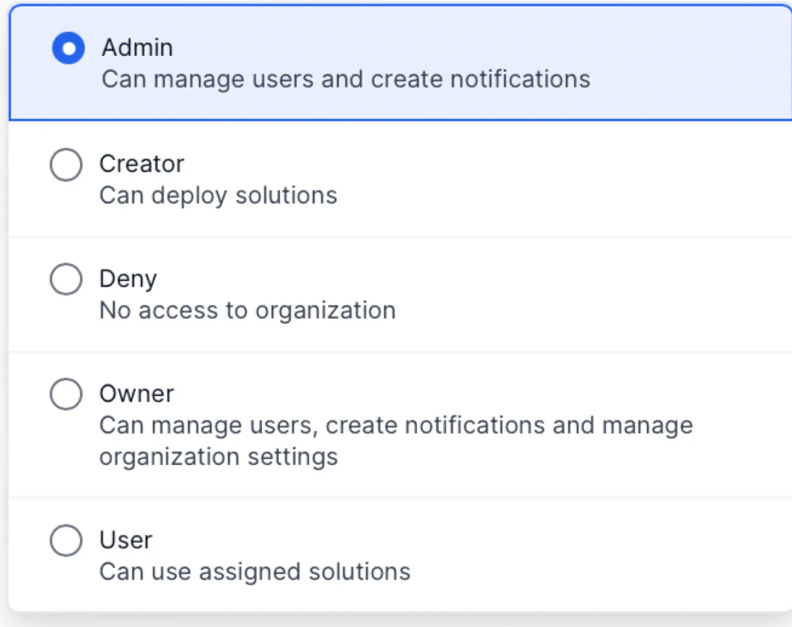
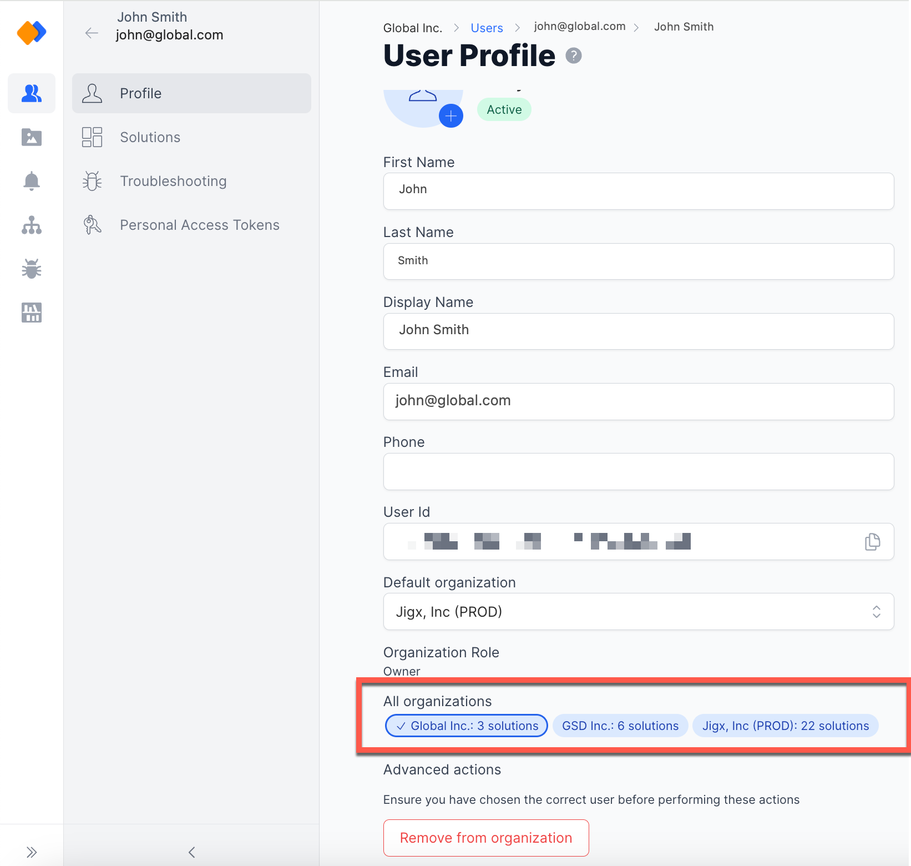
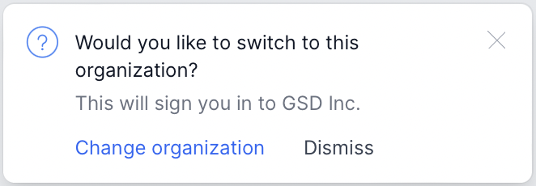
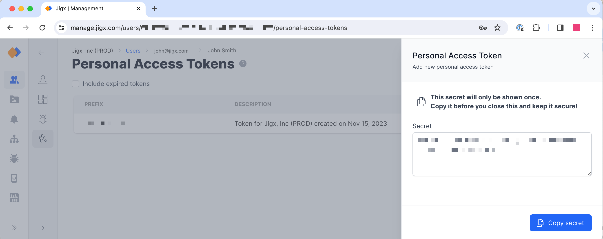
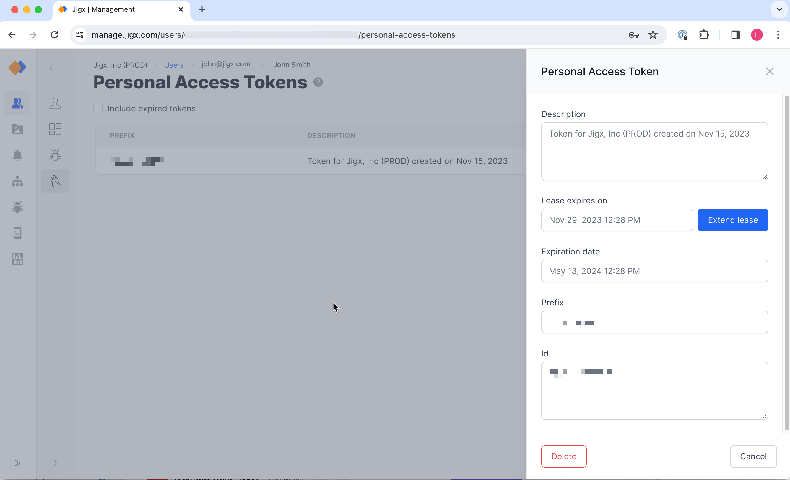

# My profile

You can access your profile either by clicking on your name in the bottom left of the screen and selecting _My profile_ from the menu, or by finding and clicking on your name in the [Users](Users.md) list. You can easily change _organization roles_, quickly _switch between organizations_, _disable a user_, or _remove a user from an organization_.

<figure><figcaption>
User Profile screen
</figcaption></figure>

#### Organization Role

Here you can see your role in the organization and if you have Admin permissions, you can easily change that role. For more information about the capabilities and permissions of each role, see [Permissions - User Roles](<Permissions - User Roles.md>).

<figure><figcaption>
Role selection
</figcaption></figure>

#### All organizations

The list of organizations will only be displayed if you are a member of more than one organization. This impacts your mobile experience and may not be suitable in cases where you want to use apps from different brands. If you belong to more than one organization, you can also change your default organization. The list of organizations include a solution count indicating the number of solutions you are assigned to. Simply switch organizations by clicking on the organization you want to access.

<figure><figcaption>
Organization with solution count
</figcaption></figure>

<figure><figcaption>
Change organizations in management
</figcaption></figure>

#### Advanced actions

Other features include the ability to disable users or remove users from an organization. Before performing these actions, make sure that you have selected the correct user. The advanced actions are only available to people who have Admin and Owner permission. For more information about the capabilities and permissions of each role, see [Permissions - User Roles](<Permissions - User Roles.md>).

#### Personal Access Tokens (PAT)

You can create a personal access token on your Jigx profile that is used in the authorization header of a REST call to Jigx APIs.

* PAT is only accessible under your own user profile.
* Expiry is set for six months after creation.
* The lease for the token auto-extends with two weeks since last use.
* You can extend the lease manually by two weeks. This ensures that the PAT is not kept alive if it isn't used.

**Create a personal access token** by:

<figure><figcaption>
Add personal access token
</figcaption></figure>

1. Log into Jigx Management.
2. Open my profile and select the **Personal Access Tokens** menu option.
3. Click the **Add New Token** button, the side pane opens.
4. Click the **Add** button at the bottom of the pane. A secret is generated for you. Make sure you use the **copy key** to copy the secrect to a safe location for use as the secret is onnly shown once.

**Extend the lease of a personal access token** by two weeks:

<figure><figcaption>
Extend token
</figcaption></figure>

1. Log into Jigx Management.
2. Open my profile and select the **Personal Access Tokens** menu option.
3. Click on the token to be extended, in the side pane that opens click the **Extend lease** button. You will see the lease expires date in the list is updated by two weeks.

**Delete the personal access token** by:

1. Log into Jigx Management.
2. Open my profile and select the **Personal Access Tokens** menu option.
3. Click on the token you want to delete, in the side pane that opens click the **Delete** button at the bottom of the pane.
