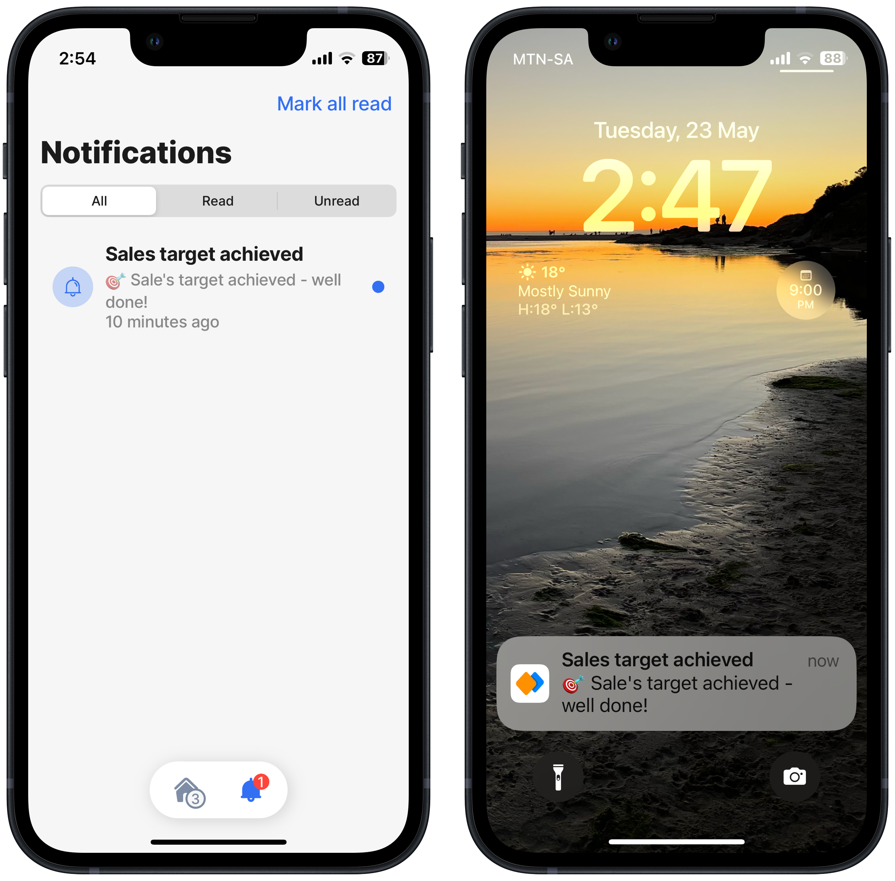
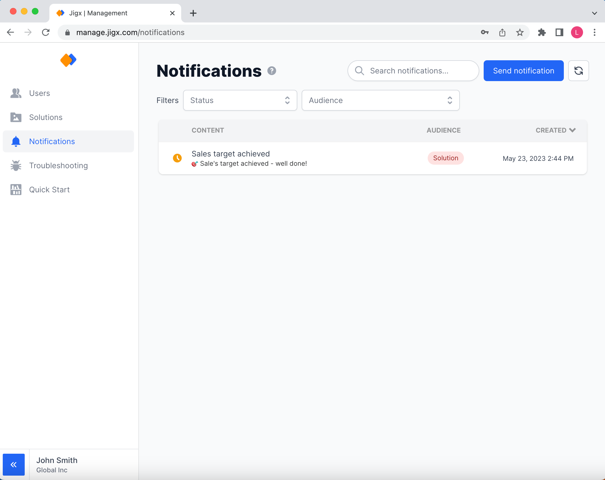
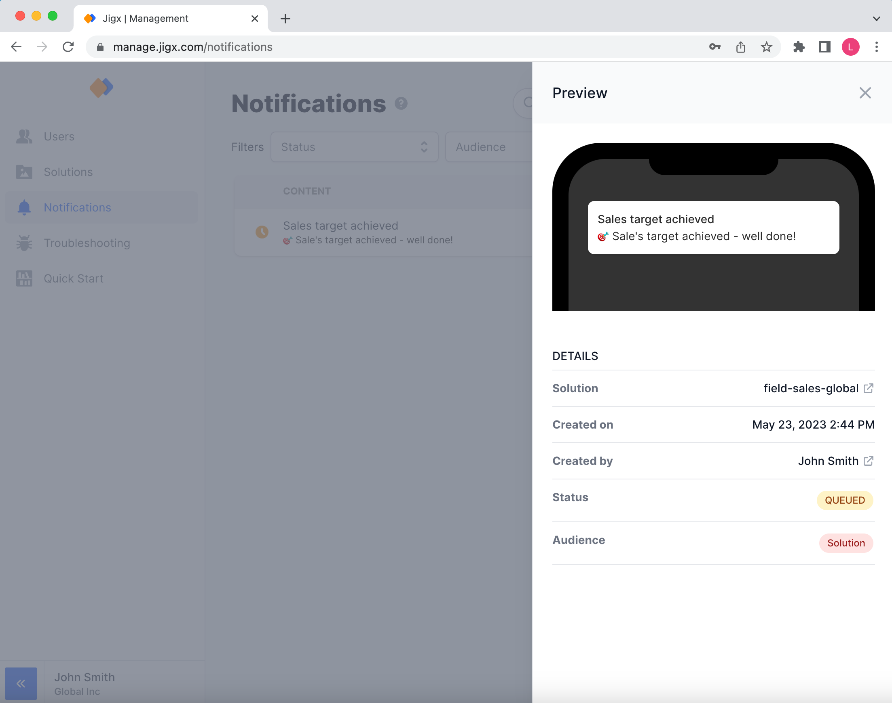
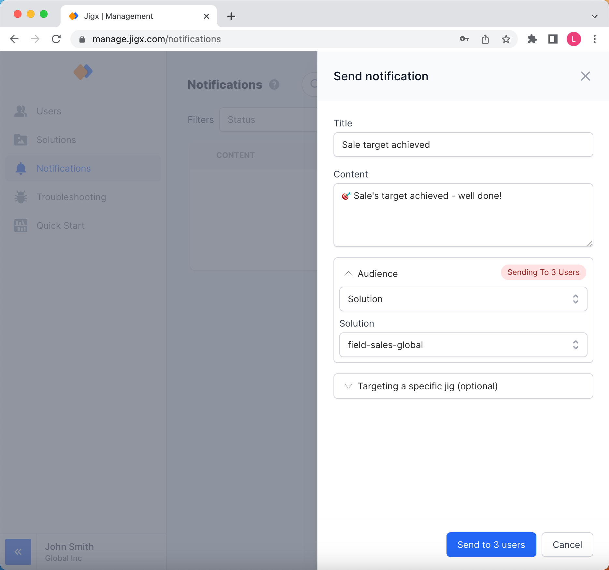

---
layout:
  width: wide
  title:
    visible: true
  description:
    visible: true
  tableOfContents:
    visible: true
  outline:
    visible: true
  pagination:
    visible: true
  metadata:
    visible: true
---

# Notifications

Notifications are a powerful feature allowing you to engage with your users. With Jigx, notifications are delivered to your users as push notifications (OS-level) and in-app notifications (on the notifications tab). You can send Notifications using Jigx Management or programmatically in your solutions, see [Notifications](../building-apps-with-jigx/additional-functionality/notifications.md). Notifications can be configured to send to a single user, the entire organization, users of a specific solution, and even users of a specific jig in a specific solution.

<figure><figcaption>
In-app &#x26; push notifications
</figcaption></figure>

<figure><figcaption>
Notifications list
</figcaption></figure>

## Notifications Overview

The notifications list shows all notifications being sent from your account, either via Jigx Management or programmatically in a solution. Notifications are put on a queue and the current status of your notification delivery is displayed in the first column. You can check the details of the notification by clicking on the notification title.


Typically all notifications are delivered **within a 60 seconds timeframe**.


<figure><figcaption>
Notification Details
</figcaption></figure>

## Configure sending a Notification

Create notifications in Jigx Management by following the steps below:

1. Click on **Send notification** at the top of the screen to open the side pane.
2. Add a title and content, you can use Emojis 🎉 if you want. Both title and content will be displayed to the user in the push notification and in-app notification preview on their devices.
3. Next, decide who your target audience will be:

* **Users**: Send to specific users, e.g. John and Mary. Click the _+ choose specific users_ to select users from the organization's global user's list.
* **Solution**: Send to all users that have a specific solution assigned to them, e.g. all users who use the sample-crm solution. Select the solution name from the _Solution dropdown_ list.
* **Solution Groups**: Send to all users that are in a group of a specific solution, e.g. all managers using sample-crm. Select the solution name from the _Solution_ dropdown, then select the group name from the _Groups_ area. If no groups exist on the solution, no group names will display in the area.
* **Organization**: Send to all users in the Organization.

1. On the _Target a specific jig (optional)_ tab, select the jigin a specific solution that will trigger the notification. This is an optional step. For example, if sales employees tap on your push notification, the mobile app will navigate directly to their list of all open opportunities.
2. Set input parameters for the jig based on key/value pairs (e.g. accountID / 123456). The solution creator needs to ensure the input parameters are processed.

<figure><figcaption>
Configuring a notification
</figcaption></figure>

## Notification URL per region

<table><thead><tr><th width="224.7734375">Region</th><th>URL</th></tr></thead><tbody><tr><td>US</td><td><a href="https://us-east-1.api.jigx.com/v2.0/tool/organizations/%7BorganizationId%7D/notifications">https://us-east-1.api.jigx.com/v2.0/tool/organizations/{organizationId}/notifications</a></td></tr><tr><td>South East (e.g. Australia)</td><td><a href="https://ap-southeast-2.api.jigx.com/v2.0/tool/organizations/%7BorganizationId%7D/notifications">https://ap-southeast-2.api.jigx.com/v2.0/tool/organizations/{organizationId}/notifications</a></td></tr><tr><td>Europe</td><td><a href="https://eu-central-1.api.jigx.com/v2.0/tool/organizations/%7BorganizationId%7D/notifications">https://eu-central-1.api.jigx.com/v2.0/tool/organizations/{organizationId}/notifications</a></td></tr></tbody></table>
