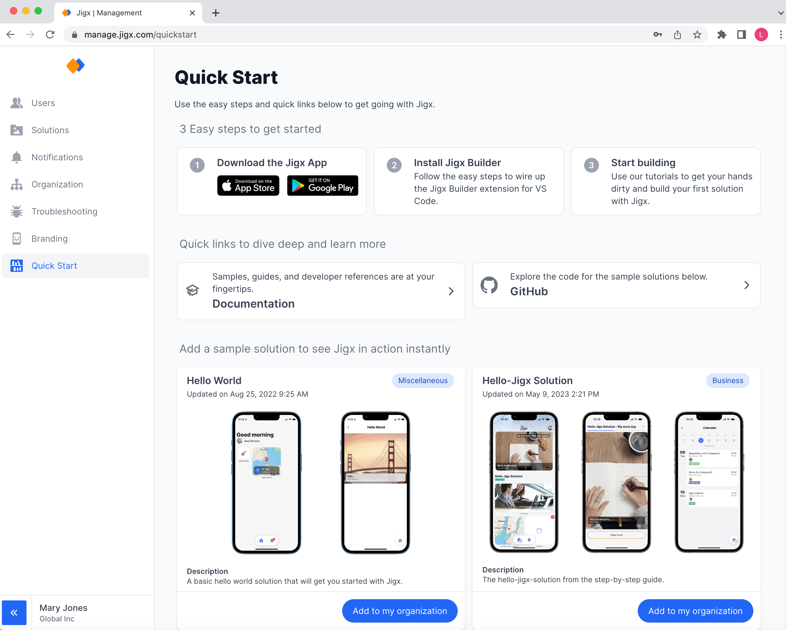

# Quick Start

Use the Quick Start option to download the iOS and Android Jigx app, access the Jigx documentation, explore Jigx [GitHub](https://github.com/jigx-com/jigx-samples/tree/main/quickstart) repository containing samples, and add preconfigured solutions to your organization.

<figure><figcaption>
Quick Start
</figcaption></figure>
