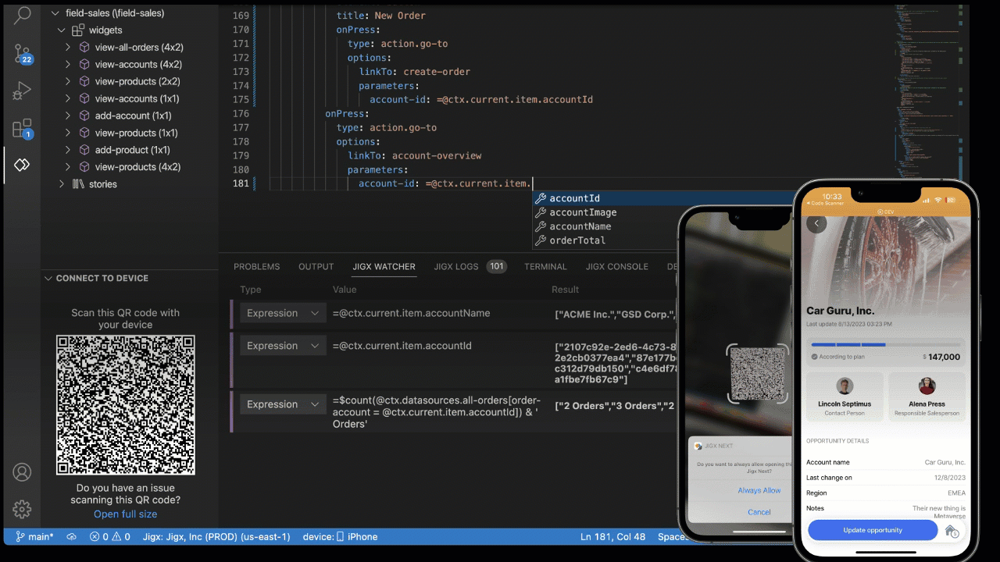

---
layout:
  width: wide
  title:
    visible: true
  description:
    visible: true
  tableOfContents:
    visible: true
  outline:
    visible: true
  pagination:
    visible: true
  metadata:
    visible: true
---

# Welcome to Jigx Documentation

Jigx simplifies mobile app development from start to finish in three steps. You can build native iOS and Android apps with familiar frameworks and tools like JavaScript, SQL, YAML, and Visual Studio Code.

<a href="getting-started/getting-started.md" class="button primary">Getting Started</a>

<figure><figcaption></figcaption></figure>

***

<table data-view="cards"><thead><tr><th></th><th></th><th data-hidden data-card-target data-type="content-ref"></th></tr></thead><tbody><tr><td><a href="getting-started/install-the-jigx-builder.md">Install</a></td><td>Install the Jigx Builder extension in Microsoft Visual Studio and create your Jigx's solutions.</td><td></td></tr><tr><td><a href="building-apps-with-jigx/jigx-builder-code-editor/jigx-builder-code-editor.md">Build</a></td><td>Start creating your mobile apps, use intellisense prompts and code completion to speed up development.</td><td></td></tr><tr><td><a href="building-apps-with-jigx/data/data.md">Data</a></td><td>Integrate with with your business's datasources, REST, Salesforce and more, or use Jigx's built in real-time datastore.</td><td></td></tr><tr><td><a href="building-apps-with-jigx/ui/ui.md">UI</a></td><td>Choose from a range of available components, add actions and integrate these with your data to create powerful apps.</td><td></td></tr><tr><td><a href="building-apps-with-jigx/logic/logic.md">Logic</a></td><td>Structure and manipulate data before binding the data to the UI using JSONata expressions, or use states to manage inputs at runtime.</td><td></td></tr><tr><td><a href="Administration/Management Overview.md">Manage</a></td><td>Manage your organization details, users, and solutions, send push notifications, and configure authorization and authentication.</td><td></td></tr></tbody></table>

***

***
