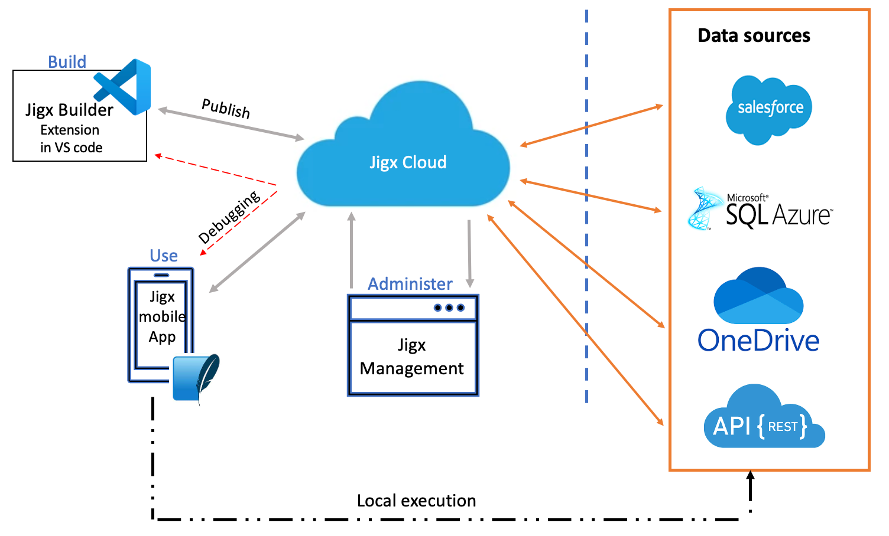

# Architecture

The Jigx platform consists of components that work together enabling you to build enterprise mobile app solutions.

<figure><figcaption>
Jigx Overview
</figcaption></figure>

<table><thead><tr><th width="165.296875">Component</th><th>Description</th></tr></thead><tbody><tr><td><a href="../building-apps-with-jigx/jigx-builder-code-editor/jigx-builder-code-editor.md">Jigx Builder</a></td><td>The Jigx Builder is an extension in Microsoft VS Code, a development environment that can be installed on many platforms, including Windows and Mac. Use YAML, SQL, JSON, and JSONata to build, test, debug, and publish Jigx mobile apps.</td></tr><tr><td>Jigx Cloud</td><td>JigxCloud authenticates users, stores organizations and solutions, and sends notifications.</td></tr><tr><td><a href="../Administration/Management Overview.md">Jigx Management</a></td><td>Jigx Management exposes the Jigx Cloud functionality in a browser-based portal, allowing you to manage users and solutions, set up send and push notifications, and view usage metrics of your organization.</td></tr><tr><td>Jigx App</td><td>The Jigx App is an iOS and Android app that works on mobile devices such as phones and tablets. The app is available in the iOS and Google Play stores. Jigx solutions built-in Jigx Builder, published to Jigx Cloud and permissions granted in Jigx Management are accessible in the Jigx App. The Jigx App is only supported in portrait mode on iOS and Android phones.</td></tr><tr><td><a href="../building-apps-with-jigx/data/data.md">Data</a></td><td>Understanding how data is used and how it flows between the Jigx components is important. Jigx data concepts, including data lifecycles, syncing and loading data, and how to work with REST, Azure SQL, and Dynamic Data are covered in the <a href="../building-apps-with-jigx/data/data.md">Data</a> topic.</td></tr></tbody></table>

### See Also

* [REST Authentication](../building-apps-with-jigx/data/data-providers/rest/rest-authentication.md)
* [Local REST Calls](../building-apps-with-jigx/data/data-providers/rest/local-rest-calls.md)
