# Jigx Concepts

Jigx uses concepts, terminology, and elements you might not be familiar with. Below is an explanation of the main core concepts to help you understand and use Jigx better.

## Jigx Solutions

Jigx refers to a native mobile app as a _solution_. With Jigx you can build and publish more than one solution to your Jigx mobile app. You can _switch_ between solutions by tapping the _More_ ellipsis icon in the navigation bar and selecting your desired solution. The currently active solution is highlighted with a checkmark icon. If only one solution is available, the _More_ icon is hidden.

<figure>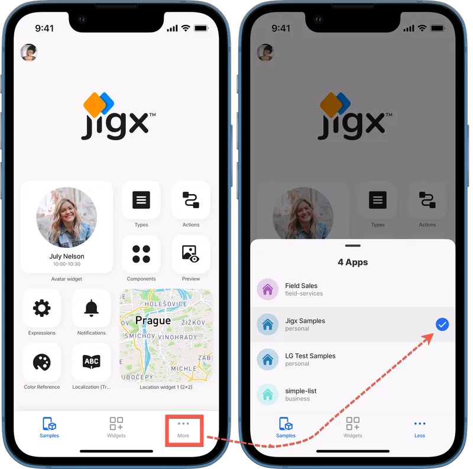<figcaption></figcaption></figure>

## Home Hub

The _home hub_ is the first screen you see when you open and sign into the Jigx mobile app. The Home Hub can display navigational menu blocks called _grid-items_, containing _images_, _widgets_, or custom controls. Once you tap on a grid-item, you are directed to a jig, which is a screen used to display various forms of content. The _index.jigx_ file is the place to configure the bottom navigation bar. In addition to grid-items, you can style the Home Hub by adding a [video-player](<Jigx Concepts.md>) or [carousel](<Jigx Concepts.md>) at the top of the Home Hub. For more information, see [Home Hub](../building-apps-with-jigx/ui/home-hub/home-hub.md) and [Creating a Home Hub](../building-apps-with-jigx/ui/home-hub/creating-a-home-hub.md).

<figure>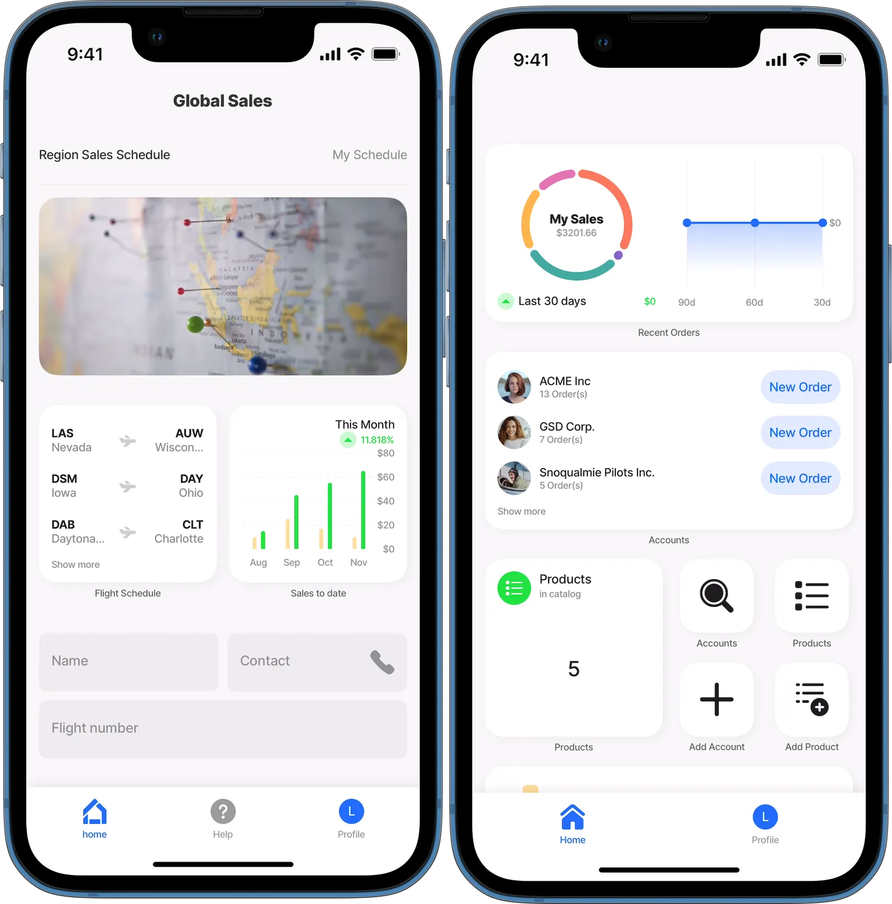<figcaption></figcaption></figure>

## Jigx Builder

Native mobile solutions are built in Microsoft Visual Studio Code, a development environment installed on many platforms, including Windows and Mac. Jigx extends VS Code with the [Jigx Builder](../building-apps-with-jigx/jigx-builder-code-editor/jigx-builder-code-editor.md), which is an extension that allows you to build, test, and publish Jigx mobile app solutions. The **Jigx Builder** extension uses YAML, SQL, JSON, and JSONata. A YAML editor is provided that includes IntelliSense, which allows for code completion by simultaneously pressing the control and spacebar (ctrl+space) keys. Only valid options in the current cursor context are displayed in the code popup. There is built-in [debugging](../building-apps-with-jigx/jigx-builder-code-editor/debugging.md) functionality to assist with troubleshooting your development. Predefined code snippets are provided in the .jigx files to help make development easier and faster. The Jigx Builder loads with a [folder structure](../building-apps-with-jigx/jigx-builder-code-editor/editor.md) to categorize the various files needed to build app solutions. These folders are actions, assets, databases, datasources, functions, jigs, and translations.

<figure>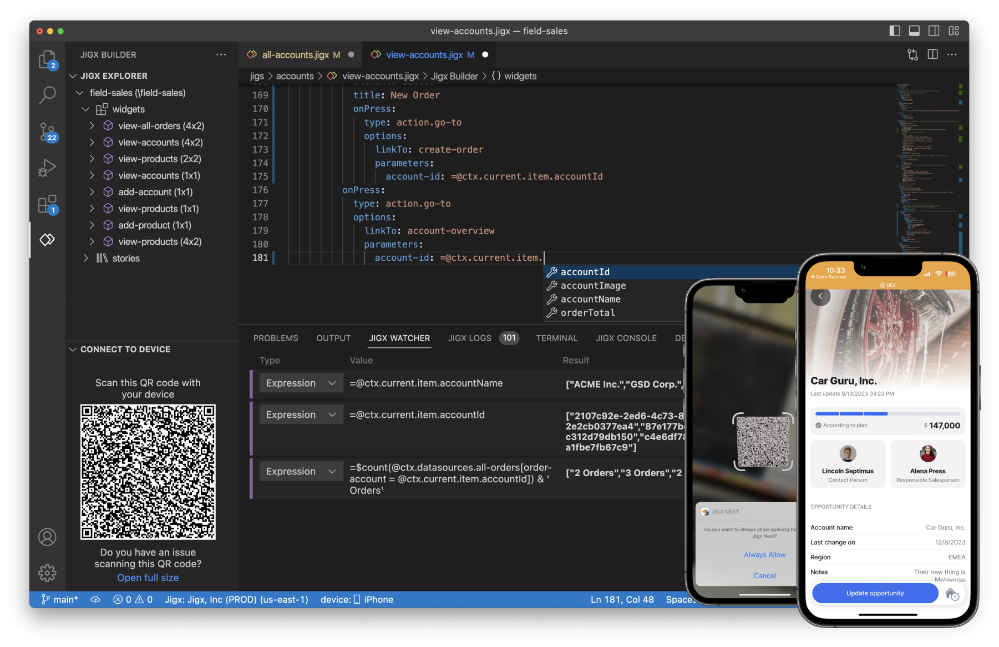<figcaption></figcaption></figure>

## index.jigx file

The _index.jigx_ file is located at the root of the Jigx solution project in the Jigx Builder. In the index.jigx file, you configure what must be displayed on the home screen (Home Hub) of your solution on the Jigx mobile app. The file opens with a pre-populated code snippet to help you configure the Home Hub. For more information, see [Index settings](../building-apps-with-jigx/ui/home-hub/index-settings.md), and [Creating a Home Hub](../building-apps-with-jigx/ui/home-hub/creating-a-home-hub.md).

<figure>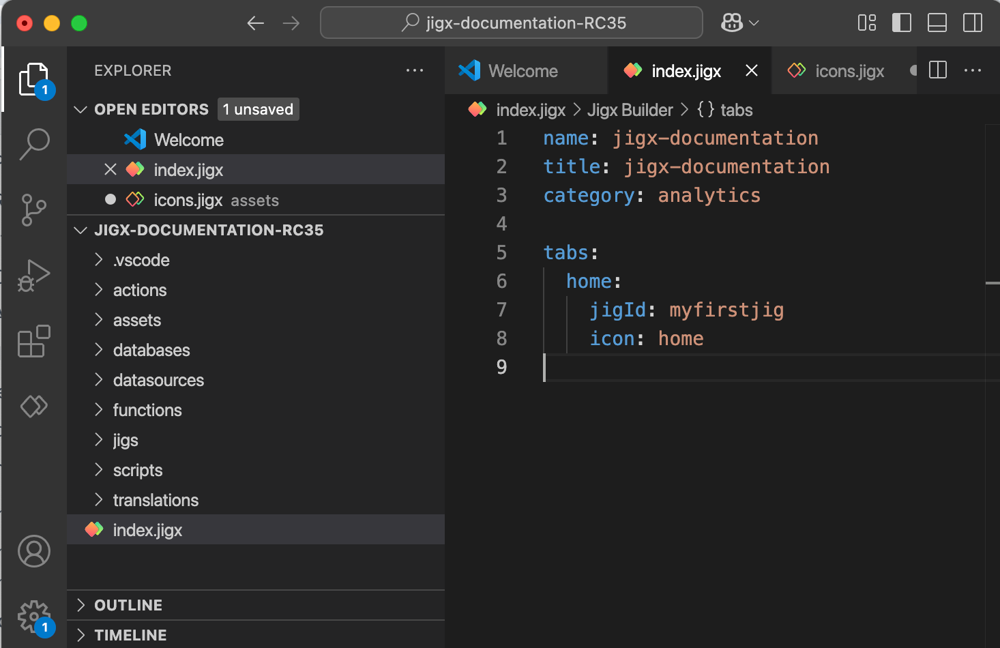<figcaption></figcaption></figure>

## Widgets

Widgets are navigational menu blocks set up on jigs, allowing them to be utilized in various parts of the solution, including the Home Hub and multiple jigs (screens). These widgets are configurable to display various UI elements, such as locations, images, charts, and more. For more information, see [Content widget components](<Jigx Concepts.md>).

<figure>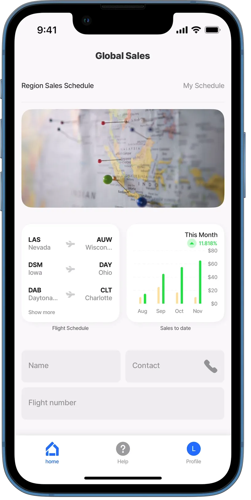<figcaption></figcaption></figure>

## Jig

A jig is a container used to configure content. A jig can be configured as a calendar, a form to capture or view data, a PDF or HTML document, a list of data, or even a combination of any one of these. Usually, tapping on a widget in the [Home Hub](../building-apps-with-jigx/ui/home-hub/home-hub.md) opens a jig. For more information, see [Jigs (screens)](../building-apps-with-jigx/ui/jigs-_screens_/jigs-_screens_.md) and [Jig Types](<Jigx Concepts.md>) sections in this guide.

<figure>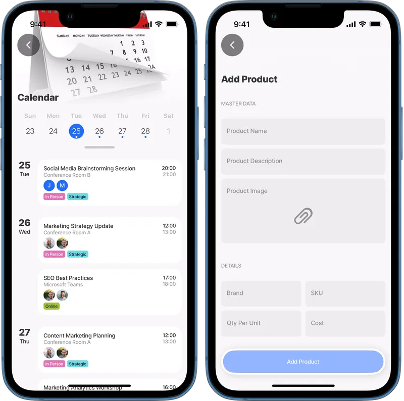<figcaption></figcaption></figure>

## Components

Components are elements that can be used when creating a Jigx solution in the Jigx Builder. These elements provide an incredible amount of functionality. Components include interactive images, video players, expanders, and charts. For more information, see [Components (controls)](../building-apps-with-jigx/ui/components-_controls_/components-_controls_.md) and [Components](<Jigx Concepts.md>) example topics in this guide.

<figure>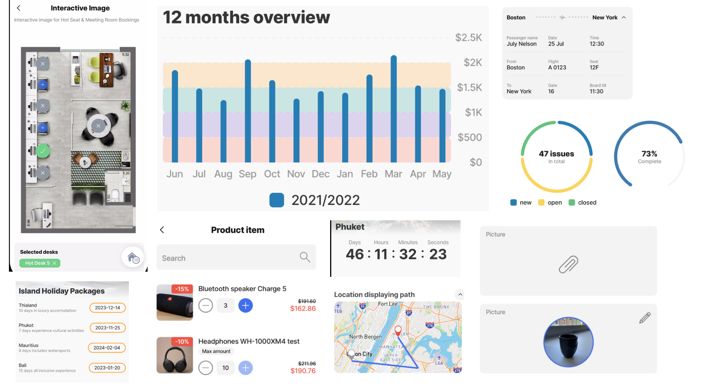<figcaption></figcaption></figure>

## Actions

Actions allow you to do something, for example, go back to a previous screen, open a URL, or submit a form. For more information on the available actions as well as code samples for each one, see the [actions](../building-apps-with-jigx/ui/actions.md) and [action examples](<Jigx Concepts.md>) sections of this guide.

<figure>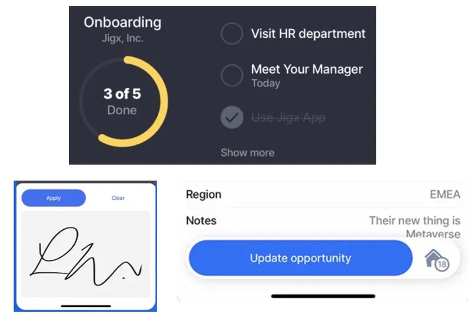<figcaption></figcaption></figure>

## Functions

Functions enable integration with other platforms through data providers. Creating a new function using one of the provided template options adds the skeleton code to the function definition, making it easier to configure with their authentication requirements. For more information, see [REST Functions](../administration/solutions/rest-functions.md), [SOAP Functions](../administration/solutions/soap-functions.md), and [SQL Functions](../administration/solutions/sql-functions.md).

<figure>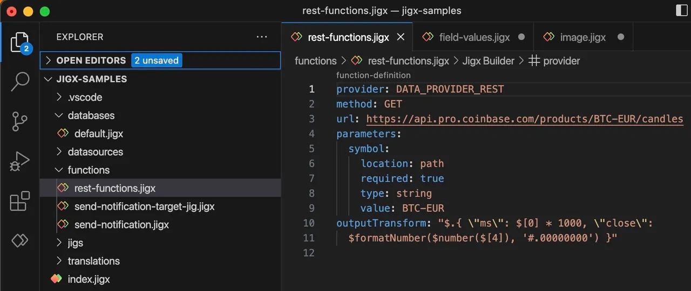<figcaption></figcaption></figure>

## Expressions

Expressions allow you to structure data before binding it to the UI components. Expressions are **JSONata** language-based. JSONata is a lightweight query and transformation language for JSON data. JSONata is a rich complement of built-in operators and functions providing options to manipulate and combine data. Learn more about [JSONata](https://jsonata.org/) and try out your expressions in their [JSONata Exerciser](https://try.jsonata.org/). The root element of Expressions in .jigx files starts with "@ctx" vs. "$." in JSONata Exerciser (e.g., @ctx.data vs. $.data). Jigx supports shorthand $ expressions for JSONata. For more information, see [Expressions](../building-apps-with-jigx/logic/expressions.md), [Expressions - cheatsheet](../building-apps-with-jigx/logic/expressions-1/expressions-cheatsheet.md) and [Expression examples](<Jigx Concepts.md>).

<figure>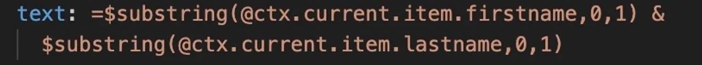<figcaption></figcaption></figure>

## Datasources

[Datasources](../building-apps-with-jigx/data/datasources.md) are sets of data that are available throughout your whole solution (global) or only inside a jig (local). Datasources can be static or dynamic. Jigx **Dynamic Data** is a built-in database that can be used to create, read, update, and delete data in an app. The underlying data store for Dynamic Data is a NoSQL store. This means that each record can have its own field structure, and you can add or remove any fields on a per-record basis. Only the id column is a system column and cannot be changed or removed from the record. Jigx Dynamic Data is managed in Jigx Management. For more information, see [Dynamic Data](../building-apps-with-jigx/data/data-providers/dynamic-data/dynamic-data.md) and [Dynamic Data examples](<Jigx Concepts.md>) .

## Database

A [data provider](broken-reference) is a service that accepts data inputs and returns data outputs. Jigx data providers include dynamic, local, REST, Salesforce, SOAP and SQL. For more information see [Data Providers](broken-reference) and [Data Provider examples](<Jigx Concepts.md>).

## Entities

Entities are tables in Jigx Dynamic Data or other databases where your data gets saved, created, updated, and deleted. Use an action such as execute-entity to work with the data. Jigx data is managed in the [Data](../administration/solutions/data.md) menu option in Jigx Management. Other databases are managed using the [connections](https://docs.jigx.com/connections), [SQL Functions](../administration/solutions/sql-functions.md), [REST Functions](../administration/solutions/rest-functions.md), and [SOAP Functions](../administration/solutions/soap-functions.md) in Jigx Management. For more information, see [execute-entity](<Jigx Concepts.md>).

## Jigx Management

Jigx Management exposes the Jigx Cloud functionality in a browser-based portal allowing you to manage users and solutions, set up send-and-push notifications, set up data, and view usage metrics of your organization. For more information, see [Management Overview](<../Administration/Management Overview.md>).

<figure>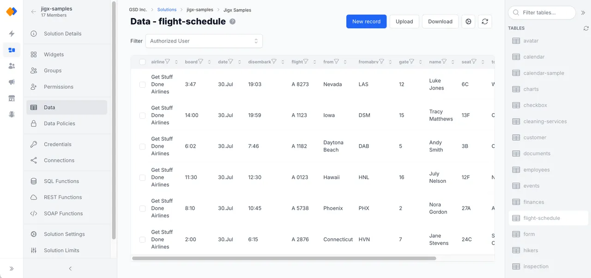<figcaption></figcaption></figure>

## Jigx App

The Jigx app is available on iOS and Android and works on any device.

* Download the Jigx iOS app from the [App Store](https://apps.apple.com/sg/app/jigx/id1495596537)
* Download the Jigx Android app from the [Google Play Store](https://play.google.com/store/apps/details?id=com.jigx.android\&pli=1)
* The Jigx App is only supported in portrait mode on iOS and Android phones.
* You can brand your app through [Organization Settings](../administration/organization-settings/organization-settings.md)

### See Also

* [Jigx color palette](<Jigx color palette.md>)
* [Jigx icons](<Jigx icons.md>)
