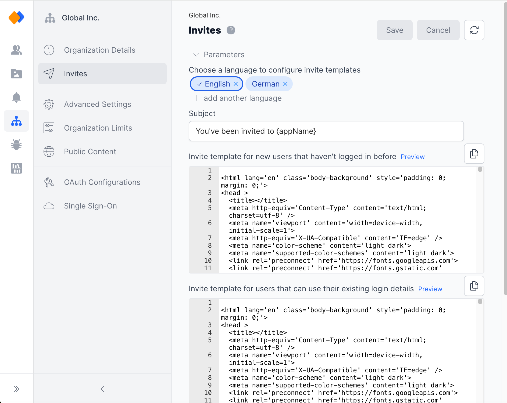
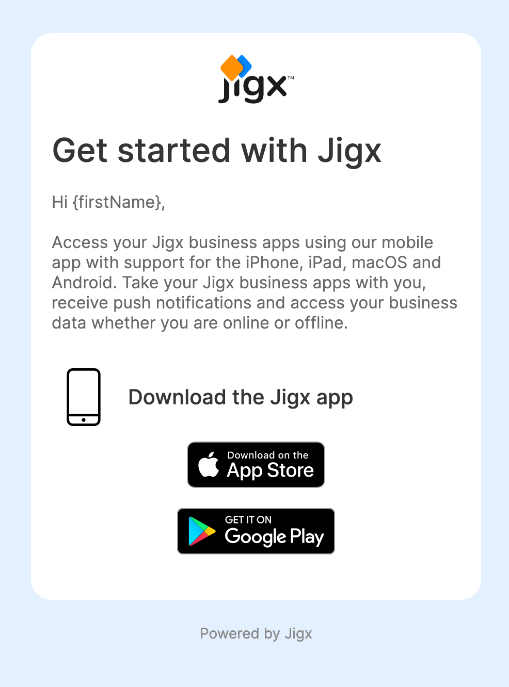
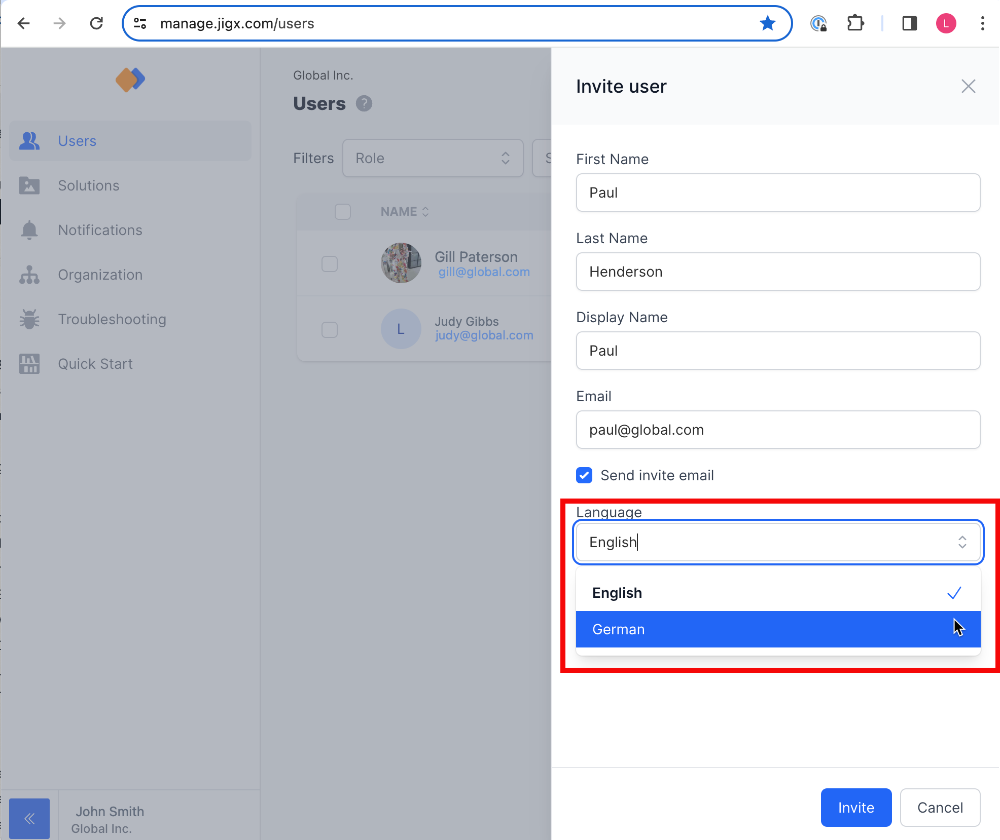

# Invites

## Default invite template

When you create an organization in Jigx Management, a default invite is automatically set up for the organization. To see what the invite looks like, click the Preview link in the invite template section. This will open an HTML view of the template in a new tab.



<figure><figcaption></figcaption></figure>



<figure><figcaption></figcaption></figure>



## Customize the invite template

The invite email template can be customized to reflect your brand's identity and style. There are two methods described below.

### Edit the provided parameters (recommended)

By editing the parameter settings you can change the logo, colors, text, icons and provide the URL to your branded app in the Apple and Google stores.

<figure><figcaption>
Customize invite template
</figcaption></figure>

1. At the top of the invite screen, expand **Parameters**.
2. Edit the **parameter fields** as required, or use the **Show Parameters Schema** to edit the raw HTML.
3. Before saving the changes, test the template by clicking on the Preview link next to the invite template. This will open an HTML view of the template with the updated parameters in a new tab.
4. Once you are satisfied with the edits and customizations to your email template, click **Save.**

### Edit the existing default HTML template

1. Copy the raw HTML from the template using the copy icon.
2. Paste the code in an HTML editor and make the required changes.
3. Replace the existing HTML with the updated HTML.
4. Before saving the changes, test the template by clicking on the Preview link next to the invite template. This will open an HTML view of the template with the updated HTML in a new tab.
5. Once you are satisfied with the edits and customizations to your email template, click **Save**.

## Invite templates in multiple languages

Invites can be sent out in multiple languages which is helpful if your organization has multiple regions in multiple countries.

### Adding a language template

<figure><figcaption>
Add language template
</figcaption></figure>

1. Click on the **+ add another language** under _Choose a language to configure invite templates_.
2. Type the language code in the field. Only use [ISO-639-1 language codes](https://en.wikipedia.org/wiki/List_of_ISO_639-1_codes) such as en, de.
3. Click **Add**.
4. Select the language tag. The pane toggles to the template for the new language.
5. Use the HTML from the English pane as a base to translate the HTML to the new language you have specified. Add the HTML in the invite template sections and add a subject. **Note:** The {introMessage} parameter translation must be made in the raw HTML and not in the parameter fields at the top of the screen.
6. Before saving the changes, test the template by clicking on the Preview link next to the invite template. This will open an HTML view of the template with the updated HTML in a new tab.
7. Once you are satisfied with the edits and customizations to your new language email template, click **Save**.

### Sending an invite in a specific language

When sending out invites to users to join your organization and access your app, you can determine which language the invite must be sent in provided you have created an invite template in that language.

<figure><figcaption>
Invite language selection
</figcaption></figure>

1. Navigate to the **Users** menu option.
2. Click the Invite user button in the top right of the screen.
3. Add the user's details.
4. Under Language select a language from the dropdown list.
5. Select the user's role and click **Invite.**
