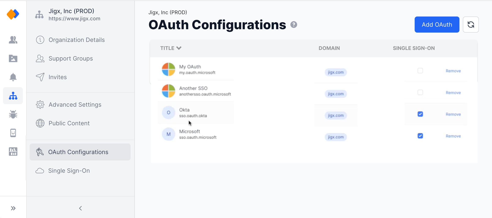
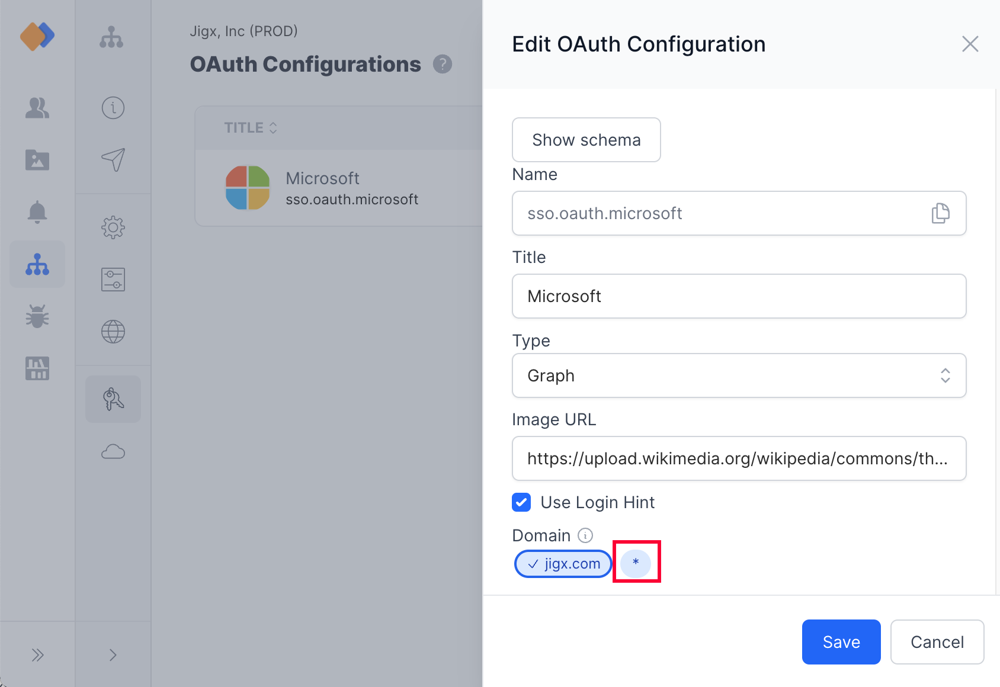
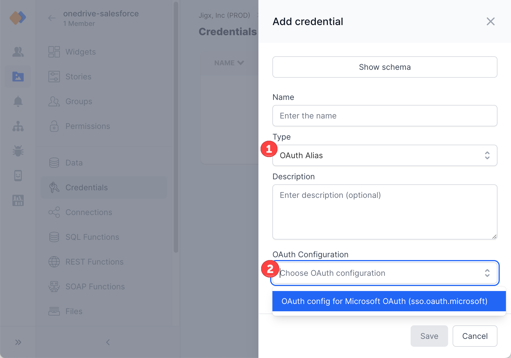

# OAuth Configurations

### Introduction

Add an OAuth configuration at the organizational level to provide Jigx with secure delegated access. OAuth configured in Jigx Management provides the authentication requirements on mobile devices, APIs, servers, and applications with access tokens. Setting OAuth at this level allows you to use it in multiple scenarios requiring [Authentication](<../../Understanding the basics/Authentication.md>). For example:

* By [Single Sign-On (SSO)](single-sign-on-_sso_.md)
* Mapped to solutions in [solution credentials](../solutions/credentials.md)
* By multiple branded apps within an organization

Jigx provides a secure credentials store in the cloud that can be used to connect to remote APIs from your solutions. OAuth configuration is referenced within your function's definitions via `Token` properties and is used at runtime to inject the OAuth token into the request.

<figure><figcaption><p>OAuth on Organizational level</p></figcaption></figure>

### Adding OAuth configuration

1. In Jigx Management under the Organization icon, select the **OAuth Configurations** option. You require `ADMIN` or `OWNER` permissions to see and access the organization settings.
2. Click on the **Add OAuth** button at the top right of the screen.
3. Fill in the fields or click on **Show schema** to add the raw JSON configuration object.
4. Enter a descriptive **name** for the OAuth setting. This name is visible to the user on the device when SSO or secondary credentials are configured.
5. The **Title** is the actual token that will be referenced from within the function definition of the solutions, best practice is to give it a descriptive name, for example, called _jigx.organizationName.oauth.token_.
6. Select the **type** of OAuth credentials required. There are three available types:
   1. Graph
   2. Okta
   3. OpenID
   4. Auth0
7. Image URL - this OAuth field is optional.
8. Use login hint - this field is optional, add a login hint parameter in the format required by the 3rd party identity provider.
9. All the organization's domains set up at registration are listed under **Domains.**
   1. To add additional domains, contact support@jigx.com.
   2. To accomodate for unknown domains not associated with the organization use a wildcard (\*) in the OAuth configuration. See [Set up a domain wildcard](https://docs.jigx.com/oauth-configurations#WJFnB).
10. **Redirect URL** - Add the redirect URL, you can add multiple URLs. Redirect URLs must match the configuration of the Client app on the 3rd Party IDP.
11. Enter the **Client ID**, and **Client Secret**. These are optional.
12. Enter the **Issuer**. If you use the Service configuration endpoints, then Issuer is not required, but if not, then Issuer is a required field to complete the configuration.
13. By default, the **Use PKCE** and **Use Nonce** are selected, you can deselect these if not required.
14. Add scopes that define the specific resources or actions that the application is allowed to access on the user's behalf.
15. If no issuer is provided, complete the Service configuration endpoints.

### Updating OAuth configurations

1. Click on the OAuth's name in the list.
2. The OAuth settings display in the side panel, make the required changes.
3. Click **Save**.

### Removing OAuth configurations

Click on the **Remove** link in the last column of the record to remove the credentials. Be aware that functions in the solution referencing the OAuth configuration will stop working as they can no longer connect to the remote API.


Before removing the OAuth configuration, check where the OAuth key is referenced. Removing the key at an organizational level could break solutions using the global OAuth token.


### Set up a domain wildcard (\*)

When your app has multiple users that register and log in from external sources for example a retail app, you do not know the domain they using, however you want the domain to use the OAuth configuration you have set up. Simply set up a wildcard (\*) in the domain setting in the OAuth Configuration, which will include all domains.

<figure><figcaption><p>Domain wildcard</p></figcaption></figure>

### Configuring OAuth error messages

When an OAuth authentication fails or expires in the mobile app, you need to provide clear, actionable feedback to the end users. By default a generic message is shown, however, you can customize the error message displayed when authentication issues occur, helping users understand what went wrong and how to resolve it.

* The error handling is configured within your [REST function](../solutions/rest-functions.md) using the `error` array.&#x20;
* Each `error` configuration consists of a conditional `when` trigger that checks the error name using: `when: =@ctx.error.name = "OAuthCredentialsMissingError` .
* The error handling must be configured in each REST function to ensure that the customized message is shown. If this is not configured a combination of the customized and default message be shown depending on the REST function used.
* To avoid multiple error messages displaying for the OAuth error message, configure the `groupId` in the error handler in all functions so it only pops up once. The `groupId` must be the same in each function.


```yaml
provider: DATA_PROVIDER_REST
method: GET
url: url
useLocalCall: true

error:
  # This condition catches the specific scenario where OAuth credentials are 
  # missing or invalid, which occurs when; a user's session has expired, 
  # authorization was revoked, initial authentication failed or was blocked.
  - when: =@ctx.error.name = 'OAuthCredentialsMissingError'
    title: Failed to get credentials. Authorization request blocked
    # Determine if the message is shown or hidden.
    notification: true
    # The operations section logs the error details for debugging and audit purposes.
    operations:
      - type: operation.upsert-merge
        table: ='restFunctionErrors'
        records: |
          ={
            "id": $uuid(),
            "user": @ctx.user.email,
            "correlationId": @ctx.correlationId,
            "error": "Unable to sign in",
            "errorDetail": @ctx.error.message,
            "errorBody": @ctx.error.message,
            "entity": @ctx.entity
          }
    # The alert section defines what the end user sees in the error message.     
    alert:
      # Use manage.jig.com to define customer name as a custom setting for your solution.
      title: ='Unable to sign in to ' & @ctx.solution.settings.custom.{CustomerName} 
      description: We couldn't connect to your {CustomerName} work account to complete your sign-in. 
      Please try again or contact your admin if the issue continues.
      icon: lock-2
      # Group related errors together to prevent duplicate alerts.
      group:
        id: no-credentials
      # Configure the UI error layout type, wither modal or toast. 
      presentAs: modal
      # Define custom action buttons for user recovery options, 
      # use IntelliSense for the available list.
      actions: 
```


#### Setting Your Customer Name

The error message references `@ctx.solution.settings.custom.{CustomerName}`. To configure this:

1. Navigate to your [solution settings](../solutions/solution-settings/solution-settings.md#custom-variables) in manage.jig.com
2. Add a custom variable with the key `CustomerName`
3. Set the value to your organization's display name or the name the OAuth relates to.

This ensures error messages are branded appropriately: "Unable to sign in to Acme Corp" instead of a generic message.

#### **Best practices:**

* Keep the message concise and non-technical
* Explain what happened in plain language
* Provide clear next steps (try again, contact admin)
* Avoid jargon like "OAuth" or "credentials"

### Considerations

1. You can create multiple OAuth configurations.
2. You can assign multiple OAuth configurations to be used with Single-Sign-On by selecting multiple checkboxes in the [Single Sign-On (SSO)](single-sign-on-_sso_.md) screen. This is useful if multiple domains are used for different people, for example, internal users, vendors, or partners.
3. OAuth configurations can be reused in Solution OAuth credentials. In the [Solution Credentials](../solutions/credentials.md) page in Jigx Management, select the **OAuth Alias** option under the **Type** dropdown and select the organization's global OAuth credentials in the **OAuth configuration** dropdown to map to.&#x20;

<figure><figcaption></figcaption></figure>

1. The _Title_ field in the OAuth configuration settings is the SSO name that users will see when logging into the app. It is important to give the Title a meaningful name.
2. The call to the OAuth configuration for authorization is made when the index.jigx (Home Hub) loads on the app.
3. The OAuth token's lifetime is 15 minutes.
