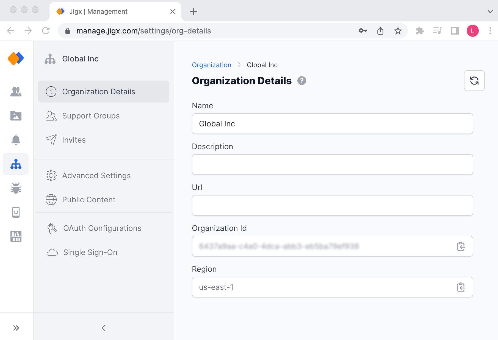

# Organization Settings

As an `ADMIN` or `OWNER` of an organization, you can configure global organization settings in Jigx Management in the **Organization Settings** area.

<figure><figcaption>
Organization Details
</figcaption></figure>

### Organization Details

Here you can view the name of your organization and its description, add an external facing marketing URL of your organization, copy your organization's Id, and cloud server region.

### Invites

You can invite new [Users](../../Administration/Users.md) to join your organization and let them receive emails with instructions on how to onboard. Your organization has already been set up with default invite settings. The email invite can be customized to align with your organization's branding or add multiple language email templates.

<figure><figcaption>
Configuring email invites
</figcaption></figure>

The following configuration is available:

* [Default invite template](invites.md)
* [Customize the invite template](invites.md)
* [Add invite language templates](invites.md)
* [Sending an invite in a specific language](invites.md)

### Advanced Settings

In the Advanced Settings screen add the email address where request emails will be sent. In this instance request emails are sent from the mobile app if a user has downloaded the app, tries to log in and has not been invited by your organization. A message will display on the app allowing the user to request access.

* **Off (will not be discoverable during registration)** - when this option is set users registering with the same domain as the organization will not be able to join your organization during the registration process. You will need to manually add them to the organization.
* **Request to join (needs approval from owners)** - a request to join will be sent and requires approval for users registering with the same domain as the organization.
* **Automatic can join without approval** - users registering with the same domain as the organization will automatically be added to the organization.

**Jigx support access** - determine the level of access that Jigx support has in Jigx Management to your organization. There are two levels of access you can choose between _Read_ or _Write_.

<figure><figcaption>
Advanced Settings
</figcaption></figure>

Set **Jigx Management idle timeout**- Set an _Idle logout_ option for Jigx Management. This is an optional security setting that once applied will display a prompt and then log the person out of Jigx Management after being idle for the configured period. Enabling the checkbox has a default of 120 minutes, but is configurable to any number of minutes.

<figure><figcaption>
Idle timeout setting
</figcaption></figure>

### Organization Limits

The organization limits allow you as the organization's owner to view the number of members and solutions in the organization. In the Solution Limit template section set the number of members allowed on new solutions, then restrict the number of rows of data and files allowed per solution.

<figure><figcaption></figcaption></figure>

### Public Content

Public content allows you to setup links that are visible on your organization's app before a user has onboarded or logged in. For example, a link to a public solution, privacy policy link, your organization's website, or a link to request access to the app. When submitting branded apps to the app stores for publishing it is recommended to include a privacy link as the stores might require you to provide sufficient warning to your users regarding tracking of data and cookies. For configuration details see [Public Content](public-content.md).

<figure><figcaption>
Public Content configuration
</figcaption></figure>

### OAuth Configurations

Use the [OAuth Configurations](oauth-configurations.md) option to configure mutiple OAuth configurations at a global organizational level that can be used in SSO and applied to multiple solutions.

### Single Sign-On (SSO)

Configure [Single Sign-On (SSO)](single-sign-on-_sso_.md) for your organization, enable auto -provisioning of users and automatically assign solutions to be available on auto-provisioned users apps.

### Organization Secrets

Add your organization's secrets for use in all app solutions. The name you give the secret must match an existing oAuth configuration Client Id. Add the secret to the Secret Value field.
