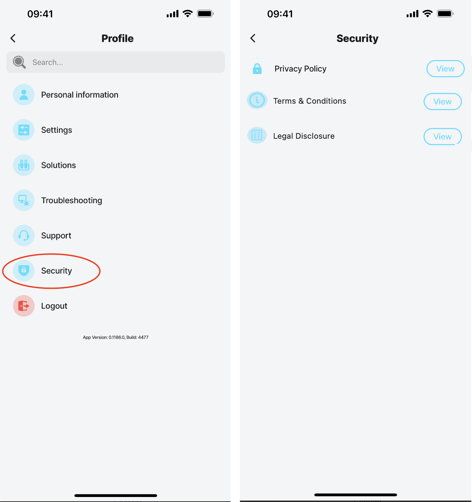
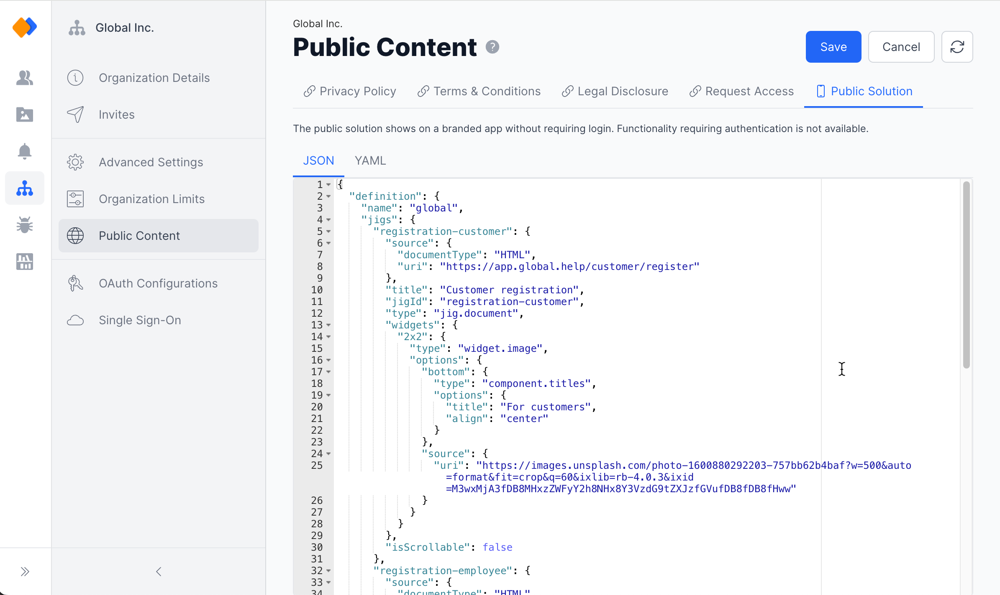

---
layout:
  width: wide
  title:
    visible: true
  description:
    visible: true
  tableOfContents:
    visible: true
  outline:
    visible: true
  pagination:
    visible: true
  metadata:
    visible: true
---

# Public Content

Public content lets you specify what is accessible to the public on your organization's branded app before a user has on boarded or logged in.

<figure><figcaption><p>Public content in app</p></figcaption></figure>

1. Configure jigs and widgets that anyone can access without needing to log in or be authorized.
2. Configure links related to security
   1. A link to your company's privacy policy.
   2. A link to your organization's website or terms and conditions for using the app.
   3. A link to your company's legal disclosure (imprint).
   4. A link allowing people to request access to the app.

<figure><figcaption><p>Public Content configuration</p></figcaption></figure>

## Considerations

* Public content is set at an organizational level and not solution level.
* Public content applies to branded apps.
* The content/links/widgets/jigs require no authorization and can be viewed by the public.
* When the Public Solution tab is configured, the intial app screen will have two options, namely,
  * _Log in_ - by logging in, you will be authenticated and have access to the solutions configured and published in Jigx Builder.
  * _Continue without logging in_ - there is no authentication and you will only see the public solution defined in the Public Solution tab.
* Limitations on using a Public Solution:
  * Cannot use REST calls as they require the Jigx authorization layer.
  * No data or Dynamic Data access.
  * No access to credentials, such as OAuth, API Key, or secrets.
* The _Public Solution_ tab is a definition file without folders.
* When submitting branded apps to the app stores for publishing it is recommended to include a Privacy Policy link as the stores might require you to provide sufficient warning to your users regarding tracking of data and cookies.
* The public content setting is not required and you can configure the nodes according to your requirements, such as privacy.

## Public Content Settings

You can add the URLs in the provided fields in the language of your choice. Multiple languages are supported.

<table><thead><tr><th width="172.3203125">Properties</th><th width="287.734375">Description</th><th>Example</th></tr></thead><tbody><tr><td>Public Solution</td><td>Configure the public solution that is shown on the branded app at the organization level that requires no login.</td><td>For example, two widgets, one for customers and the other for employees. See the example.</td></tr><tr><td>Privacy</td><td>Add the URL to your company's privacy policy. Define the URL in multiple languages, such as English (en), and German (de). The privacy settings are displayed in the app under <strong>Profile > Security</strong> and on the splash screen for branded apps.</td><td></td></tr><tr><td>Terms &#x26; Conditions</td><td>Add the URL to your company's terms of service/terms and conditions. Define the URL in multiple languages, such as English (en), and German (de).</td><td></td></tr><tr><td>Legal Disclosure</td><td>Provide a link to your company's legal disclosure page or contact/About us information.</td><td></td></tr><tr><td>Request Access</td><td>Add the URL for users to register through the app. The URL calls the Jigx api to register the user.</td><td></td></tr></tbody></table>



The public content links configuration for _Privacy Policy_, _Terms & Conditions_ and _Legal Disclosure_ are displayed in the app under **Profile > Security**.



<figure><figcaption></figcaption></figure>



## Example of a Public Solution

The Public Solution tab is a definition file configured similarly to creating the YAML in the Jigx Builder just without the folders. In the definition file the following entries are required:



1. definition
2. name
3. jigs
4. title
5. category
6. widgets



<figure><figcaption></figcaption></figure>



Simply add your JSON definition or add the YAML in the editor window. Toggle between the JSON and YAML tabs to ensure your definition is correct. Management validates values in the JSON and YAML and will provide a validation message in red at the bottom of the editor providing information regarding the issue.

<figure><figcaption><p>Public Solution JSON</p></figcaption></figure>

In the example below there are two jigs of type [document](https://docs.jigx.com/examples/readme/jig-types/jig_document). The documents are HTML pages for registering depending if you are a customer or employee. Each jig is configured with a 2x2 image widget.



```json
{
  "definition": {
    "name": "global",
    "jigs": {
      "registration-customer": {
        "source": {
          "documentType": "HTML",
          "uri": "https://app.global.help/customer/register"
        },
        "title": "Customer registration",
        "jigId": "registration-customer",
        "type": "jig.document",
        "widgets": {
          "2x2": {
            "type": "widget.image",
            "options": {
              "bottom": {
                "type": "component.titles",
                "options": {
                  "title": "For customers",
                  "align": "center"
                }
              },
              "source": {
                "uri": "https://images.unsplash.com/photo-1600880292203-757bb62b4baf?w=500&auto=format&fit=crop&q=60&ixlib=rb-4.0.3&ixid=M3wxMjA3fDB8MHxzZWFyY2h8NHx8Y3VzdG9tZXJzfGVufDB8fDB8fHww"
              }
            }
          }
        },
        "isScrollable": false
      },
      "registration-employee": {
        "source": {
          "documentType": "HTML",
          "uri": "https://app.global.help/customer/register"
        },
        "title": "Employee registration",
        "jigId": "registration-employee",
        "type": "jig.document",
        "widgets": {
          "2x2": {
            "type": "widget.image",
            "options": {
              "bottom": {
                "type": "component.titles",
                "options": {
                  "title": "I'm a Employee",
                  "align": "center"
                }
              },
              "source": {
                "uri": "https://images.unsplash.com/photo-1572021335469-31706a17aaef?w=500&auto=format&fit=crop&q=60&ixlib=rb-4.0.3&ixid=M3wxMjA3fDB8MHxzZWFyY2h8MTZ8fGVtcGxveWVlfGVufDB8fDB8fHww"
              }
            }
          }
        }
      }
    },
    "title": "Global",
    "category": "business",
    "widgets": [
      {
        "size": "2x2",
        "jigId": "registration-customer"
      },
      {
        "size": "2x2",
        "jigId": "registration-employee"
      }
    ]
  }
}
```



```yaml
definition:
  name: global
  jigs:
    registration-customer:
      source:
        documentType: HTML
        uri: https://app.global.help/customer/register
      title: Customer registration
      jigId: registration-customer
      type: jig.document
      widgets:
        2x2:
          type: widget.image
          options:
            bottom:
              type: component.titles
              options:
                title: For customers
                align: center
            source:
              uri: https://images.unsplash.com/photo-1600880292203-757bb62b4baf?w=500&auto=format&fit=crop&q=60&ixlib=rb-4.0.3&ixid=M3wxMjA3fDB8MHxzZWFyY2h8NHx8Y3VzdG9tZXJzfGVufDB8fDB8fHww
      isScrollable: false
    registration-employee:
      source:
        documentType: HTML
        uri: https://app.global.help/customer/register
      title: Employee registration
      jigId: registration-employee
      type: jig.document
      widgets:
        2x2:
          type: widget.image
          options:
            bottom:
              type: component.titles
              options:
                title: I'm a Employee
                align: center
            source:
              uri: https://images.unsplash.com/photo-1572021335469-31706a17aaef?w=500&auto=format&fit=crop&q=60&ixlib=rb-4.0.3&ixid=M3wxMjA3fDB8MHxzZWFyY2h8MTZ8fGVtcGxveWVlfGVufDB8fDB8fHww
  title: Global
  category: business
  widgets:
    - size: 2x2
      jigId: registration-customer
    - size: 2x2
      jigId: registration-employee
```


