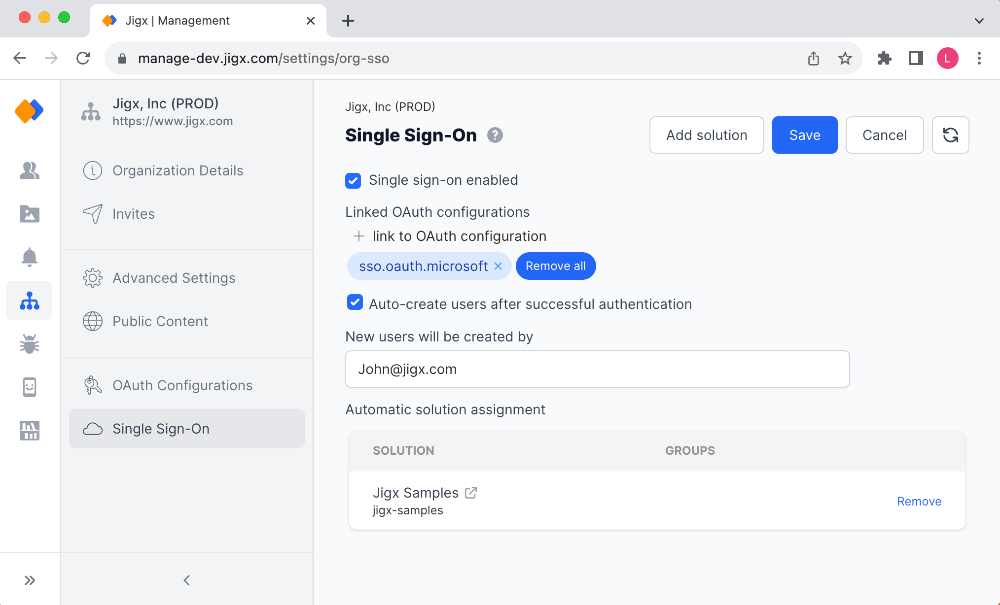
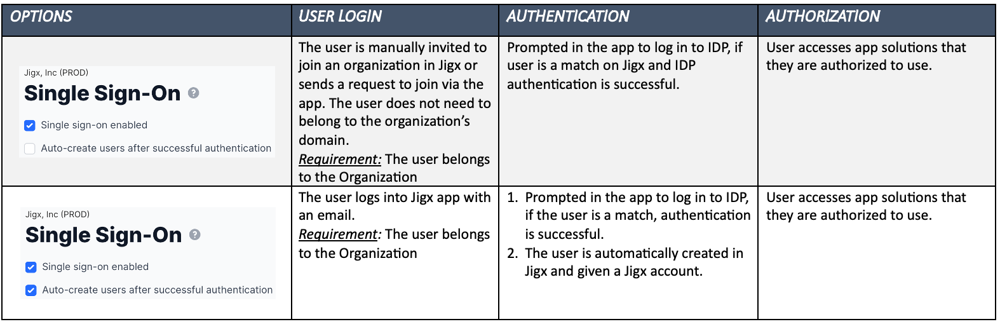
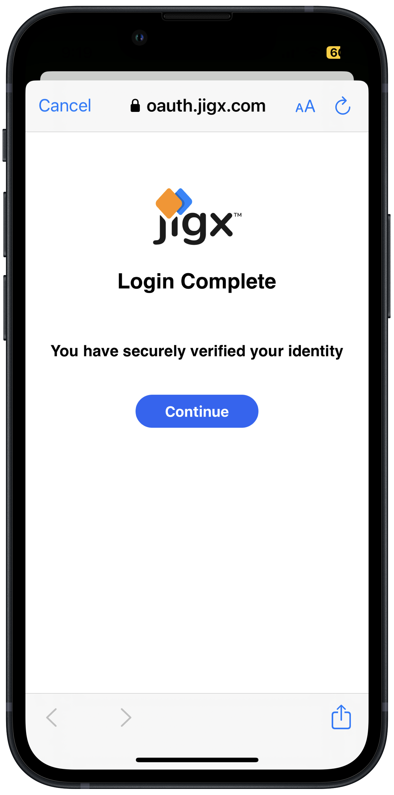
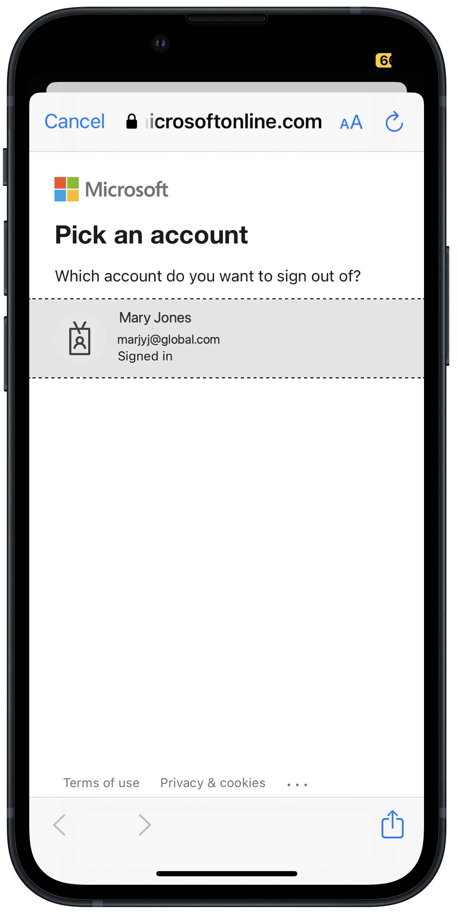

# Single Sign-On (SSO)

## Introduction

Single Sign-On is set on an organizational level in Jigx Management, allowing users in that organization to log into the Jigx App with their email address that authenticates against 3rd party identity providers (IDPs). This makes it easy for users to sign into the app with the same account (domains) used to access company systems.

SSO is only applicable when signing in to the Jigx App. To log in to Jigx Management ([https://manage.jigx.com](https://manage.jigx.com)) the organization's `OWNER` and `ADMIN` must use their Jigx accounts.

<figure><figcaption></figcaption></figure>

## Domain configuration support

Single Sign-On requires domains to be set up and associated with an organization, to view your organization's domains, see [Advanced Settings](organization-settings.md) in Jigx Management. The following scenarios are supported.

* One or more domains can be associated with a single organization
* A domain can be associated with multiple organizations
* Domains reference OAuth configuration (by Name) from [OAuth Configurations](oauth-configurations.md)
* Use a wildcard (\*) in the [OAuth Configurations](oauth-configurations.md) to reference multiple unknown domains. The OAuth configuration will be used by every account, regardless of the domain.

## Supported Identity Providers

Jigxsupports the following 3rd party identity providers:

1. Graph
2. Okta
3. OpenID
4. Auth0

## Requirement

To enable the SSO configuration, at least one OAuth configuration is required. To configure OAuth, see [OAuth Configurations](oauth-configurations.md)

## Configuring Single Sign-On

<figure><figcaption>
Single Sign-On configuration
</figcaption></figure>

The table below describes the combinations possible when enabling SSO.

<figure><figcaption></figcaption></figure>

1. In Jigx Management under the Organization icon, select the **Single Sign-On** option. You require `ADMIN` or `OWNER` permissions to see and access the organization settings.
2. Select the **Single Sign-On enabled** checkbox. The configuration options show.
3. **Required** - Click on **+ link to OAuth configuration** to open the **Choose OAuth configurations for SSO** panel on the right. Select the checkboxes next to the available OAuth configurations that you want to use with SSO. If there are no available OAuth configurations in the pane go to [OAuth Configurations](oauth-configurations.md) to set one up.
4. Selecting the **Auto-create users after successful authentication** checkbox, creates new users that sign into the Jigx App with the organization's email address as a Jigx user after authenticating the user against the 3rd party identity provider.
   * The users are automatically created with `User` rights (ability to use solutions on the app) in Jigx.
   * For Jigx to automatically create these users in an organization an email address belonging to an existing user with `Admin` or `Owner` rights must be added to the **New users will be created by** field, think of it as the organization's admin creating the users. By default the user who enables the Auto create users after successul authentication checkbox email address is shown in this field.
   * When a user joins an organization they need to sign in to the Jigx App to be auto created in Jigx.
   * If the checkbox is not selected, each user has to manually be created in Jigx before they can successfully sign in or they can request access via the app.
5. If you want users to automatically be assigned to solutions, add the solutions to the **Automatic solution assignment** list. This ensures that all users that authenticate using SSO can automatically see and use the solutions as soon as they sign in. Users will also automatically be added to any existing groups in the assigned solution. Click the **Add Solution** button at the top right of the screen. Solutions assigned here will use the [OAuth Configurations](oauth-configurations.md) configured at an organizational level.

## Sign in


{% column width="41.66666666666667%" %}
Once signed in to the app and the user is authenticated against the 3rd party identity provider a **Login Complete** screen is shown and they can continue using the solutions in the app.


{% column width="58.33333333333333%" %}
<figure><figcaption>
SSO Authenticaton successful
</figcaption></figure>



## Logout



<figure><figcaption>
IDP sign out
</figcaption></figure>



With SSO enabled when logging out of the Jigx App you are prompted to log out of the 3rd party IDP account associated with the sign in. When logging back into the app you are prompted to sign back in to the 3rd Party IDP. This is useful if the same device is shared between colleagues.



## Considerations

1. There is no system to keep Jigx and the IDPs in sync, meaning if new users join or an existing user leaves there is no automatic syncing between the IDP and Jigx. A manual task is needed to ensure the users are the same on both sides.
2. _Recommendation_: Start with setting up the [OAuth Configurations](oauth-configurations.md) before enabling SSO. To enable the SSO configuration, at least one OAuth configuration is required. The _save_ button will not be enabled if no OAuth is linked.
3. Auto-provisioning users is an optional setting, but if enabled, the email address is required in the _New users created by_ field, as well as a link to at least one solution.
4. A minimum of one OAuth configuration is required for SSO to work.
5. If multiple OAuth configurations are set to work with SSO, the user will be presented with a popup displaying the multiple SSO options. It is important to give the OAuth configuration a meaningful _Title_ as this becomes the option name presented to the user on the mobile device at login.

### See Also

[Authentication](<../../Understanding the basics/Authentication.md>)
