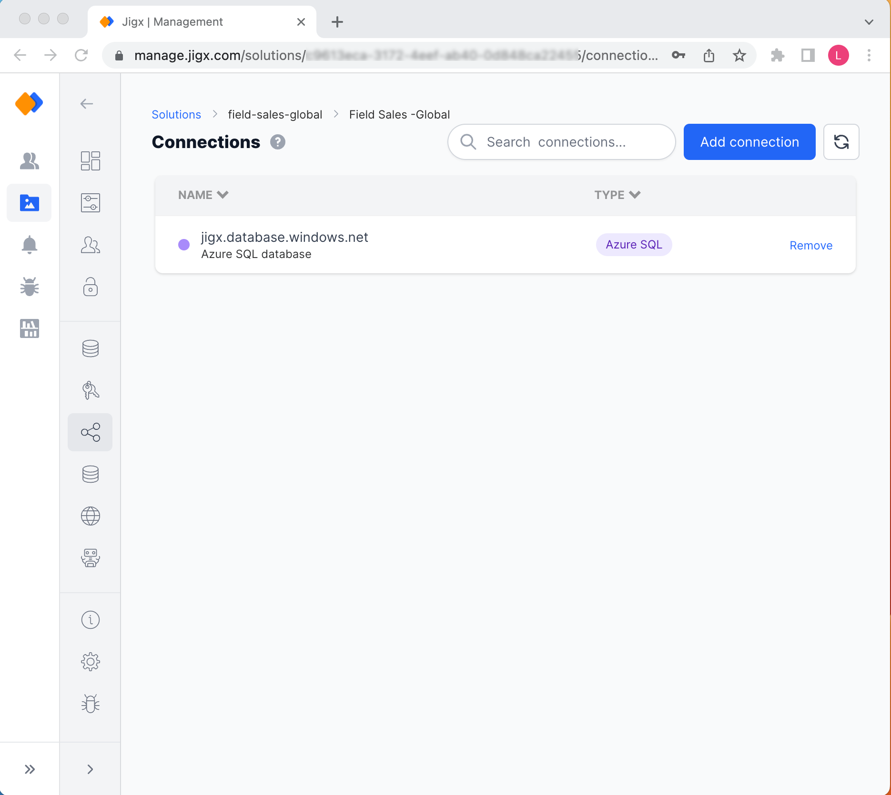
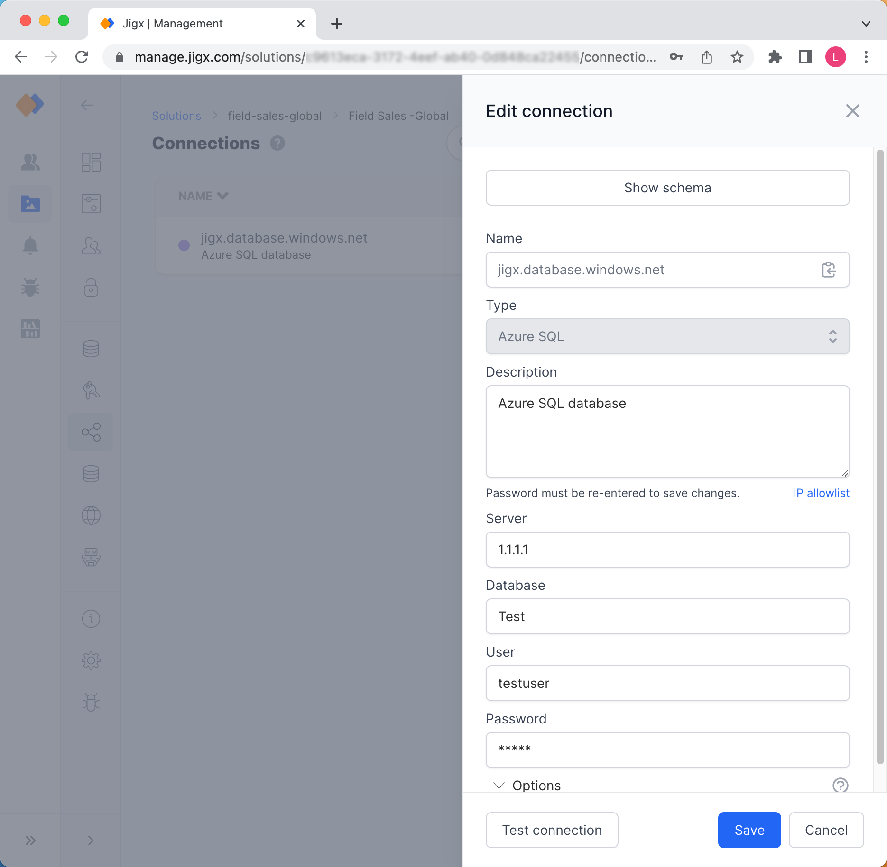

# Connections

Manage connection settings for Azure SQL database instances on the Connections tab. Solutions reference the connection using the `key`.

<figure><figcaption>
Managing Connections
</figcaption></figure>

## Adding a Connection


In order for the Azure SQL connection to function, you need to allowlist the Jigx IPs for your database instance using the Azure Portal (Azure SQL Server Instance -> Networking -> Firewall Rules). Click on **IP Allowlist** in the side pane to view the Jigx IPs you need to allowlist.


1. Click on the blue **Add connection** button to open the Add connection side pane.
2. Fill in your Azure SQL connection settings or **Show schema**. You can add additional properties for your connection using the **Options** section at the bottom. Click on the **help icon** to see a list of all available connection options you can include in the JSON schema.
3. Before clicking **Save,** click on **Test connection** to ensure that the settings are working correctly.

<figure><figcaption>
Adding a new Connection
</figcaption></figure>

## Updating a Connection

1. Click on the connection name in the list and update the configuration settings. When making changes to any setting, you must re-enter the password before you can **Save**.
2. Click **Save**.

## Removing a Connection

Click on the **Remove** link in the last column of a record. Be aware, that the functions in the solution that are referencing the connection will stop working as they cannot connect to the database connection anymore.

## Considerations

Creating a copy of a solution duplicates the structure of the credentials and connections, to allow for easy configuration by only having to respecify secrets.
