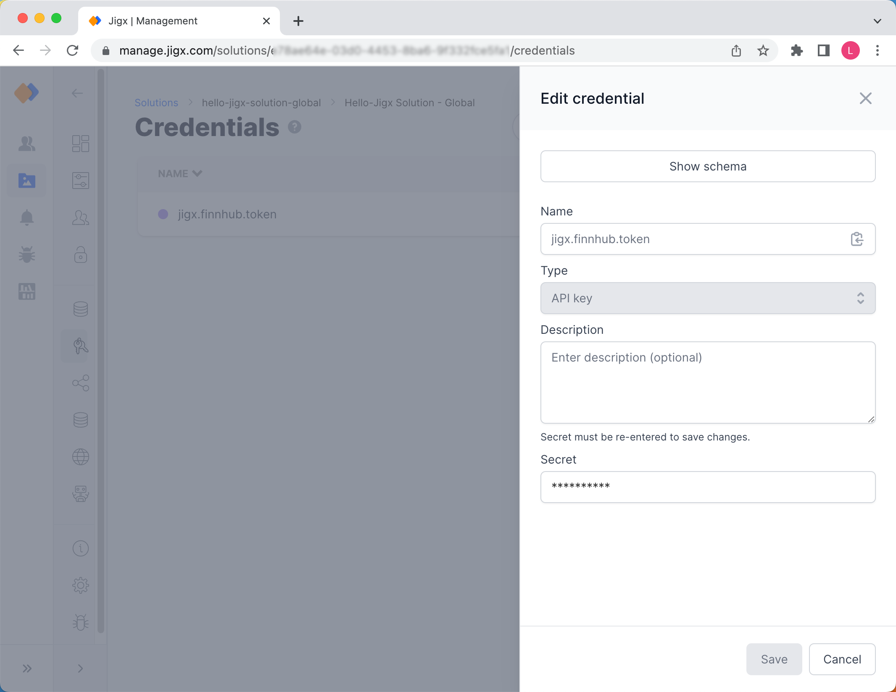

# Credentials

Jigx provides a secure credentials store in the cloud that can be used to connect to remote APIs from your solutions. Credentials are referenced within your function's definitions via `key` properties and are used at runtime to inject the credentials into the request.

<figure><figcaption>
Managing Credentials
</figcaption></figure>

## Adding Credentials

1. Click on the **Add credential** button at the top of the screen.
2. Enter a name for the credentials
3. Select the type of credentials required. There are four types of credentials available:

| **API Key**                                                                  | **Basic Auth**                                                     | **OAuth**                                                       | **Secret**                                                                 | **OAuth Alias**                                 |
| ---------------------------------------------------------------------------- | ------------------------------------------------------------------ | --------------------------------------------------------------- | -------------------------------------------------------------------------- | ----------------------------------------------- |
| A key that is used for accessing remote APIs, e.g. REST with a static secret | Basic username and password authentication, e.g. for SOAP requests | Custom OAuth provider settings and secrets, e.g. for Office 365 | Static key/ value secret used in various scenarios where you need a secret | Use the Organization's global OAuth credentials |

The `key` is the actual key that will be referenced from within the function definition of the solution, so best practice is to give it a descriptive name. In the example below it is an API key for a financial platform (finnhub.io) and therefore called _jigx.finnhub.token_.

Fill in the fields or click on **Show schema** to add the raw JSON configuration object.

## Updating Credentials

1. Click on the credential's name in the list.
2. The configuration settings display in the side panel, make the required changes.
3. Re-enter the secret/password.
4. Click **Save**.

<figure><figcaption>
Updating Credentials
</figcaption></figure>

## Removing Credentials

Click on the **Remove** link in the last column of the record to remove the credentials. Be aware that the functions in the solution that are referencing the credentials will stop working as they cannot connect to the remote API anymore.

## Considerations

Creating a copy of a solution duplicates the structure of the credentials and connections, to allow for easy configuration by only having to respecify secrets.
