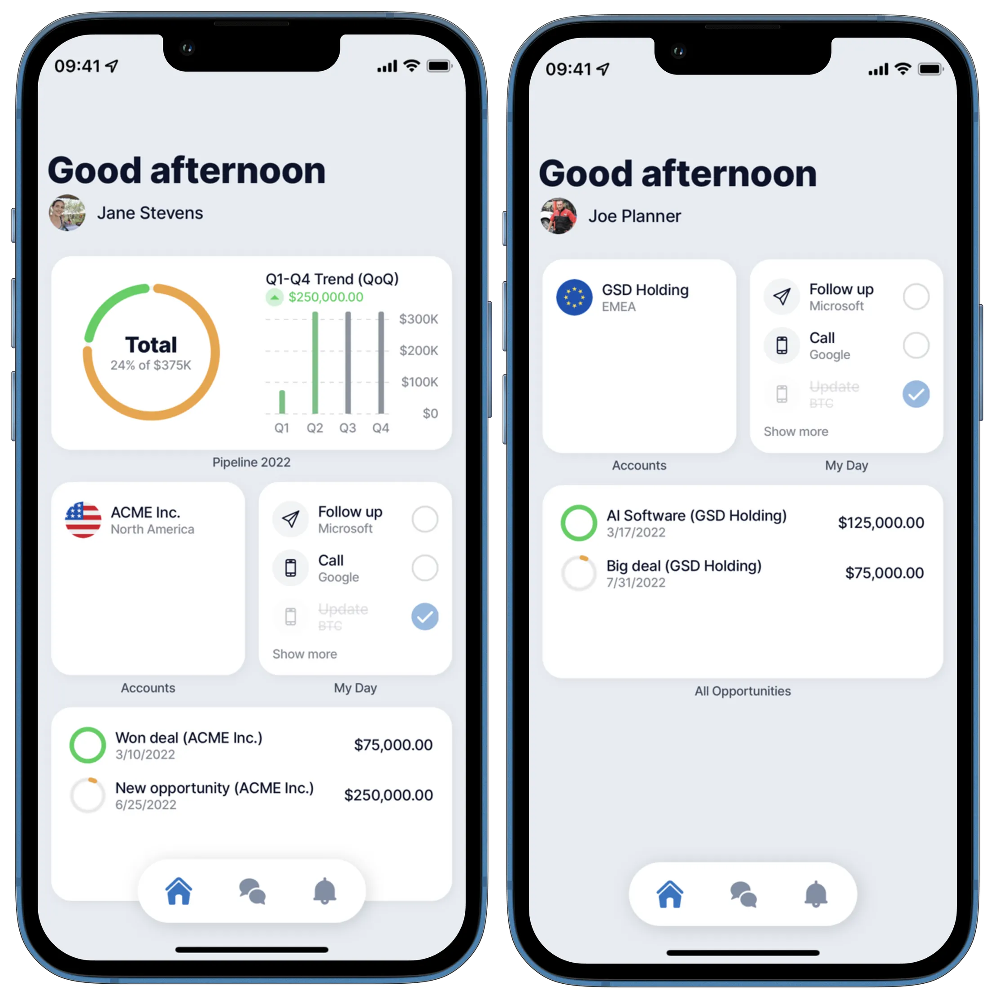
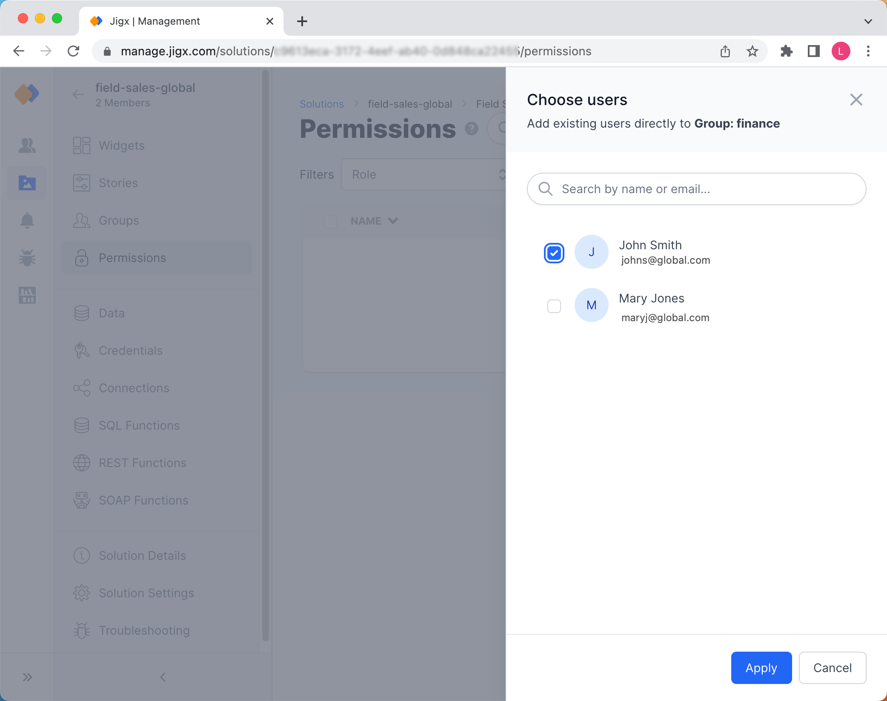

# Groups

Users who have access to a solution can be assigned to _Groups_ within the scope of that solution. _Groups_ can then be used to toggle the visibility of [Widgets](../../Administration/Solutions/Widgets.md).

For example, a CRM app configured with two Groups: Managers and _Employees_. Managers should have access to widgets that display metrics about all sales opportunities across all employees and employees should only have access to see widgets with information about their own sales opportunities.

<figure><figcaption>
Manager and Employee View
</figcaption></figure>

### Creating Groups

Groups are specific to a solution and do not appear globally in all your organization's solutions. You need to create groups per solution.

1. Click on the solution's name in the Solutions list, the solutions menu opens and the options are visible in the left navigation pane. Select the **Groups** icon.
2. Click the **Add group** button at the top right of the screen.
3. Type the name of the group to be created.
4. Click **Add**.

The new group is displayed in the list. Next you need to add users to your groups. The users you going to add to the group must have the solution assigned to their [User profile](../../Administration/Users.md).

<figure><figcaption>
Creating Groups
</figcaption></figure>

### Removing Groups

In the event that you want to remove a group from the solution, click the **remove** link next to the group in the Groups list and click **Ok** to the remove message.

You can remove groups but keep in mind that [Widgets](../../Administration/Solutions/Widgets.md) that had these groups assigned previously will be hidden to users in the removed groups.

### Adding Users to Groups

Each group requires members. The members must have access to the solution to be visible in the **Add user to group** pane.

1. Click on the name of the group you want to add users to.
2. Click on the **Add users to Group:** _Name_ button in the top right of the screen.
3. Select the checkbox of the users to be added to the group.
4. Click **Apply**.

<figure><figcaption>
Solution Groups for Managers and Employees
</figcaption></figure>

### Removing Users from Groups

Users can be removed from group membership. For example, a user changes positions in your organization and nolonger is a manager.

1. Click on the group name in the list.
2. On the **Permissions** screen, select the checkbox of the user to be removed from the group.
3. Click on the **Remove** link and click **Ok** to the remove message.
