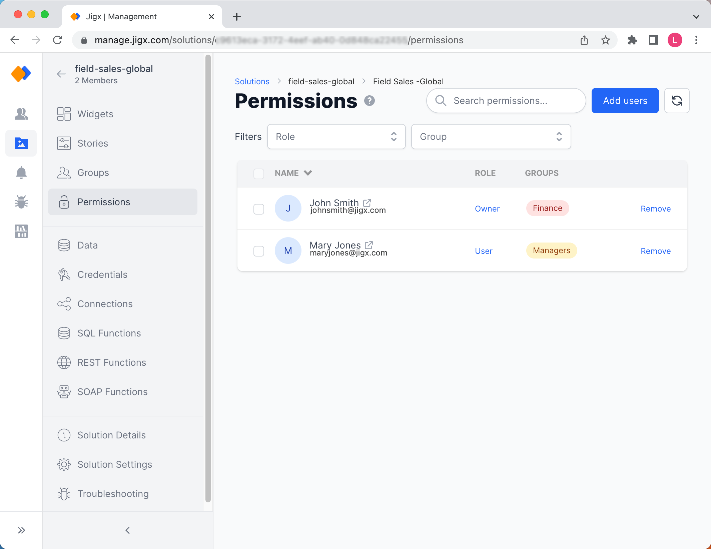
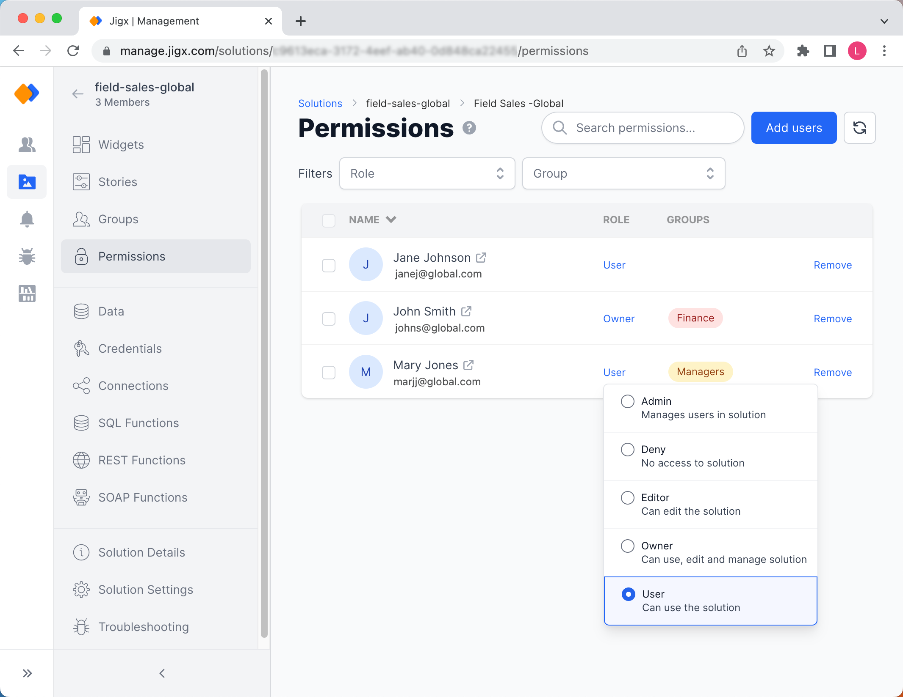
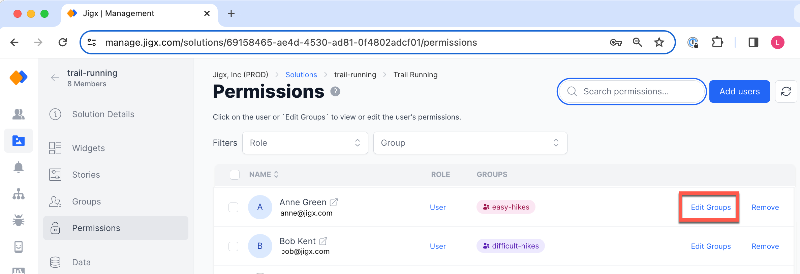

# Permissions

Access to the solution is managed on the **Permissions** tab. Here, you can give users access to the solution, define their role in the solution scope, and assign `Solution Group` membership for the visibility of [Widgets](../../Administration/Solutions/Widgets.md).

<figure><figcaption>
Managing user permissions in a solution
</figcaption></figure>

### Adding Users

1. Click on **Add Users** in the top-right of the screen to see a list of users from the organization's global user list. [Users](../../Administration/Users.md) that don't have access to the solution will not appear in the list.
2. Select the users you want to give access to.
3. Click **Apply**.

### Removing Users

To remove user's access to the solution:

1. Click on the **Remove** link in the last column next to the user you want to remove.
2. Click the red **Remove selected users** button in the top-right of the screen.
3. Click **Ok** to the message.
4. The user is removed from the list and no longer has access to the solution. The user will only be removed from the solution, but remains a user in the organization's global user list.

Bulk remove users by selecting multiple users, then click the red **Remove selected users** button at the top-right of the screen.


If you are using the **Everyone** `Organization Group` for [Widgets](../../Administration/Solutions/Widgets.md), the removed user will still have access to certain widgets although solution access has been removed for that user.


### Changing the User Role

By default a new user of the solution will be assigned to the `USER` role. See [Permissions - User Roles](<../../Administration/Permissions - User Roles.md>) to learn more about the different roles. Role assignments are instantly reflected for the user. You can elevate a role by:

1. Clicking on the **User** link in the **Role** column.
2. Select the new role to assign to the user. If you want to disable access for a user temporarily, select `DENY`.


If you want to give a user the ability to publish updates to the solution using Jigx Builder, assign either the `OWNER` or `EDITOR` role.


<figure><figcaption>
Changing the role of an user
</figcaption></figure>

### Assigning and editing group membership


Once you assigned a user a group you have to use the groups when assigning permissions for widgets. For example, if you assign the `Finance` group to users all other widgets also need to have groups, like `Manager`, assigned.


If you want to assign users to [Groups](groups.md) in your solution that will be used for toggling visibility of [Widgets](../../Administration/Solutions/Widgets.md):

1. Select the user to assign to a group.
2. Click on the **Edit Groups** link on the right.
3. In the group membership pane select the group(s) the user will be in.
4. Click **Change**.

<figure><figcaption></figcaption></figure>
