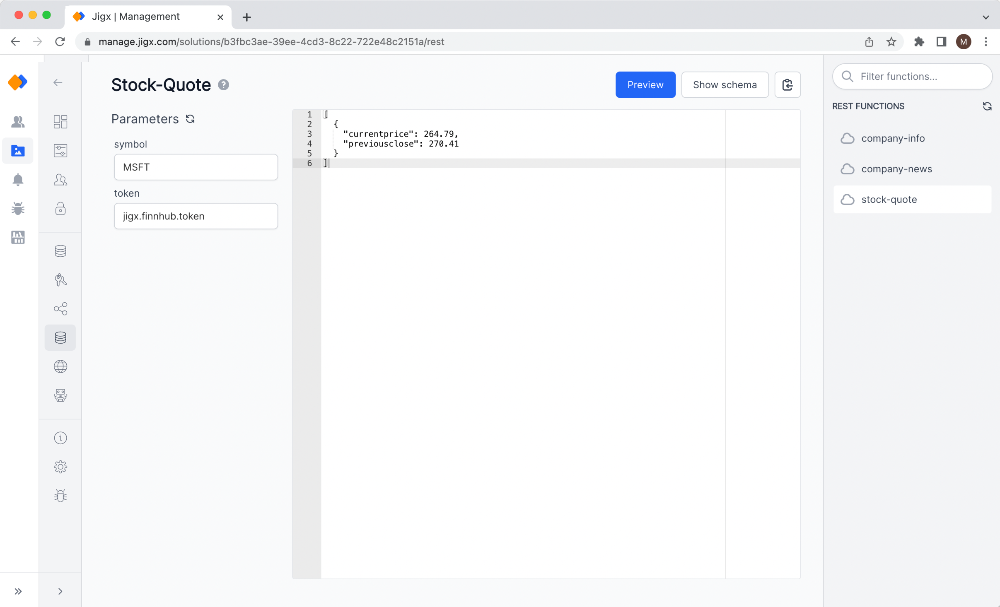

# REST Functions


REST functions are only visible in the list if the Solution Creator defined functions that use the [REST data provider](https://docs.jigx.com/rest). Make sure that credentials such as API Keys are set up correctly in [Credentials](credentials.md) if they are being referenced in the function definition.


You can try out all functions of the solutions that use the REST data provider.

1. On the left side, you will see all input parameters of the function including the initial set values such as the `key` of the credential, in the example below there is an API Key reference called jigx.finnhub.token.
2. Enter values into the input parameter fields and click the **Preview** button at the top of the screen. The JSON editor on the right side will show the results returned by the function.
3. Click on **Show schema** to view the function definition.


You can click the **copy to the clipboard** icon at the top and paste the JSON result into [JSONata Exerciser](https://try.jsonata.org/). This allows you to run and test [Expressions](../../building-apps-with-jigx/logic/expressions.md) against real REST response data.


<figure><figcaption>
Preview a REST function
</figcaption></figure>
