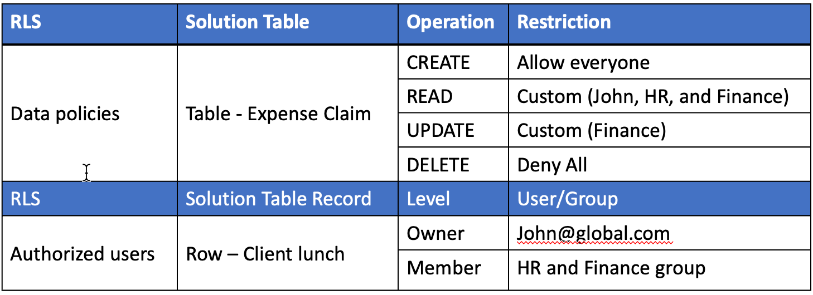
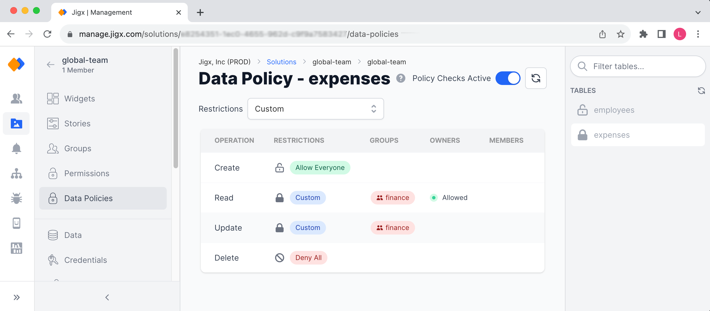
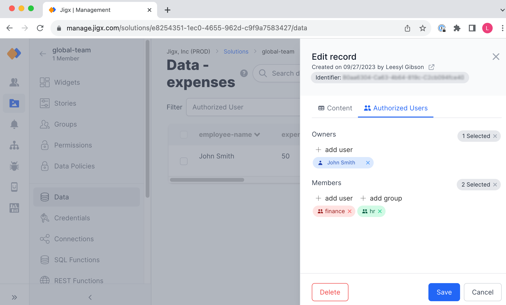

# Row Level Security

Protect and secure your dynamic data by determining the operations users can perform on the database, such as creating or deleting records and controlling users' access to the data records in the tables, for example, the ability to see sensitive information.

1. [Data policies](data-policies.md) - get set on the solution level and determine who can CREATE, READ, UPDATE, and DELETE records in a table.
2. [Authorized users](authorized-users.md) - restricts access on a granular level and determines the exact data records in a table users can see.

### Data Policy

Data policies are set per solution and table, with restrictions set per operation.

The following **operations** are available on each table:

* **CREATE** - the ability to create new records in the table
* **READ** - the operation allows users to read or list the records in a table
* **UPDATE** - the ability to update existing records in a table
* **DELETE** - allows records to be deleted from the table

The following **restrictions** are configurable on each operation, or you can set the restriction on the solution level which is applied to app operations:

* **Custom** - configure which groups, owners, or members can perform an operation
* **Allow everyone** - grants all users of the solution rights to perform an operation
* **Deny all** - prevents all users of the solution from performing an operation

### Authorized Users

Valid Jigx user's email addresses and solution groups are used to define explicit access to each data record by assigning either the `Owner` or `Member` rights. Multiple users and groups can be assigned to each record.

1. `Owner`- by default, is the person who created the record; for example, the currently logged-in user in the app creates a record by completing a field on a form. That person becomes the owner of the record. Only email addresses can be used to grant `Owner` rights.
2. `Member` - A combination of email addresses and groups can be used to grant access to users.

### Considerations

* Setting data policies and authorized users on dynamic data tables is a powerful mechanism for controlling data access at a very granular level, ensuring that users can only see and interact with the data they are authorized to access.
* Plan your data policies before configuring them to ensure the correct users and groups can perform the correct operations and access the required data records.
* Important - In a custom restriction data policy, if you add a group to `Members`, all users in that group can see all records in the table.
* Data policies take precedence over authorized user settings. When setting both test to ensure you are getting the expected results.

### Configuration

#### In Jigx Management

1. Data policies are configured under the **Data Policies** menu option found in each Solution's configuration menu in Jigx Management.
2. Authorized users are configured in the **Data** menu option in the **Authorized Users** tab of each individual data record in each Solution's table.

#### In Jigx Builder

**Authorized users** can be configured in the YAML in Jigx Builder by specifying values for the `Owner` and `Member` keys in the CREATE and UPDATE methods on `action.execute-entity` and `action.submit-form` for the `data_provider_Dynamic`.


```yaml
actions:
  - children:
      - type: action.submit-form
        options:
          formId: expense-form
          provider: DATA_PROVIDER_DYNAMIC
          title: Create Record
          entity: default/charts
          method: create
          goBack: previous
          authorized:
            members:
            - 'hr-group'
            - 'finance-group'
            - 'mary@global.com'
            owners:
            - =@ctx.components.email.state.value   
```


### Example use case

Your organization has an employee app that provides certain self-service options, such as updating employee details, submitting an expense claim or leave request, or seeing the number of available leave days. Each employee can only access and interact with their own records in the associated table. HR must be able to access and interact with certain records, plus the Finance team must be able to approve the expense claim, for example.

Let's take the expense claim for employee John and see the configuration.

<figure><figcaption><p>Employee Expense Claim</p></figcaption></figure>

<figure><figcaption><p>Data policy in Management</p></figcaption></figure>

<figure><figcaption><p>Authorized User in Management</p></figcaption></figure>
