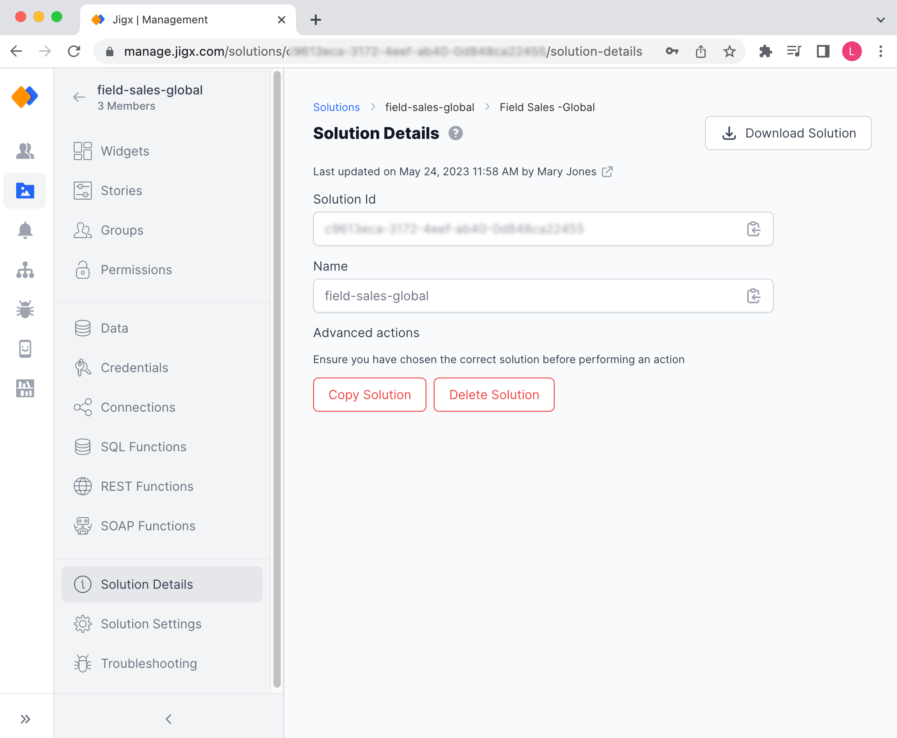
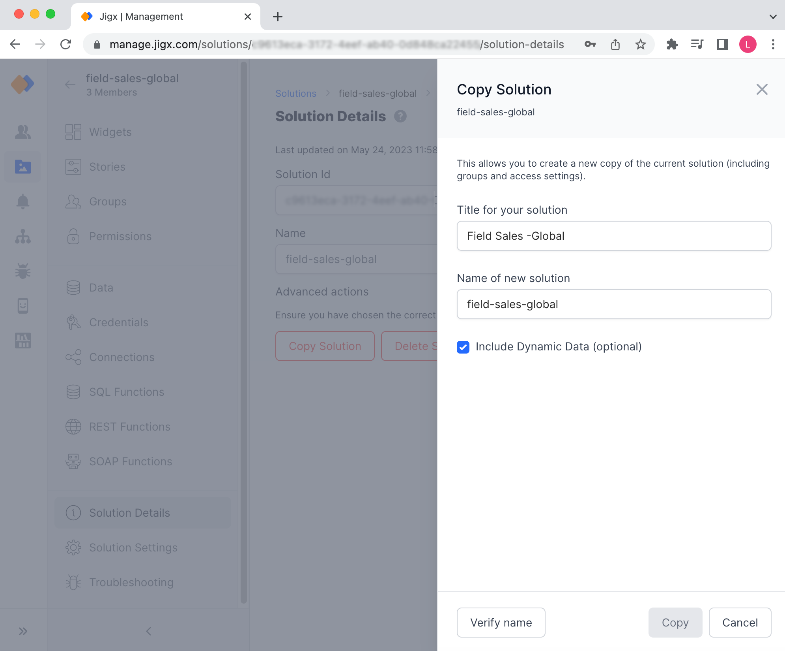

# Solution Details

The _Solution Detail_ screen provides details about your solution such as the _name_ and _Solution Id_ that can be copied to a clipboard for use elsewhere. From this screen, you can manage the _deleting_ of the solution and _download_ a zip file of the solution.


The _Solution Details_ and [Solution Settings](solution-settings/solution-settings.md) tab function together, enabling settings on one will make new options visible and available for configuration on the other tab.


<figure><figcaption>
Solution Detail screen
</figcaption></figure>

### Download Solution

Before deleting your solution it is good practice to make a backup of the solution. Click the _Download Solution_ button in the top right-hand corner of the screen, and a zip file will be downloaded to your local machine.

The following is **not** included in the downloaded solution zip file:

* Permissions
* Credentials
* Connections
* Dynamic Data - To backup your Dynamic Data navigate to the [Data](data.md) tab in Jigx Management and export the data to a CSV file for each table.

### Advanced actions

Advanced actions allow the solution Owner to copy or delete the solution. Copying a solution is helpful if you want to base a new solution on the current solution and extend the functionality. Deleting a solution that is no longer in use or required keeps your organization's solution assets clean and up to date.

#### Delete the Solution

Deleting the solution requires that you have solution _Owner_ permissions. When you delete a solution the following actions occur:

* The solution is deleted from the Jigx Cloud
* The solution is removed from all the applicable user's profiles in Jigx Management
* The solution is removed from all applicable users' Jigx App on their mobile devices
* All [Dynamic Data](../../building-apps-with-jigx/data/data-providers/dynamic-data/dynamic-data.md) associated with the solution is deleted

#### Copy Solution

Making a copy of a solution has many benefits to speed up the development process in an organization.

<figure><figcaption>
Create a copy of solution
</figcaption></figure>

By default, the _Copy Solution_ button is not visible. To enable this feature follow the steps below:

1. Navigate to the [Solution Settings](solution-settings/solution-settings.md) tab.
2. In the Allow copy of solution dropdown, select either **Within current organization** or **To any organization**.
3. Check the **Permit copy of data** if you want to copy the solution's data along with the solution definition.
4. Click **Save**.
5. Navigate back to the Solution Details tab, the red **Copy Solution** button will be visible.
6. Click the red **Copy Solution** button, and give the solution a new or updated **title.**
7. Verify the name is available by clicking on the **Verify name** button.
8. Choose to include or exclude the current solution's data with the copy. This option is only visible if you checked the **Permit copy of data** checkbox in step 3 above.
9. Once copied the new solution is displayed in the [Solutions](solutions.md) list.
10. For audit purposes the copied solution's details page will have a field displaying the solution GUID of the orginal solution.
