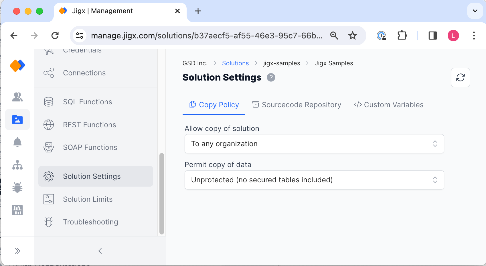

# Solution Settings

The solution settings feature is extremely useful, as it speeds up the development process by allowing a copy of the solution to be made, with or without the existing solution's data. For example, if you have a Global HR solution and you want to create Regional HR solutions based on the global solution, you can simply copy the Global HR solution as a base and then extend it in Jigx Builder including the regional requirements.


The _Solution Settings_ and [Solution Details](../solution-details.md) tab function together, enabling settings on one will make new options visible and available for configuration on the other tab.


<figure><figcaption>
Solution Settings screen
</figcaption></figure>

### Copy Policy

The settings on this screen include:

* **Allow copy of solution** - By default the option is set to _Off_.
  * **Within current organization** - enables copying the solution to the organization you are currently using in Jigx Management
  * **To any organization** - enables you to choose when you copy the solution which organization you want it copied to. The list of organizations you belong to will be displayed when you copy the solution
* **Permit copy of data** - Select whether the data of the solution can be copied. You can copy data unprotected or protected.
  * **Unprotected** - only tables without [Data policies](../row-level-security/data-policies.md) restrictions will be copied.
  * **Protected** - includes all data, regardless of the data policy setting. This allows the solution owner to determine what can be copied without having to disable the current policies to accomplish it.

The following is **included** when copying a solution:

* Data (if selected)
* Permissions
* Groups, and access settings

The following is **not** included when copying a solution:

* Credentials
* Connections Once you have made your selection on this screen go to the [Solution Details](../solution-details.md) screen and use the red Copy solution button.

### Sourcecode repository

Store the details of your Jigx solution's sourcecode repository, allowing people to easily find the details and contribute to the solution.

### Custom variables

Defining custom variables enables you to create reusable values that can be dynamically controlled, for example production or development environment details. For more information see [Custom variables](custom-variables.md).
