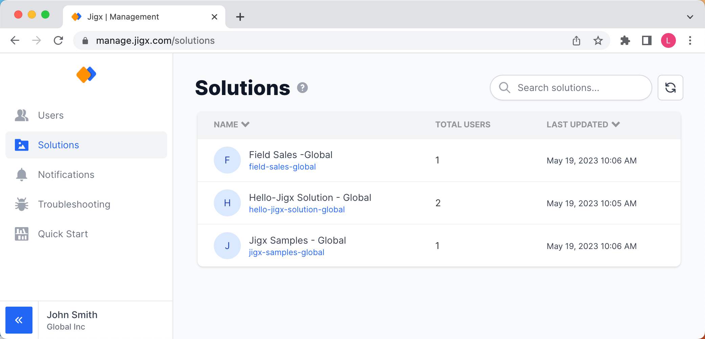
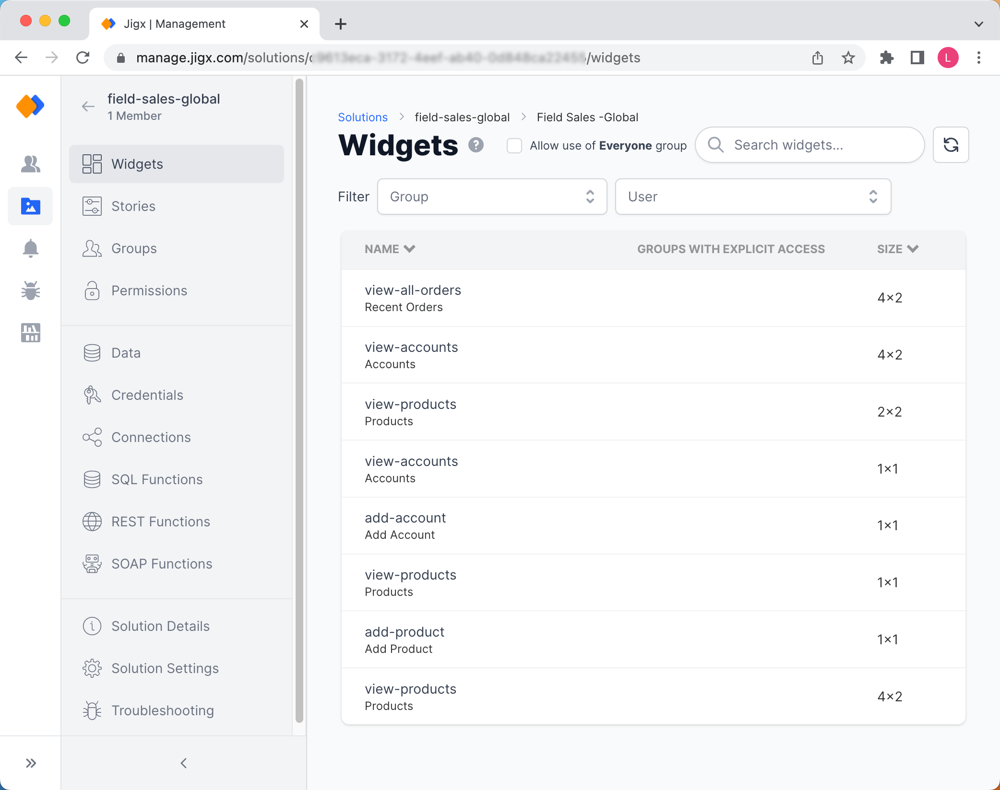
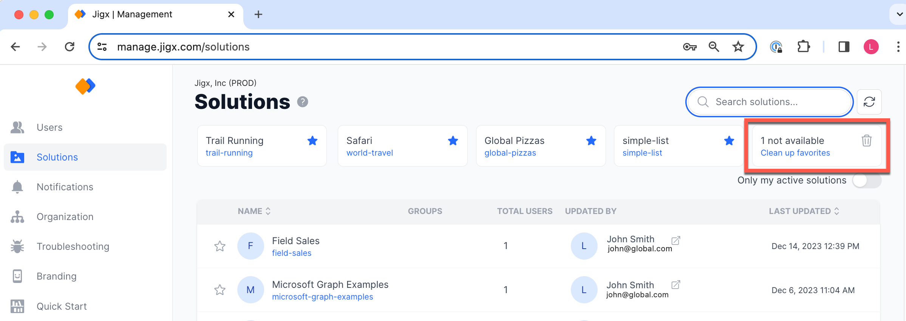

# Solutions

In the **Solutions** area, you can view and manage all solutions in your organization. You need sufficient user rights to manage specific solutions. Refer to [Permissions - User Roles](<../../Administration/Permissions - User Roles.md>) to get an overview of the different roles and permissions.

Solutions must be published from Jigx Builder to show up in the solutions list of Jigx Management. Please refer to [Publish your project](../../getting-started/create-an-app-from-scratch/create-the-calendar/publish-your-project.md) to understand how to publish a solution.

<figure><figcaption>
Solutions Area
</figcaption></figure>

### Managing a solution

<figure><figcaption>
Managing a solution
</figcaption></figure>

Click on the solution's name in the list, the solutions menu opens and the options are visible in the left navigation pane. Here you can manage various features and settings of the solution. These include:

* [Groups](groups.md)
* User [Permissions](permissions.md) and group memberships
* [Data](https://docs.jigx.com/data) stored in Dynamic Data tables
* [Credentials](credentials.md) such as API Keys
* [Connections](connections.md) such as Azure SQL DB connections
* [SQL Functions](sql-functions.md) / Stored Procedures including a "Run now" feature
* [REST Functions](rest-functions.md) including a "Run now" feature
* [SOAP Functions](soap-functions.md) including a "Run now" feature

### Favorite solutions

Pin your favorite solutions by clicking on the star icon. The solution moves to the section above the list. Favorites are always visible even while you scroll or search you will always have easy access. Your latest favorite solution will appear first, the list allows you to pin 5 solutions to make it manageable. The star icon also functions as a toggle to add or remove favorites.

<figure><figcaption>
Pin Favorite Solutions
</figcaption></figure>

Clean up your favorites or remove favorite entries that are no longer available. This is useful when a solution is deleted, or you no longer have access to see the solution in the list. Only the last 5 solutions pinned as favorites are tracked, this option provides a quick indicator that a frequented solution from management is no longer available.

<figure><figcaption>
Cleanup favorites
</figcaption></figure>
