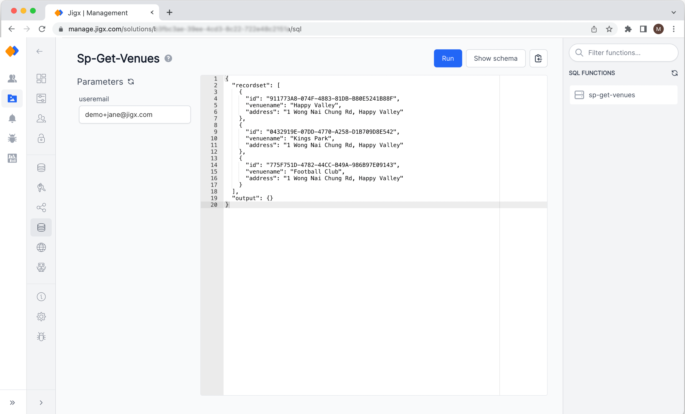

---
layout:
  width: wide
  title:
    visible: true
  description:
    visible: true
  tableOfContents:
    visible: true
  outline:
    visible: true
  pagination:
    visible: true
  metadata:
    visible: true
---

# SQL Functions


SQL functions are only visible in the list if the Solution Creator defined functions that use the SQL data provider, see [Microsoft Azure SQL](../../building-apps-with-jigx/data/data-providers/microsoft-azure-sql/microsoft-azure-sql.md). Make sure that your SQL connection is set up correctly in [Connections](connections.md).&#x20;


You can try out all functions of the solutions that use the SQL data provider.

1. On the left side, you will see all input parameters of the function including the initial set values.
2. Enter values into the input parameter fields and click the **Run** button at the top of the screen. The JSON editor on the right side will show the results returned by the function.
3. Click on **Show schema** to view the function definition.


You can click the **copy to the clipboard** icon at the top and paste the JSON result into [JSONata Exerciser](https://try.jsonata.org/). This allows you to run and test [Expressions](../../building-apps-with-jigx/logic/expressions.md) against real SQL result data.


<figure><figcaption>
Run a SQL function
</figcaption></figure>
