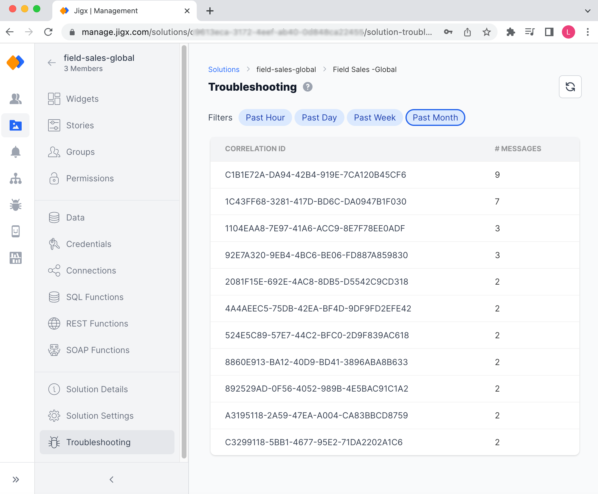

# Troubleshooting (Solution)

Troubleshooting in Jigx Management helps identify problems when an app crashes, or when issues and errors occur while using and running solutions on the Jigx App. Think of this as runtime troubleshooting performed by support or your organization's administrator versus design time debugging which is available in the Jigx Builder for creators who are building solutions.

**Permissions required**: Solution Owner or Organization Owner

<figure><figcaption>
Solution troubleshooting
</figcaption></figure>

### Jigx Management troubleshooting levels

There are three levels of troubleshooting in Jigx Management.

1. [Troubleshooting (Organization)](docId:pQc4nyhx_9tTLoyDm4MVu) - provides troubleshooting context for all users and solutions in that organization. The exact Correlation ID is required to start troubleshooting.
2. [Users](docId:hy9SNgXQZpRAbe51imv7Q) - provides troubleshooting context only for that specific user, and spans across all solutions assigned to that user
3. [Troubleshooting (Solution)](docId:tzQJID9go54bvHZap88co) - provides troubleshooting context only for that specific solution, and spans across users using that solution. When clicking on the Correlation ID the next level of detail shows who the user was at the top right of the screen.

* **Filters** - Filter by time period to find a specific or Correlation ID to troubleshoot
* **Correlation ID** - appears on the mobile device in the Jigx App. Using the ID in the troubleshooting section helps you identify the specific entry in the log and helps you follow the user's journey while using the solution in the app
* **Messages** - provides the number of messages logged for that specific Correlation ID

Information that is logged is determined by the settings in the Jigx App. By default, all users Troubleshooting app settings have Error and crash logging enabled.

### Configure logging on the Jigx App

<figure><figcaption>
Solution troubleshooting
</figcaption></figure>

To configure logging on the mobile device perform the following steps:

1. Open the Jigx App on your mobile device
2. Click on your **Profile icon** in the top right-hand corner of the app
3. Tap **Troubleshooting**
4. The following settings are configurable:
   * **Error and crash logging** - enabled by default. Logs any errors displayed while using the app and logs when the app crashes
   * **Basic logging** - logs basic flow when using the solutions in the app
   * **Detailed logging** - logs errors, app crashes, and flow of the app, and exposes some data. Tap on the field to see the available categories. Enable the categories you require, use the _Selected_ tab to see what is enabled.
     * _Debug categories_ - select from the listed categories
     * _Trace Categories_ - Select from the listed categories

### Use troubleshooting information

Troubleshooting allows you to drill down into the detail logged for each Correlation ID.

1. Click on the **Correlation ID** to drill down to see the log information.
2. The following levels are logged depending on the troubleshooting settings enabled on the mobile device: - WARNING - ERROR - DEBUG - INFO
3. **Category** - shows the area where the issue occurred such as REST-provider, action.sync.entities, or jig.default.
4. **Message**: Provides exact details of the issue such as execute failed, or Failed to sync entity 'user-profile/get-user..'.
5. Click on a specific level entry in the list to drill down into the log detail. The side pane opens displaying the solution Id, correlation Id, device id, App id, message, and additional parameters.
6. Use the copy to clipboard icon to use the values elsewhere.

### Download log

Clicking the Download log button downloads a CSV file to your local machine.
