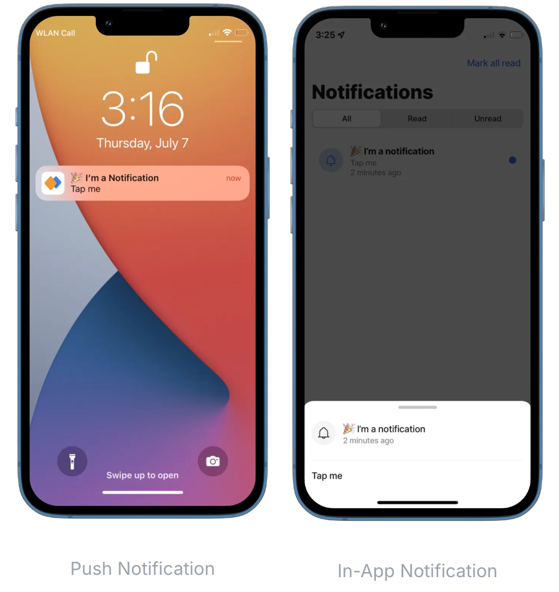

---
layout:
  width: wide
  title:
    visible: true
  description:
    visible: true
  tableOfContents:
    visible: true
  outline:
    visible: true
  pagination:
    visible: true
  metadata:
    visible: true
---

# Notifications

Notifications are a powerful way to grab your user's attention. With Jigx, notifications appear on the user's device as push and in-app notifications.

<figure><figcaption></figcaption></figure>

There are three different ways to create notifications:

## Send notifications using Jigx Management

Read the documentation about [Notifications](../../Administration/Notifications.md) in the Administration section to learn more about managing notifications using Jigx Management.

## Send notifications programmatically

You can send notifications from within your solution to other users. There are two elements to include in your solution in order to send notifications:

* **Function**: To communicate with the Jigx (or any other) REST API, you have to define a function in the _Functions_ folder of your solution. The function has input parameters such as the notification `title`, the notification `text` and requires a Jigx `accessToken` or [personal access token (PAT)](<../../Administration/My profile.md>) .
* When calling the function within Jigx use the Jigx `accessToken`, when calling the function from outside Jigx use the personal access token. Your personal access token is available in Jigx Management/ User/ Personal Access Tokens.
* **Jig**: Your jigs will invoke the function for sending notifications either via submitting form values to the function or by using an [execute-entity](https://docs.jigx.com/examples/readme/actions/execute-entity) action for invoking the function.

### Function

You can use the Jigx REST API to send notifications to other users within your organization.

Add a function definition (_send-notification.jigx_) to the _functions_ folder of your solution Replace the {organizationId} in the `url` with your organization's Id.

See the code sample in [GitHub](https://github.com/jigx-com/jigx-samples/blob/main/quickstart/jigx-samples/functions/Notifications/send-notification.jigx).


```yaml
provider: DATA_PROVIDER_REST
method: POST
url: https://kdiqmco762.execute-api.us-east-1.amazonaws.com/default/organizations/{organizationId}/notifications
inputTransform: >-
  $.{
    "content": {
      "title":title,
      "text":text,
      "jigId":jigId,
      "screen":"jig" 
    },
    "scope":scope,
    "emails":emails,
    "description": "description",
    "solutionId": solutionId
  }
parameters:
  solutionId:
    type: string
    location: body
    required: false
  jigId:
    type: string
    location: body
    required: false
    value: notification-form
  deviceId:
    location: body
    type: string
    required: true
    value: jig
  command:
    location: body
    type: string
    required: false
    value: createNotification
  organizationId:
    location: path
    type: string
    required: true
  scope:
    location: body
    type: string
    required: false
    value: USR
  emails:
    location: body
    type: array
    required: true
  title:
    location: body
    type: string
    required: true
  text:
    location: body
    type: string
    required: true
  accessToken:
    location: header
    type: jigx
    value: jigx
    required: true
```


### Calling the Function from a Jig

In your jig, you can either invoke the above function using an [execute-entity](https://docs.jigx.com/examples/readme/actions/execute-entity) action or by submitting a form using [submit-form](https://docs.jigx.com/examples/readme/actions/submit-form). Sending notifications using an [execute-entity](https://docs.jigx.com/examples/readme/actions/execute-entity) action gives you more control over what's being sent to the function.

### Target a Jig with Input Parameters

You can also target a specific jig with input parameters from your push notification. An example of this would be a notification about a new product promotion with the promotion detail jig as the target. When the user taps on the notification (either on the native push notification or the in-app notification), the app will navigate to the specific promotion:

For this, you need a REST function definition, a Jig that invokes the REST function, and a target jig that will be displayed when the user taps on the notification. See [Notifications](https://docs.jigx.com/examples/readme/notifications) for the code example.

## Send notifications using Jigx notification endpoint

See [External push notifications (API)](https://docs.jigx.com/examples/readme/notifications/external-push-notifications-_api_) for more information and examples.

## Send notifications using a Webhook

For external systems that should send Jigx notifications you can use Webhooks provided by the Jigx platform.

Reach out to the _Jigx Support team_ to receive the technical details and security credentials for your organization to get started with Webhooks.


You can find the above examples in the [jigx-samples app](https://github.com/jigx-com/jigx-samples/tree/main/quickstart/jigx-samples/jigs/guide-notifications) on Github.


## Examples and code snippets

The following examples with code snippets are provided:

* [Notification sent when submitting a form](https://docs.jigx.com/examples/readme/notifications)
* [Send notification with execute-entity](https://docs.jigx.com/examples/readme/notifications)
* [End notification with a target jig with input parameters](https://docs.jigx.com/examples/readme/notifications)
* [Send notification to users (USR)](https://docs.jigx.com/examples/readme/notifications/external-push-notifications-_api_/send-notification-to-users-_usr_)
* [Send notification to all solution users (SLN)](https://docs.jigx.com/examples/readme/notifications/external-push-notifications-_api_/send-notification-to-all-solution-users-_sln_)
* [Send notification to solution groups (SLN\_GRP)](https://docs.jigx.com/examples/readme/notifications/external-push-notifications-_api_/send-notification-to-solution-groups-_sln_grp_)
* [Send notification to the organization (ORG)](https://docs.jigx.com/examples/readme/notifications/external-push-notifications-_api_/send-notification-to-the-organization-_org_)
* [Target a specific jig with inputs](https://docs.jigx.com/examples/readme/notifications/external-push-notifications-_api_/target-a-specific-jig-with-inputs)
