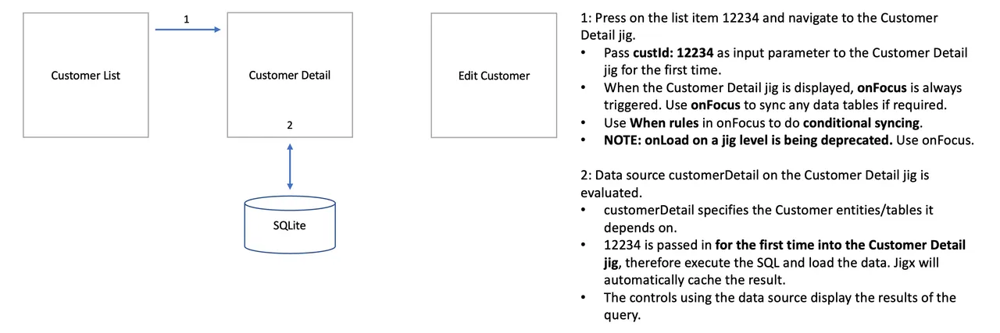
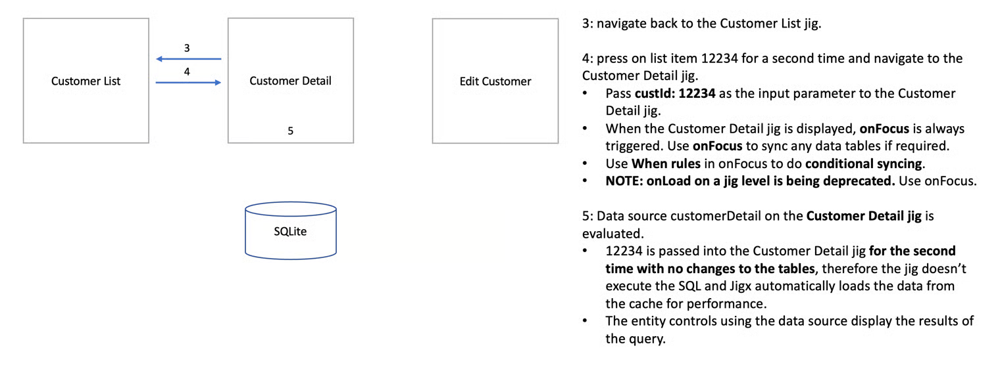
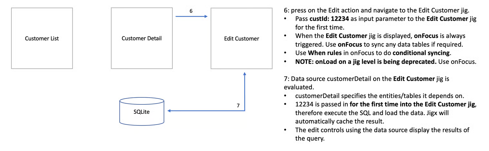
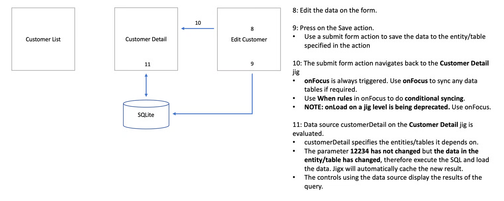

# Data lifecycles in Jigx

Understanding the data lifecycle in a Jigx solution is essential to help you plan your data calls and when and why to make them. The diagrams below describe when and why data is loaded when a jig is accessed.

### Navigating to a Jig for the first time

<figure><figcaption></figcaption></figure>

### Navigating to the same jig a second time

<figure><figcaption></figcaption></figure>

### Editing the record

<figure><figcaption></figcaption></figure>

### Navigating back to view the edited record

<figure><figcaption></figcaption></figure>
