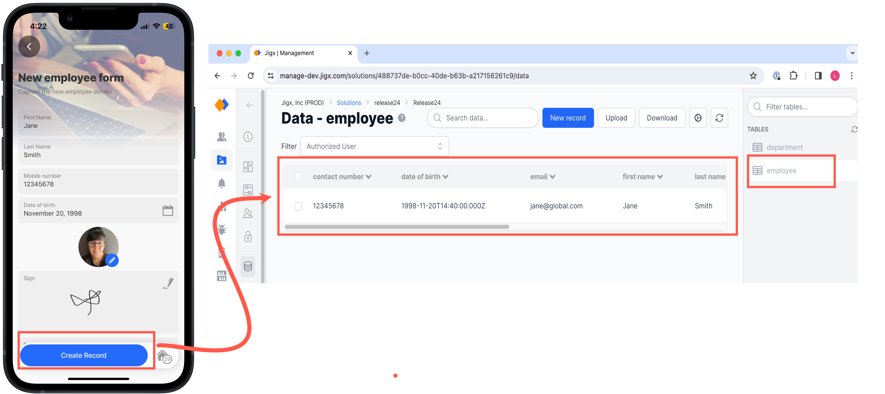
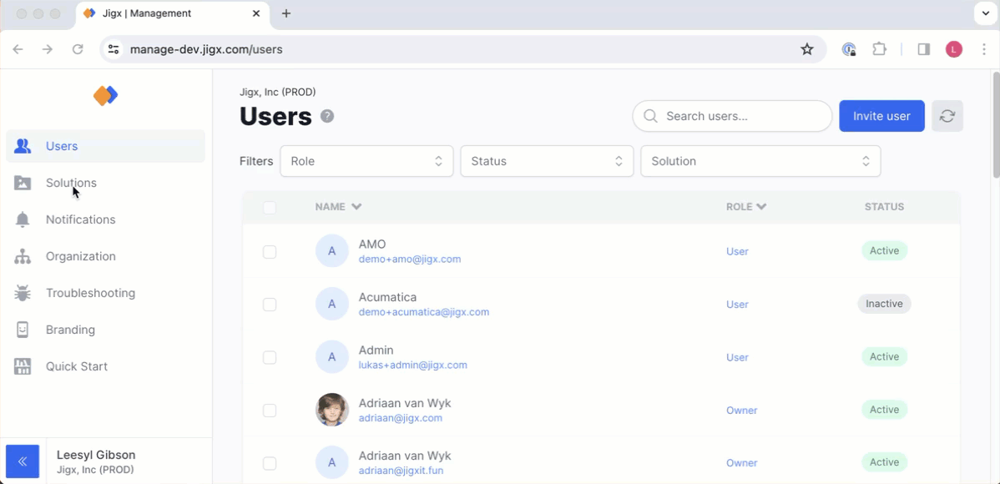
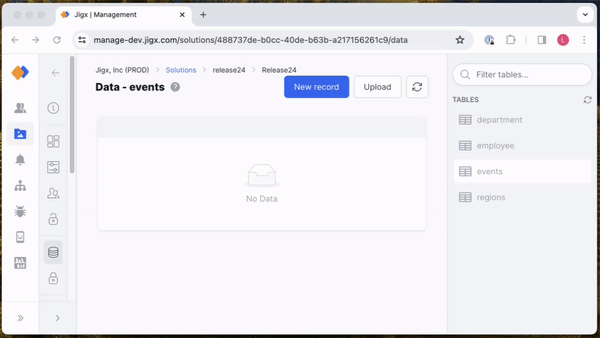

# Creating columns & data records

There are three methods to create columns in Dynamic Data tables, and it all depends on where your data comes from if it is pre-existing or new data to be added while the app is in use.

1. Create a jig in Jigx Builder with the columns and save data to your table.
2. Create your columns and data manually in Jigx Management.
3. Import your data from a CSV or JSON file using the [Jigx Management](https://manage.jigx.com/).


Jigx does not recommend storing images in Dynamic Data (via any conversion), as the max file size per record is 350K.&#x20;


## Creating columns and records via Jigx Builder

You can create columns in the table by creating a jig, then define the columns you require in the table by using the Dynamic Data provider's `create` or `save` method. Here are scenarios commonly used to create columns and data from a jig.

### Create a [**form**](https://docs.jigx.com/examples/readme/components/form) and use the [**submit form**](https://docs.jigx.com/examples/readme/actions/submit-form) action

In this scenario, the `formId` in the `component.form` is used in the `submit-form` action to get context to the property `instanceId`. Each value used in the `instanceId` becomes the column's name in the table. The `entity` property specifies the table to add the columns and data to.


&#x20;The columns and data records are created when the form is completed and submitted on the mobile device and not at the time of publishing the solution in Jigx Builder.


<figure><figcaption><p>Form creates column and data record</p></figcaption></figure>

1. Add a `component.form` to a jig and give it a `formId`.
2. Add any of the available form properties, such as [text-field](https://docs.jigx.com/examples/readme/components/text-field), [date-picker](https://docs.jigx.com/examples/readme/components/date-picker), [number-field](https://docs.jigx.com/examples/readme/components/number-field).
3. Add the `submit.form` action.
4. Specify the same `formId` used in the `component.form`.
5. Use the `DATA_PROVIDER_DYNAMIC` with the `create` or `save` method.
6. In the `entity` property, specify the table where the columns and data must be added.
7. Publish the solution.
8. Open the solution in Jigx App and complete the form, click the submit button.
9. Browse to Jigx Management> _solution_ >data> _table_ to see the new record and columns.


```yaml
title: New employee form
description: Capture the new employee details
type: jig.default

header:
  type: component.jig-header
  options:
    height: medium
    children:
      type: component.image
      options:
        source:
          uri: https://unsplash.com/photos/black-smartphone-LNlzd-Y7orw

children:
  - type: component.form
  # used in the submit-form action to get context to the property instanceId.
    options:
    instanceId: form-employee 
      children:
        - type: component.text-field
          instanceId: first_name # becomes the name of the column in table
          options:
            label: First Name
        - type: component.text-field
          instanceId: last_name # becomes the name of the column in table
          options:
            label: Last Name
        - type: component.number-field
          instanceId: contact_number # becomes the name of the column in table
          options:
            label: Mobile number
        - type: component.date-picker
          instanceId: date_of_birth # becomes the name of the column in table
          options:
            label: Date of birth
        - type: component.avatar-field
          instanceId: photo # becomes the name of the column in table
          options:
            label: My profile
        - type: component.signature-field
          instanceId: signature # becomes the name of the column in table
          options:
            label: Sign
        - type: component.email-field
          instanceId: email # becomes the name of the column in table
          options:
            label: Email address

actions:
  - children:
      - type: action.submit-form
        options:
          # Used to get context to the property instanceIds.
          formId: form-employee 
          # Dynamic data provider
          provider: DATA_PROVIDER_DYNAMIC 
          # Creates data and the columns if they do not already exist.
          title: Create Record 
          # Specify the table to create the data and columns in.
          entity: default/employee 
          # Use create or save.
          method: create 
          onSuccess:
            type: action.go-back
```


### Use [execute-entity](https://docs.jigx.com/examples/readme/actions/execute-entity) or [execute-entities](https://docs.jigx.com/examples/execute-entities) action to create columns and data records

In this scenario you can use actions in a jig that interact with data to add columns and data records. The columns and data are configured in the `data:` property the action.Use the following actions with the Dynamic Data provider's `create` and `save` methods:

* `action.execute-entity` - used to add a **single** data record
* `action.execute.entities` - used to add **multiple** data



```yaml
type: action.execute-entity
        options:
          provider: DATA_PROVIDER_DYNAMIC
          entity: default/department
          method: create
          data:
            department_name: =@ctx.current.item.department
            manager_name: =@ctx.current.item.manager
            email: =@ctx.datasources.company_contacts.email
```



```yaml
type: action.execute-entities
        options:
          provider: DATA_PROVIDER_DYNAMIC
          entity: default/department
          method: create
          data:
            department_name: =@ctx.current.item.department
            manager_name: =@ctx.current.item.manager
            email: =@ctx.datasources.company_contacts.email
```



## Creating columns in Jigx Management

### Manually create columns and data records

<figure><figcaption><p>Creating columns</p></figcaption></figure>

1. Open [Jigx Management](<../../../../Administration/Management Overview.md>), navigate to your solution and select the **Data** option.
2. Click on the table you want to add a record to in the right-hand **Tables** pane.
3. Click on the blue **New record** button. If you already have records in the table, you will see all existing columns of all records.
4. In the **New record** pane add the data values for each column.
5. **Add new columns** to your record by defining a column name and clicking on the **+** button next to the new column name. As you add data in the column the field displays the type under the entry, such as number, string or boolean.
6. Enter data values in the column fields and click **Save**.


You do not need to specify an rid column. Dynamic Data will create a GUID based id column for you automatically. You can optionally view the rid column by selecting the settings button and checking the id column as a visible column.


### Importing data using a JSON or CSV file

If you have pre-existing data or a large data set with multiple records to add to a table you can import the data by uploading a CSV or JSON file that will create the columns and populate the data records.

<figure><figcaption><p>Add data with JSON file</p></figcaption></figure>

1. Open [Jigx Management](<../../../../Administration/Management Overview.md>), navigate to your solution and select the **Data** option.
2. Click on the table you want to add a record to in the right-hand **Tables** pane.
3. Click on the **Upload** button at the top of the screen.
4. By default the JSON upload window is shown. You can toggle to upload CSV using the **Switch to CSV** button in the top right. Provide the property name for the unique identifier, otherwise by default the rid (GUID based id) property will automatically be created for you. Drag and drop the file in the designated area.
5. Click **Save**.
6. For CSV uploads select the type of **comma-delimited** used in the **CSV file.** Drag and drop the file in the designated area.
7. Click **Add**.
8. Click **Save**.

## Examples and code snippets

The following examples with code snippets are provided:

* [Creating Dynamic Data](https://docs.jigx.com/examples/readme/data-providers/dynamic-data/creating-dynamic-data)
* [Reading Dynamic Data](https://docs.jigx.com/examples/readme/data-providers/dynamic-data/reading-dynamic-data)
* [Updating Dynamic Data](https://docs.jigx.com/examples/readme/data-providers/dynamic-data/updating-dynamic-data)
* [Deleting Dynamic Data](https://docs.jigx.com/examples/readme/data-providers/dynamic-data/deleting-dynamic-data)

## See Also

[Using Dynamic Data](using-dynamic-data.md)
