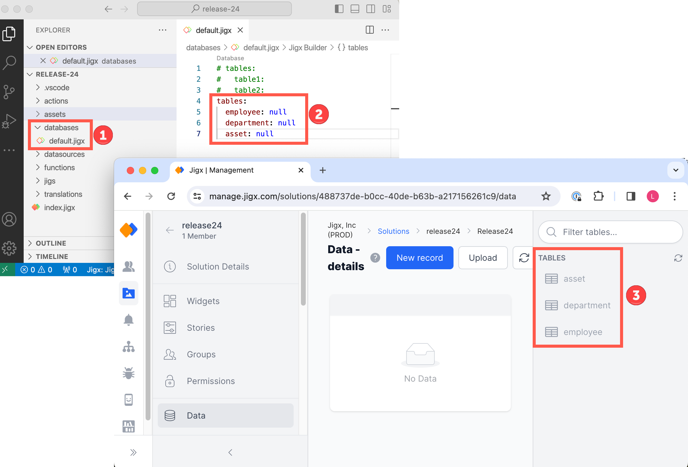

# Creating tables

First step in creating Dynamic Data for a solution is to create the tables that the solution requires. Tables are created in a solution in Jigx Builder in the _default.jigx_ file located in the _database_ folder. All tables are created under the default database. Follow the steps below to create tables:

<figure><figcaption>
Tables in Dynamic Data
</figcaption></figure>

1. Open an existing solution or [create a new solution](../../../jigx-builder-code-editor/create-a-new-jigx-solution.md) in Jigx Builder.
2. Expand the database folder and click on the **default.jigx** file.
3. Use IntelliSense (ctrl+space) in the editor, select **tables**, and press enter.
4. Type the name of your table and provide a null value, for example, `employee: null`. Take note of the table name formats below:
   * Table names must be in lowercase
   * The first character must start with a letter
   * The name can contain alphanumeric or symbols '-' and '\\\_'
   * You can include "-" dash , "\_" underscore and digits as per the regex: "^\[a-z]\[a-z0-9\_-]{0,28}\[a-z0-9]$"
   * The name cannot contain spaces
   * The name cannot end with special characters
   * The length must be between 2-50 characters
5. Add multiple tables by adding the table names under each other in the default.jigx file.
6. [Publish](../../../jigx-builder-code-editor/publishing-a-solution.md) the solution to create the tables.
7. In [Jigx Management](<../../../../Administration/Management Overview.md>) browse to your solution and navigate to the [Data](https://docs.jigx.com/data) menu to view your tables. Note that only the tables have been created; next, you must create the [columns and data](creating-columns-_-data-records.md).

## Considerations

* If _default.jigx_ does not exist, simply use the file / new capability to add a new file called _default.jigx_ and place it within a folder called databases as per the VS Code folder layout shown in the image at the top of this page.
* If you remove a table in the default.jigx file and publish the solution, the table becomes _unused_ in the solution. To include the table and it's records again in the solution, simply add the table back to the default.jigx file and republish the solution.
* A table must be _unused_ before you can [delete ](deleting-tables.md)the entire table.

## Examples and code snippets

The following examples with code snippets are provided:

* [Creating Dynamic Data](https://docs.jigx.com/examples/readme/data-providers/dynamic-data/creating-dynamic-data)
* [Reading Dynamic Data](https://docs.jigx.com/examples/readme/data-providers/dynamic-data/reading-dynamic-data)
* [Updating Dynamic Data](https://docs.jigx.com/examples/readme/data-providers/dynamic-data/updating-dynamic-data)
* [Deleting Dynamic Data](https://docs.jigx.com/examples/readme/data-providers/dynamic-data/deleting-dynamic-data) (deletes records in the Dynamic Data table)

## See also

[Creating columns & data records](creating-columns-_-data-records.md)
