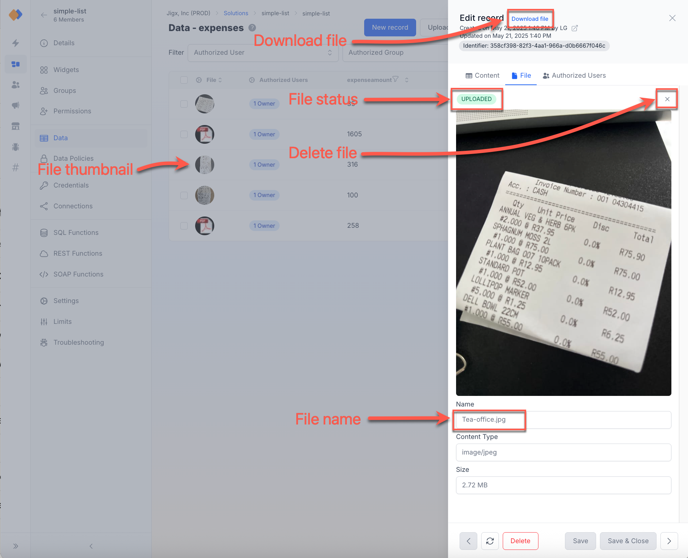

---
layout:
  width: wide
  title:
    visible: true
  description:
    visible: true
  tableOfContents:
    visible: true
  outline:
    visible: true
  pagination:
    visible: true
  metadata:
    visible: true
---

# Dynamic files

Dynamic Files extend Jigx's Dynamic Data entities to include file references, allowing files to be securely stored and associated with records. Files are physically stored in Amazon S3, offering a combination of simplicity, security, and portability.

For example:

* For an expense claim scenario, create an _Expense_ record in Dynamic Data.
* Capture the expense detail and attach the receipt file to the _Expense_ record.

## Key Functionalities

### Uploading Files

* The `create` method of the `Dynamic Provider` uploads files to Amazon S3.
* One file is linked/associated with one record, which means that the `execute-entity` action is used for the upload.
* Use the [media-field](https://docs.jigx.com/examples/readme/components/media-field) component to select files for upload or upload a file to the record in _Management>solution>data>table>record>file_.
* Specify a `localPath` for the file.
* Specify a `fileName` with the file extension. If a `fileName` is not provided, the system extracts it from the `localPath`.


```yaml
actions:
  - children:
      - type: action.action-list
        options:
          title: Submit
          isSequential: true
          actions:
            - type: action.execute-entity
              options:
                provider: DATA_PROVIDER_DYNAMIC
                entity: default/expenses
                # Use the create method to upload files.
                method: create
                goBack: previous
                data:
                  expenseitem: =@ctx.jig.components.expenseitem.state.value
                  expenseamount: =@ctx.components.expenseamount.state.value
                # Specify the file to be uploaded.
                file: 
                  localPath: =@ctx.components.expenseimage.state.value
```


### Deleting Files

* Delete a file by executing the standard `delete` entity method in an `execute-entity` action.
* To delete a file from an entity record, you call `save` or `update` and set the `file` property to `null`, or `localPath` to `null`.


```yaml
onPress: 
  type: action.execute-entity
  options:
     provider: DATA_PROVIDER_DYNAMIC
     entity: default/expenses
     # Use the update method to delete files.
     method: update
     goBack: stay
     data:
       id: =@ctx.current.item.id
     # Set the file to null which deletes the file.  
     file: null                                     
```


### Downloading Files

* Files can be downloaded via the `download` method using the entity `id` in an `execute-entity` action.
* The file is downloaded to a local cache on the device, and the entity record's `localPath` property updates to reflect the local download location.
* You will not be able to browse to it on the device.
* Use a `datasource` query to access the downloaded file using properties available on a downloaded file. See the available properties in the _datasource-query_ code example below. The datasource allows you to use the thumbnail URI from the server, for faster loading and lower bandwidth.The full file for high-resolution, detailed viewing or editing. As well as storing the file in the cache (localPath) to cater for offline use, and repeated requests for the same file. Depending on your requirement will determine which properties to include in the datasource query.



```yaml
actions:
  - type: action.execute-entity
    options:
      provider: DATA_PROVIDER_DYNAMIC
      entity: default/expenses
      # To download the file, you execute the download method,
      # and provide the entity id.
      method: download
      goBack: stay
      data:
       id: =@ctx.current.item.id              
```



```yaml
# File properties available to query a downloaded file.
datasources:
  expenses-ds:
    type: datasource.sqlite
    options:
      provider: DATA_PROVIDER_DYNAMIC
      entities:
        - default/expenses
      query: |
        SELECT
          id,
          '$.expenseitem',
          json_extract(file, '$.localPath') as localPath,
          json_extract(file, '$.fileName')  as filename,
          json_extract(file, '$.uploadProgress')  as uploadProgress,
          json_extract(file, '$.downloadProgress')  as downloadProgress,
          json_extract(file, '$.hash'),
          json_extract(file, '$.status') as status,
          json_extract(file, '$.contentType'),
          json_extract(file, '$.contentLength'),
          json_extract(file, '$.thumbnail.base64') as thumbnail,
          json_extract(file, '$.thumbnail.contentType'),
          json_extract(file, '$.thumbnail.contentLength')
        FROM [default/expenses]
        ORDER BY '$.expenseitem'
```



## File Status Tracking

* A system table, `_fileStatus`, tracks a file's upload or download progress.
* This can be used to `join` or `query` directly to check the status of a file operation.
* The progress column is updated as the file is uploaded/downloaded.
* Errors during operations update the status to `failed`, and these can be retried using `action.retry-queue-command` with the corresponding `commandId` from the `_fileStatus` table.



```yaml
title: File Progress
type: jig.list
icon: move-down
  
data: =@ctx.datasources.file-status-ds
item:
  type: component.list-item
  options:
    title: =@ctx.current.item.fileName
    color:
      - color: color11
        when: =(@ctx.current.item.progress >= 1)
      - color: color2
        when: =(@ctx.current.item.progress >= 75 and @ctx.current.item.progress < 100)
      - color: color1
        when: =(@ctx.current.item.progress < 75 and @ctx.current.item.progress > 30)
      - color: color8
        when: =(@ctx.current.item.progress <= 30)
    # Display the progress of uploading files.    
    description: =@ctx.current.item.progress & '%'
    label:
      title: =@ctx.current.item.uploadstatus
    progress: >
      =@ctx.current.item.progress != null ? (@ctx.current.item.progress / 100) :
      0
    swipeable:
      left:
        - color: primary
          icon: pencil-2
          label: Retry
          onPress:
            # Configure the retry action to process the files on the queue.
            type: action.action-list
            options:
              isSequential: true
              actions:
                - type: action.retry-queue-command
                  options:
                    id: =@ctx.current.item.commandId
```



```yaml
datasources:
  file-status-ds:
    type: datasource.sqlite
    options:
      provider: DATA_PROVIDER_LOCAL
      # Query the system _fileStatus properties to configure the progress of files. 
      entities:
        - _fileStatus
        - default/expenses
      query: |
        SELECT
          e.id,
          '$.expenseId',
          e.timestamp,
          json_extract(e.file, '$.localPath') as localPath,
          json_extract(e.file, '$.fileName')  as fileName,
          fs.commandId as commandId,
          fs.progress as progress,
          fs.state as uploadstatus
        FROM [_fileStatus] AS fs
        LEFT JOIN [default/expenses] AS e ON
        e.id = fs.id
        ORDER BY e.timestamp
      queryParameters:
        expenseId: =@ctx.jig.inputs.expenseId
```



## File Permissions

Permissions are managed at the solution level in Jigx Management and Jigx Builder based on a records [Row Level Security](../../../administration/solutions/row-level-security/row-level-security.md):

* `Ownership` and `membership` are specified at the record level.
* Multiple `owners`/`groups` can be assigned.

See [Row Level Security](../../../administration/solutions/row-level-security/row-level-security.md) and [Data policies](../../../administration/solutions/row-level-security/data-policies.md) for more information.

**Permissions Configuration Example:**

```yaml
actions:
  - children:
    - type: action.execute-entity
      options:
        title: Submit Expense
        provider: DATA_PROVIDER_DYNAMIC
        entity: default/expenses
        # Use the create method to upload files.
        method: create
        goBack: previous
        data:
          expenseitem: =@ctx.jig.components.expenseitem.state.value
          expenseamount: =@ctx.components.expenseamount.state.value
        # Specify the file to be uploaded.
        file: 
          localPath: =@ctx.components.expenseimage.state.value  
          fileName: =@ctx.components.fileName.state.value 
        # Set the permissions (Row level security) on the record, 
        # the permissions will be applied to the file.    
        authorized:
          owners:
            - "frank@global.com"
          members: 
            - "finance"
```

## Thumbnails and File Display

Consider when and how the files are used in the app. Thumbnails are useful when displaying a preview or list view where speed matters more than quality and you want to minimize bandwidth and memory usage. The code snippet below uses the thumbnail (base64 string) if available, otherwise, it uses the local file path. If neither is available, it returns nothing (null). The datasource query includes the thumbnail and local path:



```yaml
leftElement:
  element: avatar
  text: ""
  uri: |
    =@ctx.current.item.thumbnail != null ? 'data:image/png;base64,' & @ctx.current.item.thumbnail :
    @ctx.current.item.localPath != null ? @ctx.current.item.localPath
```



```yaml
# File properties available to query to use in the expression file.
datasources:
  expenses-ds:
    type: datasource.sqlite
    options:
      provider: DATA_PROVIDER_DYNAMIC
      entities:
        - default/employees
      query: |
        SELECT
          id,
          '$.avatar',
          json_extract(file, '$.localPath') as localPath,
          json_extract(file, '$.fileName')  as filename,
          json_extract(file, '$.thumbnail.base64') as thumbnail
        FROM [default/employees]
```



## Jigx Management

Files and their detail are visible in Management and are associated with a record.

<figure><figcaption><p>Dynamic Files</p></figcaption></figure>

1. Locate the [Data](../../../administration/solutions/data.md) tab.
2. Click on a record and select the **File** tab.
3. The file **status**, **thumbnail**, **name**, **content type** and **size** are displayed.
4. To download the file from Management, use the **Download file** link at the top of the record.
5. To delete a file, click the **X** next to the file preview.
6. To view the file thumbnail in the table, ensure **File** is checked in the **Column settings** pane.

## Examples and code snippets

1. [Upload a file](https://docs.jigx.com/examples/readme/data-providers/dynamic-files/upload-a-file)
2. [Download a file](https://docs.jigx.com/readme/data-providers/dynamic-files/download-a-file)
3. [Delete a file](https://docs.jigx.com/examples/readme/data-providers/dynamic-files/delete-a-file)
4. [Status of a file](https://docs.jigx.com/examples/readme/data-providers/dynamic-files/status-of-a-file)
