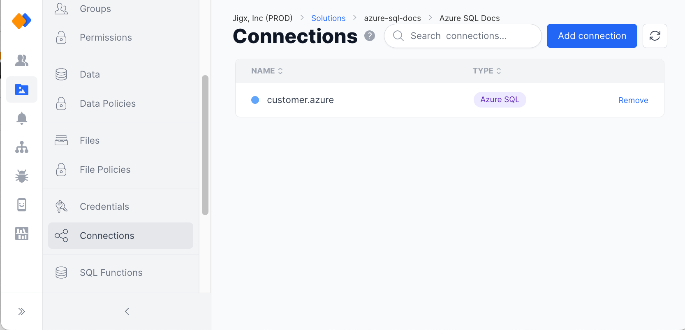
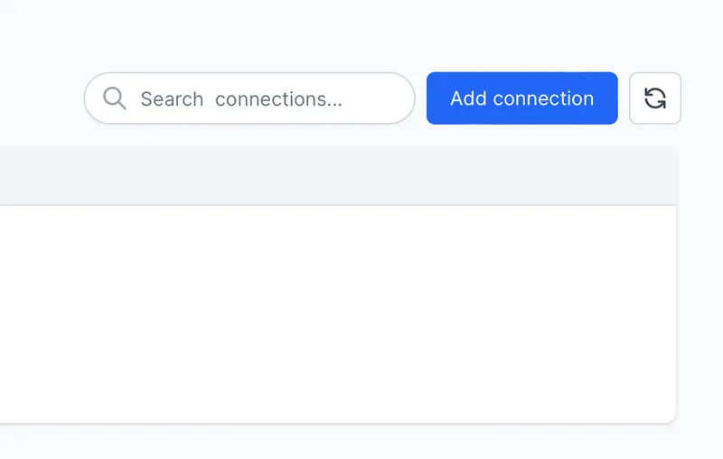
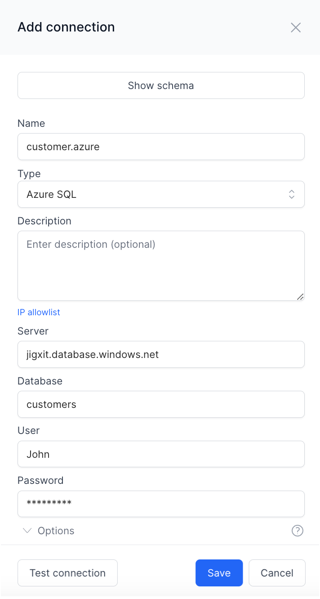
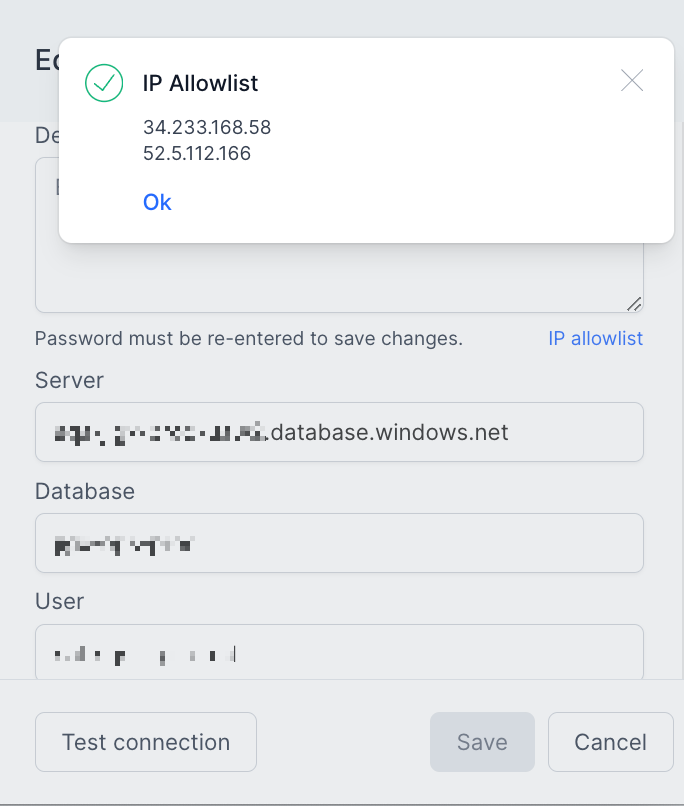
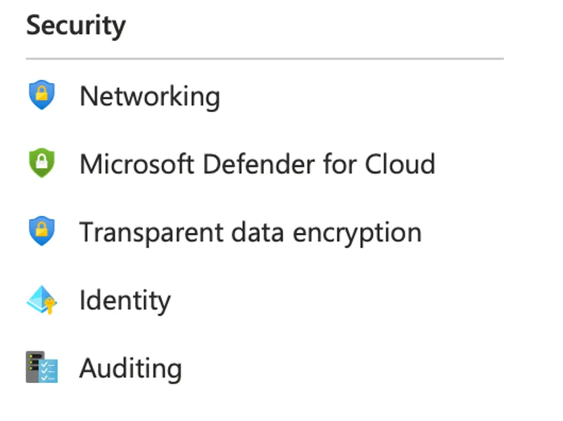
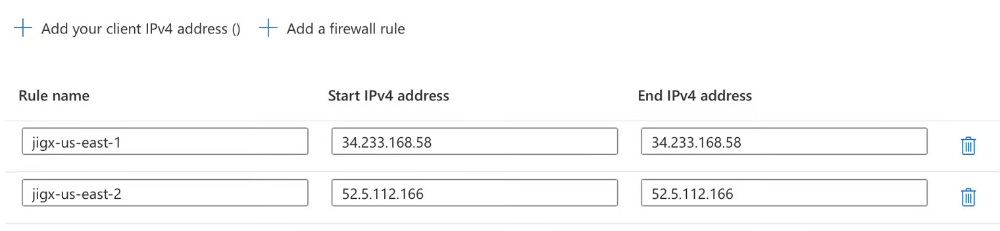
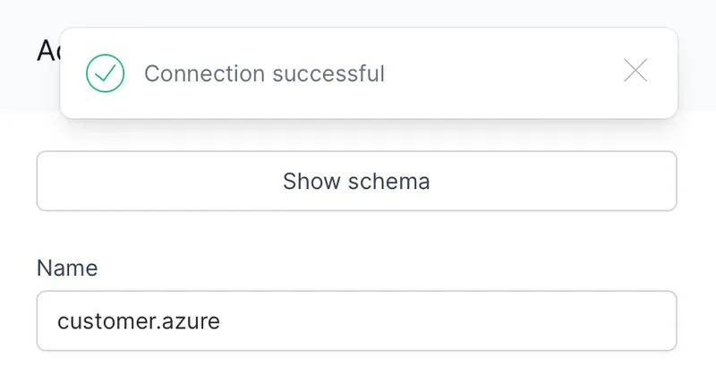

---
layout:
  width: wide
  title:
    visible: true
  description:
    visible: true
  tableOfContents:
    visible: true
  outline:
    visible: true
  pagination:
    visible: true
  metadata:
    visible: true
---

# Configuring the SQL Connection


Best practice for production apps is to use REST as the data layer to access data and not directly integrate to SQL using the SQL data provider. The SQL data provider will be squiggled in blue to indicate it is not recommended, together with a message to use [REST](configuring-the-sql-connection.md) instead. See [REST endpoints from Azure SQL](configuring-the-sql-connection.md) for more information.


Jigx will route all calls to Azure SQL Server from a Jigx mobile app through the Jigx cloud. No data is stored or cached in Jigx cloud. The encrypted SQL connection information is stored in non-user-readable secure storage in Jigx cloud and allows for IP allowlisting for Azure SQL database servers.

To complete these steps, the user will need Jigx credentials with **admin** privileges for the solution being configured and **Azure SQL administrative credentials** to configure the allowlisted IP addresses for the Azure SQL Server being used in the Jigx solution.

Following these steps to configure a new Azure SQL connection for the solution in Jigx cloud before adding the Jigx cloud IP addresses to the allowlisted IP addresses in Azure SQL.

## Creating an Azure SQL connection in Jigx Cloud

1. Sign in to Jigx management at [https://manage.jigx.com](https://manage.jigx.com) and navigate to the solution being configured.
2. Click on the **Connections** menu option on the left of the solution screen.

<figure><figcaption>
Connections in Jigx Management
</figcaption></figure>

3\. Click **Add Connection** on the top right of the Connections screen.

<figure><figcaption>
Add a new connection
</figcaption></figure>

4\. Enter the connection information for the new Azure SQL Connection.

<figure><figcaption>
Azure SQL connection
</figcaption></figure>

* In the **Name** field, enter your server's name, which will be the connection name Jigx functions will refer to when you create SQL functions. We recommend that this be the same as your SQL instance, for example, jigx1.database.windows.net.
* In **Type** – Select Azure SQL for both Azure SQL and on-premise SQL Servers.
* Optionally enter any descriptive text in the **Description** field.
* In **Server** enter the name of Azure SQL or SQL on-premise database server. The Azure administrator or database administrator will assist with this name.
* In **Database** enter the name of the SQL Server database you want to connect to.&#x20;
* In **User** enter the user name that will connect to SQL Server.
* In **Password** enter a valid password for the SQL Server.
* In **Options** configure other connection options such as non-standard ports or other specific connection information that the database server may need.&#x20;

5\. Before saving or testing the connection, click the **IP allowlist** link in the middle of the new connection screen. Note the two IP addresses listed. The calls from Jigx Cloud to Azure SQL will always originate from one of these IP addresses. These IP addresses will be added to the Azure SQL Server.


These IP addresses will vary depending on the Jigx cloud region being used.


<figure><figcaption>
Jigx IP address
</figcaption></figure>

6\. Navigate to the administrative portal for the Azure SQL Server instance hosting the database used in the Jigx solution. Under the Security section, select **Networking**. Please refer to [Azure SQL firewall connection documentation](https://learn.microsoft.com/en-us/azure/azure-sql/database/firewall-configure?view=azuresql) for detailed instructions.

<figure><figcaption>
Azure administrative portal
</figcaption></figure>

7\. Add the two Jigx IP addresses to the IP addresses allowlist for this Azure SQL instance.

<figure><figcaption>
Adding IP addresses
</figcaption></figure>

8\. In Jigx Management, click **Test connection**. If all the settings are configured correctly, the connection will succeed. Click **Save**.

<figure><figcaption>
Testing SQL connection
</figcaption></figure>

9\. The connection can now be used in your Jigx project to execute SQL queries or stored procedures to read and write data to Azure SQL.
