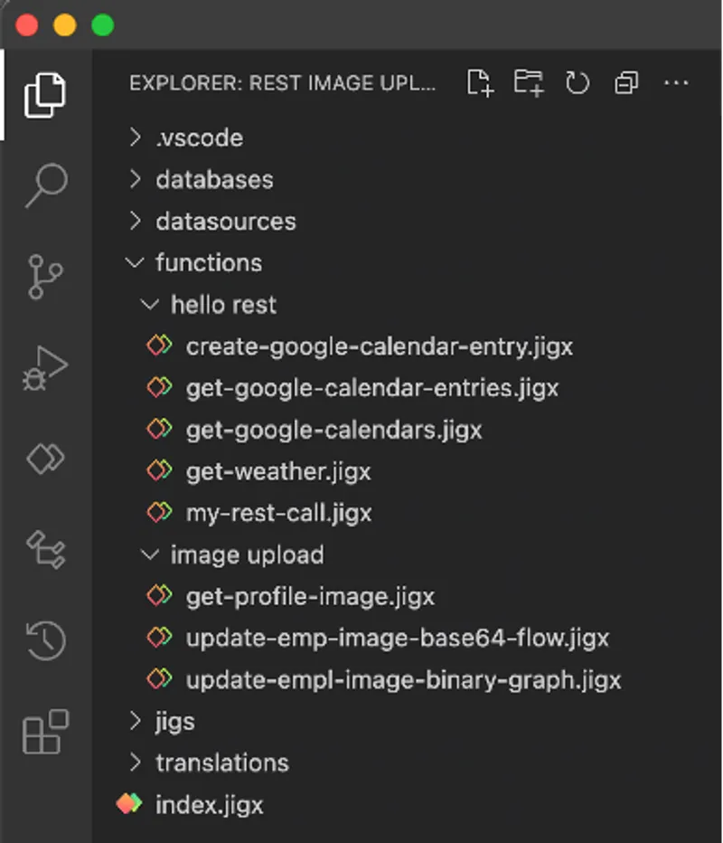
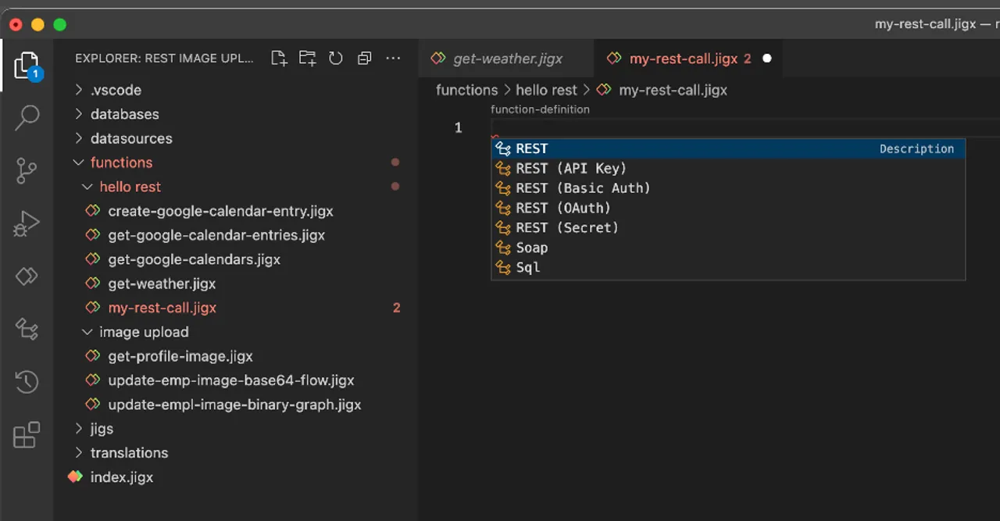

# Functions

The Jigx function contains the URL of the REST service, details of the required parameters, and the ability to map your Jigx parameters to complex JSON for either input or output purposes. In the sections below, we will explain each part of the function definition and how you can define any REST service and use it within your Jigx application.

## Functions structure

<table><thead><tr><th width="215.734375">Structure </th><th>Description</th></tr></thead><tbody><tr><td><a href="continuation.md">Continuation</a></td><td>Use when REST services limit the number of items to be returned. Jigx function calls can automatically repeat calls by specifying a continuation block. This overwrites the parameters in the original function call.</td></tr><tr><td><a href="conversions.md">Conversions</a></td><td>Handles file format conversions between local-uris and base64, data-uri, or buffer when sending to or receiving from a REST datasource.</td></tr><tr><td><code>disableTokenRefresh</code></td><td>Disables the auto-handling of 401 errors that refresh tokens twice.</td></tr><tr><td><a href="../rest-error-handling.md">error</a></td><td>Customize REST endpoint error messages to suppress or customize default error messages, log error details for more effective debugging, configure retries, and track errors through error logging.</td></tr><tr><td><code>format</code></td><td>Specifies the format of the data returned from the REST server. Supported formats include json, text, pdf, and xml. This setting determines how the response is processed by the function.</td></tr><tr><td><a href="forrowsinrange.md">forRowsInRange</a></td><td>This function's results are for a specific range in the data - all rows matching the specified column name and parameter value ranges (inclusive) will be removed and replaced with the results from the function. If not specified, the whole table is replaced with the function results, unless either for <code>RowsWithValues</code> is specified.</td></tr><tr><td><a href="forrowswithmatchingids.md">forRowsWithMatchingId</a>s</td><td>This function's results are for specific rows with matching IDs, and other rows are not changed or removed. If not specified, the whole table is replaced with the function results, unless either <code>forRowsWithValues</code> and/or <code>forRowsInRange</code> is specified.</td></tr><tr><td><a href="forrowswithvalues.md">forRowsWithValues</a></td><td>This function's results are for specific rows in the data - all rows matching the specified column name and parameter value pairs will be removed and replaced with the results from the function. If not specified, the whole table is replaced with the function results, unless for<code>RowsInRange</code> is specified.</td></tr><tr><td><code>functionId</code></td><td><p>Used to override the name of the function. Expected value is a string that respects the following rules:</p><p>The first character has to start with a letter.</p><p>The name can contain alphanumeric or symbols '-' and '_'.</p><p>The name cannot contain spaces.</p><p>The name cannot end with special characters.</p><p>The length must be between 2-50 characters.</p></td></tr><tr><td><a href="guard.md">guard</a></td><td>Guard functions allow you to control what happens after a query runs by conditionally executing additional logic. These functions are called after a query completes and can invoke any other function.</td></tr><tr><td><a href="inputtransform.md">inputTransform</a></td><td>When the function format is JSON, the request body is generated using the inputTransform, a JSONata expression that can reference parameters defined in the function.</td></tr><tr><td><code>keepTempIds</code></td><td>If set to true, temporary Ids in local data will not be deleted on sync. This does not apply when forRowsWithMatchingIds is set to true.</td></tr><tr><td><code>method</code></td><td><p>Jigx supports the following methods when making REST calls:</p><p>DELETE</p><p>GET</p><p>HEAD</p><p>PUT</p><p>PATCH</p><p>POST</p></td></tr><tr><td><a href="operations.md">operations</a></td><td>A function can specify zero or multiple table operations to perform on the solution's local SQLite database.</td></tr><tr><td><code>output</code></td><td>The function’s output is returned to calling actions or functions. If an <code>outputTransform</code> is defined, its result is returned; otherwise, the full response from the REST provider is used by default.</td></tr><tr><td><a href="outputtransform.md">outputTransform</a></td><td>The <code>outputTransform</code> is a JSONata expression that converts the REST response into JSON for local SQLite insertion.</td></tr><tr><td><a href="parameters.md">parameters</a></td><td>Function parameters are used to pass data into the function definition from the jig that uses the function. It can be used in body, query, path, and also as input parameters for procedures and views.</td></tr><tr><td><code>provider</code></td><td>DATA_PROVIDER_REST for making REST service calls.</td></tr><tr><td><a href="queries.md">queries</a></td><td>Queries in functions provide Just-In-Time (JIT) access to the latest local data, evaluated during function execution. The results can be used in function expressions.</td></tr><tr><td><code>url</code></td><td><p>The URL of the service that must be called. Jigx</p><p>supports path and query parameters in the URL. Path parameters are tagged with curly brackets {}. Jigx</p><p>will replace the path parameters with the values of the parameters defined in the parameter section of the function definition. Query parameters specified in the URL will be removed by Jigx</p><p>and replaced by parameters defined in the parameters section of the function definition with a location property of type <code>query</code>.</p></td></tr><tr><td><a href="when.md">when</a></td><td>Specify a condition for when to execute a function (default) and when to skip and not execute a function based on the local state of the database. The <code>when</code> expression is evaluated after the <code>parameters</code> and <code>queries</code> are evaluated. The <code>when</code> expression is evaluated before token credentials are checked and <code>inputTransforms</code> are evaluated. The when expression is re-evaluated on each <code>continuation</code>.</td></tr></tbody></table>

## Creating Function Definitions




Function definitions are stored in the functions folder in a Jigx project with a .jigx file extension. The Jigx Builder IntelliSense code completion provides all the available code completion options relevant to REST functions.





<figure><figcaption><p>Jigx functions</p></figcaption></figure>



To add a new function, create a file in the functions folder. The .jigx extension is added automatically. Function file names must be lowercase and cannot contain special characters.  Using a clear naming convention is recommended to help identify the purpose of each function, e.g. rest-get-customer or rest-update-customer.

Once functions are published in a Jigx solution you can preview the function in Jigx Management under the solution's REST functions option. See [REST Functions](../../../../../administration/solutions/rest-functions.md) for more information.

## Referencing a function in a jig

Functions can be used in a jig to access and manage data in your app. You can either query the local SQLite database, populated from REST using configured functions, or use actions to trigger functions that update both the local and remote (REST) data.



```yaml
datasources:
  customers: 
    type: datasource.sqlite
    options:
      provider: DATA_PROVIDER_LOCAL
      entities:
        - entity: customers
      query: |
        SELECT 
          cus.id AS id, 
          json_extract(cus.data, '$.firstName') AS firstName, 
          json_extract(cus.data, '$.lastName') AS lastName,
          json_extract(cus.data, '$.companyName') AS companyName,
          json_extract(cus.data, '$.address') AS address,
          json_extract(cus.data, '$.city') AS city,
          json_extract(cus.data, '$.state') AS state,
          json_extract(cus.data, '$.zip') AS zip,
          json_extract(cus.data, '$.phone1') AS phone
        FROM 
          [customers] AS cus
        -- ORDER BY 
        --  json_extract(cus.data, '$.companyName')
```



```python
actions:
  - children:
        # Action to update the record.
      - type: action.execute-entity 
        options:
          title: Update Customer
          provider: DATA_PROVIDER_REST
          entity: customers
          # Update the record in the local SQLite table. 
          method: update
          # Update the record in the REST service. 
          function: rest-update-customer  
          # Define the data to be updated for the record.
          functionParameters: 
            id: =@ctx.jig.inputs.customer.id
            firstName: =@ctx.components.firstName.state.value
            lastName: =@ctx.components.lastName.state.value
            companyName: =@ctx.components.companyName.state.value
            address: =@ctx.components.address.state.value
            city: =@ctx.components.city.state.value
            state: =@ctx.components.state.state.value
            phone: =@ctx.components.phone.state.value
            zip: =@ctx.components.zip.state.value
          onSuccess: 
            type: action.go-back  
```



## Supporting JSON

REST services typically have simple or complex JSON structures which enable you to provide them with suitable input data as well as return complex data structures. Jigx has built-in capabilities to deal with these structures. These are achieved using:

* [InputTransform](inputtransform.md)
* [OutputTransform](outputtransform.md)

## Authentication Support

All REST functions support header, path, query, and body parameters. In addition, including calling services with no authentication, Jigx supports OAuth, API Key, and Basic Auth or Secrets for authentication. See [Authentication](../rest-authentication.md) for configuration steps. &#x20;

<figure><figcaption><p>Functions code completion options</p></figcaption></figure>

The code completion will display the available template options when adding a new function. Creating a new function using one of these code options adds the skeleton code to the function definition, making it easier to configure functions for specific providers with their authentication configuration. These options are:

* **REST**: A REST service call with no authentication that returns JSON by default.
* **REST (API Key)**: A REST service call that includes `x-API-key` in the header for authentication.
* **REST (Basic Auth)**: A REST service call that includes `basicAuth` in the header populated with the credential's information.
* **REST (OAuth)**: A REST service call that includes `accessToken` (Authorization) in the header populated with the OAuth Token returned during the OAuth loop.
* **REST (Secret)**: A REST service call that includes a `secret` that can be added to the header or query string parameters for authentication.

## Function execution order

Function properties are evaluated and executed in the following order:

* Check if function exists.
* Check and execute the `parameters`.
* Then execute `queries`, `dependencies` first.
* Then execute the `when` in the main function.
* Then the `guard` function is executed.
* Then the `when` in the guard function is executed.
* Then execute `operations`.
* Execute `inputTransform`.
* Then execute `conversions`.
* Return the `output` of the function.

## Examples and code snippets

The following examples with code snippets are provided:

<table><thead><tr><th width="153.64453125">Example</th><th></th></tr></thead><tbody><tr><td><a href="../rest-overview.md">Hello REST</a></td><td>In this section, a REST API is used to create a customers Jigx app, allowing you to add new customers and update and view customer details, location, and images.</td></tr><tr><td><a href="https://docs2.jigx.com/m2WORrppBE0ftZCDChzX/examples/readme/data-providers/rest/ms-graph">MS Graph</a></td><td>The MS Graph examples use the User, Calendar, Mail, Insights, and To-do tasks to create a powerful Jigx apps with everything you need in one app.</td></tr></tbody></table>
