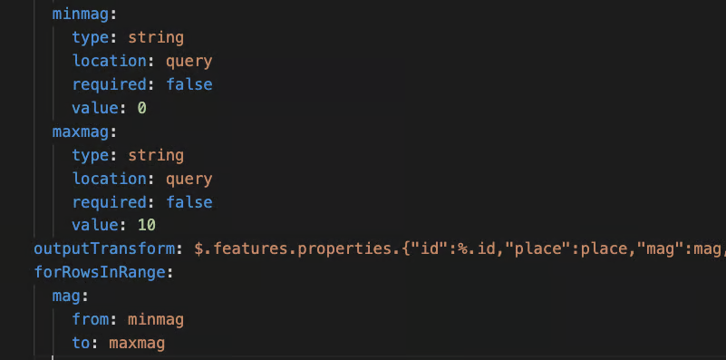
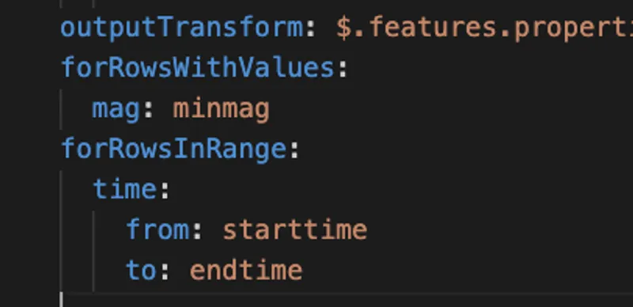

# forRowsinRange

By default, the JSON payload returned from the REST call replaces the existing data in the SQLite database. The `forRowsInRange` property specifies one or more key-value pairs, where the key is a json\_extract() column in the table, and the value defines the range to match. Only rows that match these criteria will be updated. If no match is found, the object is added as a new row in the collection.

You can specify multiple key-value pairs under `forRowsInRange`, which effectively acts like a WHERE ... BETWEEN clause. Jigx uses this to determine which rows to update or insert when applying the `outputTransform` result from the REST call to the table.

Before inserting the new data, Jigx deletes all rows from the table that match the `forRowsInRange` criteria. The user interface is updated only after the data operation completes, preventing flickering or partial updates. UI updates occur as the final step.


Pass the values you want to test as input parameters. In this example, minmag and maxmag. The property to test is **mag**. This property (**mag**) must appear in the `outputTransform`. Then set the range you are testing for in the input parameters (**minmag**) and (**maxmag**).


<figure><figcaption>
forRowsInRange
</figcaption></figure>


* You can combine `forRowswithValues` and `forRowsInRange` as per the example below.
* You cannot combine `forRowsWithMatchingIds` with any other range or value check.


<figure><figcaption>
Combined properties
</figcaption></figure>
