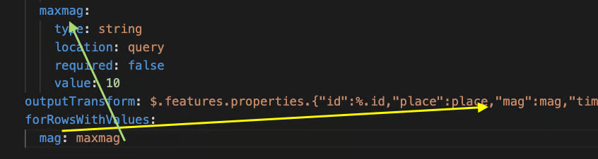

# forRowsWithValues

By default, the JSON payload returned from a REST call replaces all existing data in the SQLite database. The `forRowsWithValues` property allows you to update only specific rows, instead of replacing all records, which results in a smoother user experience.

`forRowsWithValues` defines one or more key-value pairs, where each key is a json\_extract() column in the SQLite table, and the value is the criteria used for matching. Only rows that meet these conditions will be updated. If no match is found, the object is added as a new row.

You can specify multiple key-value pairs under `forRowsWithValues`, which effectively acts as a WHERE clause. Jigx uses this condition when applying the result of the outputTransform to the SQLite table.

Before inserting new data, Jigx deletes all rows that match the `forRowsWithValues` criteria. The user interface is updated only after the data action completes, preventing flickering or intermediate updates. UI refresh occurs as the final step.


The property should be passed as a parameter and be referenced in the `outputTransform`.


<figure><figcaption><p>forRowsWithValues</p></figcaption></figure>

## Example code

```yaml
# REST Data Provider with forRowsInRange function example
# This example fetches earthquake data and updates only rows with the value active.
provider: DATA_PROVIDER_REST
method: GET
url: https://earthquake.usgs.gov/earthquakes/feed/v1.0/summary/all_day.geojson
useLocalCall: true      
# Input parameters for the range values
parameters:
  mag:
    type: number
    location: query
    required: false
    value: 2.0
  dmin:  
    type: number
    location: query
    required: false
    value: 5.0

# Transform the earthquake data
outputTransform: |
  {
    "earthquakes": features[].{
      "id": id,
      "place": properties.place,
      "mag": properties.mag,
      "time": properties.time,
      "coordinates": geometry.coordinates,
      "depth": geometry.coordinates[2]
    }
  }
operations:
  - type: operation.delete-insert
    table: earthquake_data
    records: |
      =$.earthquakes.{
      "id": id,
      "place": place,
      "mag": mag,
      "time": time,
      "longitude": coordinates[0],
      "latitude": coordinates[1],
      "depth": depth
      } 
    # Only update rows for the specified value.
    forRowsWithValues:
      status: "active"
```
