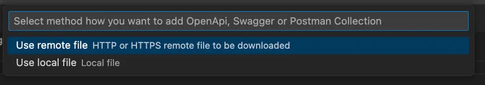

# Swagger parser

The Swagger parser function allows you to convert Swagger, open API, and Postman collection data to Jigx functions in the Jigx Builder.

## How to use the Swagger parser

The command to start the Swagger parser function is (command + shift + p): Generate Jigx Functions

<figure><figcaption>
Generate Jigx functions
</figcaption></figure>

Both remote and local files can be used, and only JSON format is allowed.

<figure><figcaption>
File options
</figcaption></figure>

All files created by the Swagger parser function saves in your functions folder.

### Variable replacement

You can replace variables in your Postman collection, for example, replacing the baseUrl. As you add the value 'google.com' to the variable all functions requiring this variable will be updated.

<figure><figcaption></figcaption></figure>
