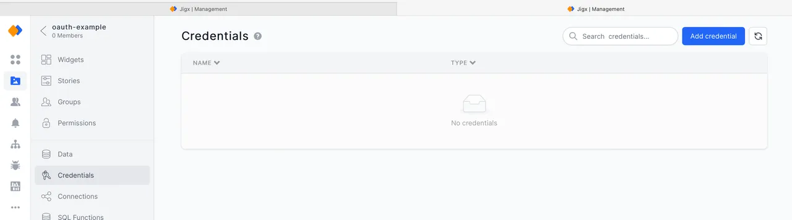
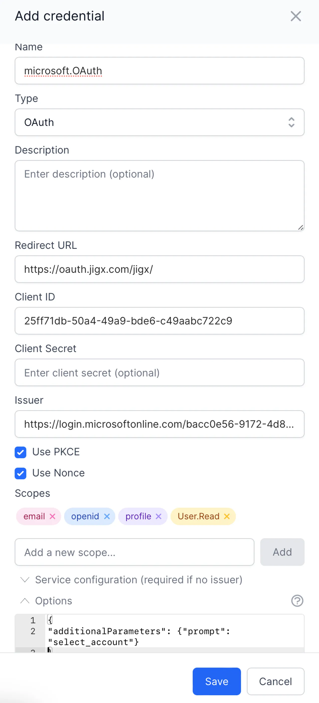

# Adding the OAuth Configuration to the solution in Jigx Management


To complete these steps, you must be an **Owner or Creator of the solution** in Jigx Management and **your Jigx solution has been published at least once** and is available in Jigx Management.


1. Log in to Jigx Management at [https://manage.jigx.com](https://manage.jigx.com/) and open your solution.
2. In the menu on the left, click on **Credentials**.

<figure><figcaption>
Solution Crenentials
</figcaption></figure>

3. Click **Add Credential** on the top right of the screen.
4. **Enter a name** for the credential, for example, microsoft.OAuth.
5. Select **OAuth** as the type.
6. Enter the **OAuth redirect URL** you specified when configuring the OAuth app in Microsoft Azure. In the case of the default app, the redirect URL is [https://oauth.jigx.com/jigx/](https://oauth.jigx.com/jigx/). If you are configuring this for a Jigx Branded app replace /jigx/ with the name of the branded app as specified in its app configuration. For example, [https://oauth.jigx.com/companyname/](https://oauth.jiigx.com/companyname/)
7. Enter the **Application (Client) ID** copied from the Azure OAuth configuration in the **Client ID** field.
8. Leave the **Secret field empty** for Microsoft openid-based OAuth.
9. Enter the **portion** of the URL copied from the **OpenID Connect metadata document** field in Azure in the **Issuer** field.
10. Add the **scopes** selected when the OAuth application was defined in Azure. Note that scopes are case-sensitive.
11. To allow a user to **switch accounts** when they are prompted during the OAuth loop, **expand the Options section** and replace the {} with the following: {"additionalParameters": {"prompt": "select\_account"\}}. The **completed configuration** should be as follows:

<figure><figcaption>
Credentials
</figcaption></figure>

12. Click on **Save** to store the credential.

The **credential** is now ready for use in a function in a Jigx mobile app to prompt the user for their OAuth credentials when an API in Microsoft Graph is called.
