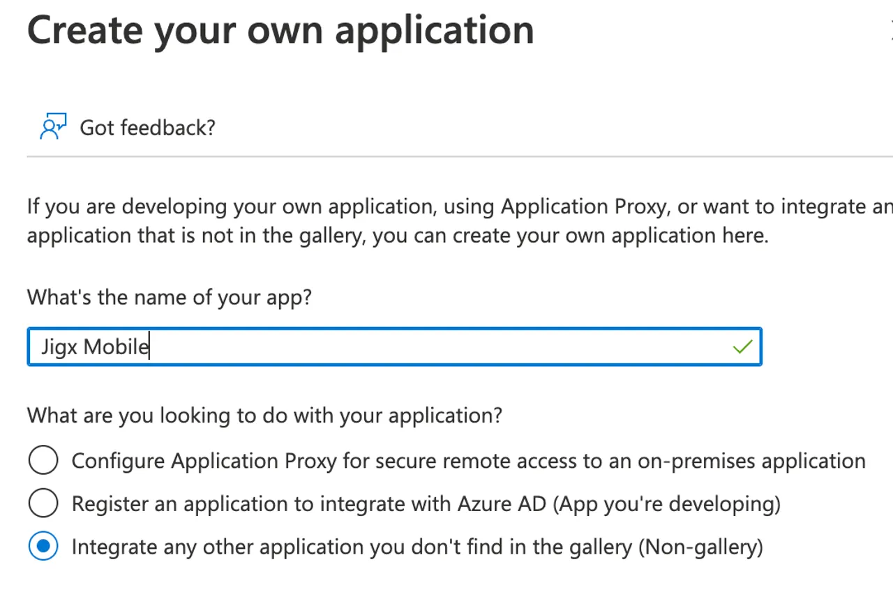
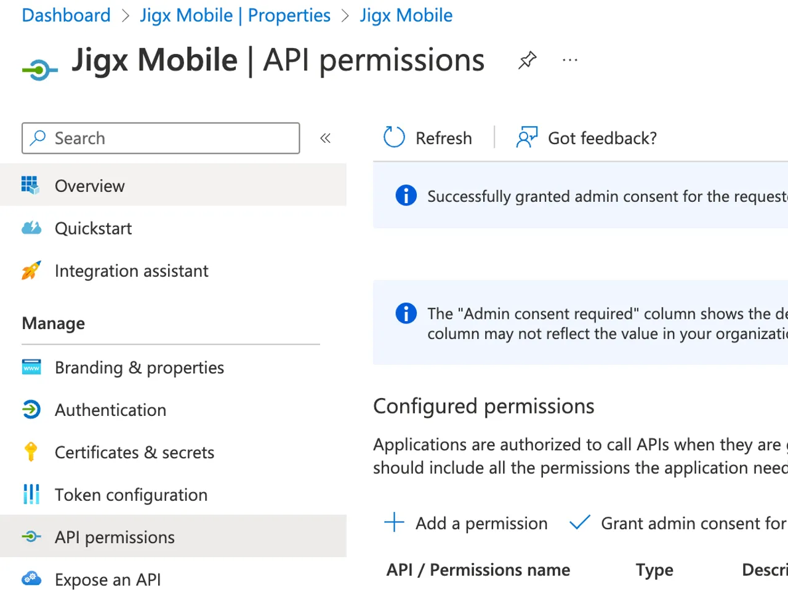

# Create and configure a new OAuth app in Microsoft Azure AAD


This topic is specific to Microsoft Azure OAuth and not a feature of Jigx. Jigx requires an OAuth app to authenticate with Microsoft Graph.

To successfully complete these steps, you will need a Microsoft Office 365 Administrator account with access to the Azure Active Directory Administration portal.&#x20;


1.Login to [https://admin.microsoft.com](https://admin.microsoft.com/)

2\. Expand the menu on the left by clicking on the hamburger icon on the top left of the page.

<figure><figcaption>
Microsoft Admin center
</figcaption></figure>

3\. Click on the **three dots** next to Show All.

4\. Click on **Azure Active Directory** under Admin Centers.

<figure><figcaption>
AAD
</figcaption></figure>

5\. In the left menu, click on **Enterprise Applications**.

<figure><figcaption>
AAD admin center
</figcaption></figure>

6\. Click **New application** on the toolbar in the top middle of the page.

<figure><figcaption>
New application
</figcaption></figure>

7\. Click on **Create your own application** on the toolbar at the top of the page.

<figure><figcaption>
New application
</figcaption></figure>

8\. Enter a name for your app. In this document, we will use Jigx Mobile.

9\. Make sure **Integrate any other application you don't find in the gallery (Non-gallery)** is selected, and click on the **Create** button at the bottom of the screen.

<figure><figcaption>
New application
</figcaption></figure>

10\. Under Manage, click on **Properties**.

<figure><figcaption>
Properties
</figcaption></figure>

11\. Set **Assignment required** to false and click on **Save** on the menu bar at the top left.

<figure><figcaption>
New application
</figcaption></figure>

12\. Click on the **application registration link** at the top right of the page.

13\. Click on **Authentication** in the left menu.

<figure><figcaption>
Authentication
</figcaption></figure>

14\. Click on **Add a platform**.

<figure><figcaption>
Authentication
</figcaption></figure>

15\. Click on **Mobile and desktop applications**. **Do not** select iOS/macOS or Android.

<figure><figcaption>
Applications
</figcaption></figure>

16\. Select the **three checkboxes** and add [https://oauth.jigx.com/jigx/](https://oauth.jiigx.com/jigx/) in the custom URL section. If you are configuring this for a Jigx Branded app replace /jigx/ with the name of the branded app as specified in its app configuration. For example, [https://oauth.jigx.com/companyname/. ](https://oauth.jiigx.com/companyname/)Click on **Configure** to save the changes.

<figure><figcaption>
Redirect URLs
</figcaption></figure>

If you are planning on using **Postman** to test calls to Microsoft Graph using the Jigx Mobile OAuth configuration, click on Add URI and add the following URL: [https://oauth.pstmn.io/v1/callback](https://oauth.pstmn.io/v1/callback) then click on **Save** at the bottom of the screen.

17\. Click on **API permissions**. Depending on the functionality you want to expose to Jigx Mobile, you will have to specify specific API permissions, also referred to as scopes.

<figure><figcaption>
Scopes
</figcaption></figure>

18\. For this example, click on **Add a permission** and then **Microsoft Graph** at the top of the next screen.

<figure><figcaption>
API permissions
</figcaption></figure>

19\. Click on **Delegated permissions** since we want the Jigx solution user to access the API using his identity and access rights.

<figure><figcaption>
API permissions
</figcaption></figure>

20\. Enable **email, openid, profile and User.Read, offline\_access**. These are the minimum scopes needed by Jigx to access the API. **To find User.Read,** enter it in the search box. Click on **Add permissions** at the bottom of the screen.

<figure><figcaption>
API permissions
</figcaption></figure>

21\. Click on **Grant admin consent** on the toolbar above the API permissions. Your API permissions should look similar to the image below.

<figure><figcaption>
API permissions
</figcaption></figure>

22\. Click on **Overview** on the top left.

<figure><figcaption>
API permissions overview
</figcaption></figure>

23\. Copy the **Application (Client) ID** and save this for later.

<figure><figcaption>
Application ID
</figcaption></figure>

24\. Click on **Endpoints** in the toolbar. Select the **portion of the URL** up to the / after v2.0 of the OpenID Connect metadata document field and save this for later.

<figure><figcaption>
Endpoints
</figcaption></figure>

25\. At this stage, the **OAuth app** is configured and ready to use.

In the next section, add the configuration to the Jigx solution in Jigx Management.
