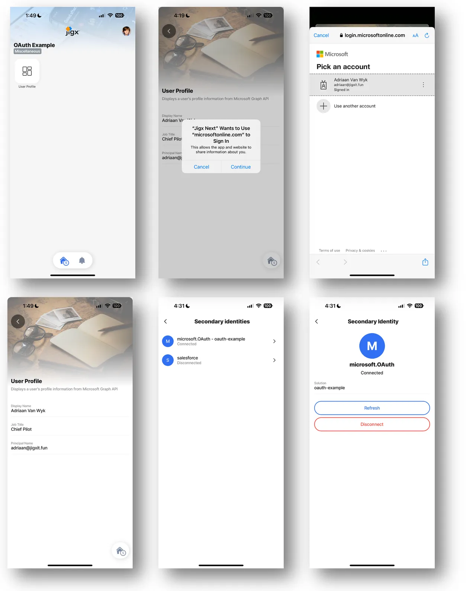

# Using the OAuth configuration in a Jigx solution

1\. **Add a function** to your Jigx solution to get a user’s profile information from Microsoft Graph. See the code below.

```yaml
provider: DATA_PROVIDER_REST
method: GET
url: https://graph.microsoft.com/v1.0/me

parameters:
  accessToken:
    location: header
    required: true
    type: string
    # Use manage.jigx.com to define credentials for your solution.
    value: microsoft.OAuth 
```

2\. **Add a jig** that uses this function.


To invoke the OAuth dialog, you must pass the accessToken parameter from the jig to the function. This is specific to when the REST provider is used with access tokens. If the access token parameter is not passed as part of the jig function configuration, the mobile app will not prompt the user for their credentials. 


See the code below.

```yaml
title: User Profile
description: Displays a user's profile information from Microsoft Graph API
type: jig.default

header:
  type: component.image
  options:
    source:
      uri: https://builder.jigx.com/assets/images/header.jpg

onFocus:
  type: action.sync-entities
  options:
    provider: DATA_PROVIDER_REST
    entities:
      - entity: userProfile
        function: get-user-profile
        functionParameters:
          accessToken: microsoft.OAuth

datasources:
  mydata:
    type: datasource.sqlite
    options:
      provider: DATA_PROVIDER_LOCAL

      entities:
        - entity: userProfile

      query: SELECT id, '$.displayName', '$.jobTitle', '$.userPrincipalName' FROM userProfile

      isDocument: true

children:
  - type: component.entity
    options:
      children:
        - type: component.entity-field
          options:
            label: Display Name
            value: =@ctx.datasources.mydata.displayName
        - type: component.entity-field
          options:
            label: Job Title
            value: =@ctx.datasources.mydata.jobTitle
        - type: component.entity-field
          options:
            label: Principal Name
            value: =@ctx.datasources.mydata.userPrincipalName
```

3\. Add the `jigId` to access this jig in the index.jigx file. See the sample code below.

```yaml
name: oauth-example
title: OAuth Example
category: miscellaneous
tabs:
  home:
    jigId: view-user-profile
    icon: home-5g
```

4\. Publish the solution and open it in the Jigx Mobile app. The user should is prompted for their credentials. After a successful OAuth loop, the token will be stored for future use, and the function will be executed, displaying the information on the jig.

<figure><figcaption><p>OAuth loop</p></figcaption></figure>


* After a **successful OAuth loop**, the returned token **will be stored for future use** until it expires. If the provider supports a **refresh token**, Jigx will automatically use the refresh token to avoid prompting the user again for credentials. Once the refresh token becomes invalid or if no token was provided, Jigx will prompt the user with the OAuth loop to get a new token.
* If **authentication fails**, the user can use the **Secondary Identities menu** in the **Settings** section of the **Jigx mobile App** to manage OAuth tokens. If the token is not visible in the list, something failed early during the OAuth loop. Use the **Jigx debug tools** in VS Code to trace the error using the Jigx Builder output window.&#x20;


