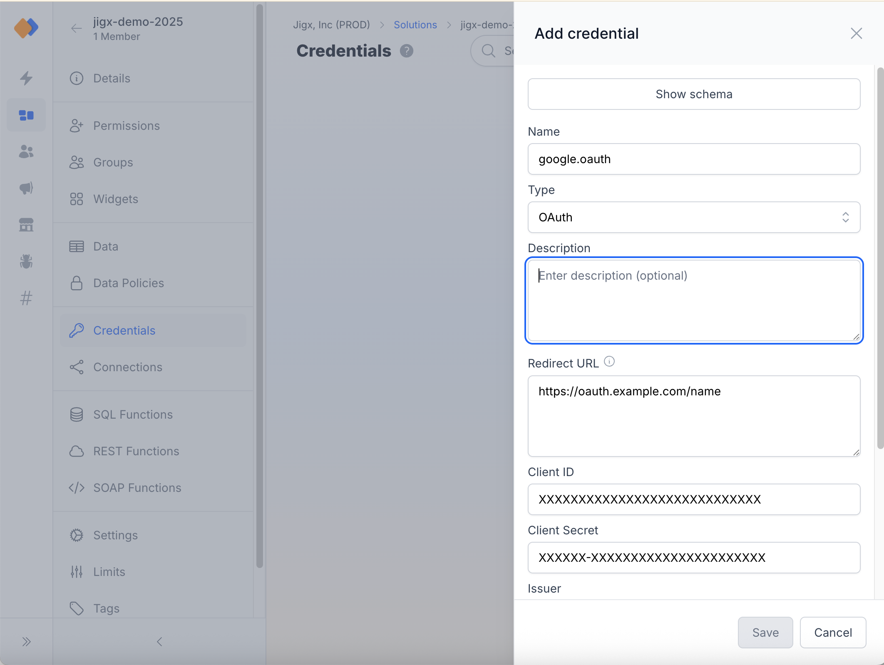
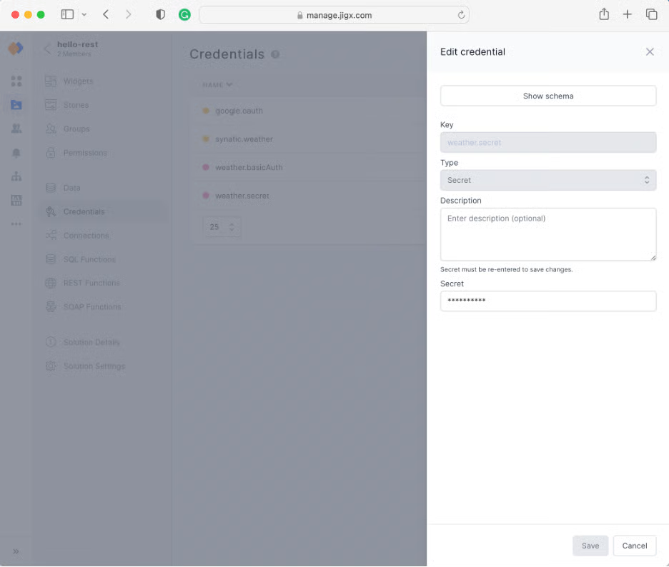

# REST Authentication

## REST Authentication

## Overview

Jigx supports OAuth, tokens, Basic Auth credentials, secrets, and API keys as authentication methods. These result in entries added to the request's header unless the authentication parameters' location is specified differently. We **do not recommend** building solutions with Jigx where credentials are stored in the YAML of the Jigx solutions. Jigx provides a secure mechanism for defining, storing, and retrieving authentication information during runtime.

## Setting up Jigx Management to securely store credentials

Credentials, including OAuth configurations, are stored in Jigx Management under the [credentials](../../../../administration/solutions/credentials.md) section for a solution. Each authentication type entry has the fields required for Jigx to add the credentials to the request when it executes the function on the device. These entries are stored in the Jigx Cloud-using AWS amplifies encryption that Jigx cannot decrypt. Entries containing secrets are not visible once they are stored. During runtime, when Jigx comes across a parameter it recognizes as an authentication parameter, it will retrieve the configuration from the Jigx cloud and stores it in the device's keychain. Only the Jigx application can access and retrieve the information once stored on the device. This is protected by on-device encryption and can only be accessed by the native application signed with the Jigx certificate for the signed-in user.

## Authentication examples

### OAuth and Bearer Tokens

The result of a successful OAuth loop is a token that is stored on the user's device in the keychain secure storage. When the token expires, Jigx uses a refresh token to get an updated token. If the OAuth loop provides no refresh token, the user will be prompted for their OAuth credentials by the REST call.

The `accessToken` must be specified as a parameter in the YAML. Jigx only retrieves the values from the cloud if specified in the YAML. If this parameter is omitted, the OAuth loop will not be initiated.

#### OAuth Example

Jigx Management Configuration. See [Credentials](../../../../administration/solutions/credentials.md) for more information.

<figure><figcaption><p>Crendentials configuration</p></figcaption></figure>

Jigx Function example:

```yaml
provider: DATA_PROVIDER_REST
url: https://www.googleapis.com/calendar/v3/calendars/{calendarId}/events?
method: GET
outputTransform: $.items
parameters:
  accessToken:
    location: header
    required: true
    type: google.oauth
    value: google.oauth
  calendarId:
    type: string
    location: path
    required: true
  maxResults:
    type: string
    location: query
    required: true
    value: "100"
  timeMin:
    type: string
    location: query
    required: true
```

Jig YAML example:

```yaml
title: View Calendar
type: jig.calendar

datasources:
  mydata:
    type: datasource.sqlite
    options:
      provider: DATA_PROVIDER_LOCAL
      entities:
        - entity: calendar-entries
          function: get-google-calendar-entries
          functionParameters:
            accessToken: google.oauth
            calendarId: =@ctx.jig.inputs.calendarId
            maxResults: "100"
            timeMin: =$now()

      query: |
        SELECT id, 
        datetime(json_extract(Data, '$.start.dateTime')) as startDateTime,
        datetime(json_extract(Data, '$.start.date')) as startDate,
        datetime(json_extract(Data, '$.end.dateTime')) as endDateTime,
        datetime(json_extract(Data, '$.end.date')) as endDate,
        '$.summary'
        FROM [calendar-entries]

data: =@ctx.datasources.mydata
item:
  type: component.event
  options:
    from: "=(@ctx.current.item.startDateTime = null ? @ctx.current.item.startDate : @ctx.current.item.startDateTime)"
    to: "=(@ctx.current.item.endDateTime= null ? @ctx.current.item.endDate : @ctx.current.item.endDateTime)"
    title: =@ctx.current.item.summary
placeholders:
  - title: Fetching Data
    icon: loading-data
    when: =$count(@ctx.datasources.mydata) < 1
```

#### API Key Example

Jigx Management Configuration. See [Credentials](../../../../administration/solutions/credentials.md) for more information.

<figure><figcaption><p>Credentials configuration</p></figcaption></figure>

Jigx Function example:

```yaml
provider: DATA_PROVIDER_REST
method: GET
url: https://api.weather.example/gridpoints/SEW/131,69/forecast/hourly

parameters:
  x-api-key:
    location: header
    required: true
    type: secret
    # Use manage.jigx.com to define credentials for your solution
    value: synatic.weather
```

jig YAML example:

```yaml
title: ="Hourly Weather for " & $fromMillis($toMillis($now()),'[M01]-[D01]-[Y0001]')
type: jig.list
icon: contact

datasources:
  mydata:
    type: datasource.sqlite
    options:
      provider: DATA_PROVIDER_LOCAL
      entities:
        - entity: forecast
          function: get-weather-api-key
          functionParameters:
            x-api-key: synatic.weather
      query: |
        SELECT id, '$.startTime', 
        '$.endTime', '$.temperature', 
        '$.temperatureUnit', '$.windSpeed', 
        '$.windDirection', '$.icon',
        '$.shortForecast'
        FROM [forecast]

data: =@ctx.datasources.mydata
item:
  type: component.list-item
  options:
    title: |
      ="from " & $fromMillis($toMillis(@ctx.current.item.startTime),'[h#1]:[m01][P]')
      & " to " & $fromMillis($toMillis(@ctx.current.item.endTime),'[h#1]:[m01][P]')
    subtitle: |
      ="Temp " & @ctx.current.item.temperature & @ctx.current.item.temperatureUnit & 
      " with wind at " & @ctx.current.item.windSpeed & 
      " from " & @ctx.current.item.windDirection
    leftElement:
      element: image
      text: =@ctx.current.item.shortForecast
      uri: =@ctx.current.item.icon
      resizeMode: contain
```

#### Basic Authentication

A username and password for basic authentication are stored in Jigx Management with a specific key. The key is referenced in the Jigx function definition using a header parameter called basicAuth.

Jigx Management Configuration. See [Credentials](../../../../administration/solutions/credentials.md) for more information.

<figure><figcaption><p>Credentials configuration</p></figcaption></figure>

Jigx Function example:

```yaml
provider: DATA_PROVIDER_REST
method: GET
url: https://api.weather.example/gridpoints/SEW/131,69/forecast/hourly

parameters:
  basicAuth:
    location: header
    required: true
    type: secret
    # Use manage.jigx.com to define credentials for your solution
    value: weather.basicAuth
```

Jig YAML example:

```yaml
title: ="Hourly Weather for " & $fromMillis($toMillis($now()),'[M01]-[D01]-[Y0001]')
type: jig.list
icon: contact

datasources:
  mydata:
    type: datasource.sqlite
    options:
      provider: DATA_PROVIDER_REST

      entities:
        - entity: forecast
          function: get-weather-basic-auth
          functionParameters:
            basicAuth: weather.basicAuth
      query: |
        SELECT id, '$.startTime', 
        '$.endTime', '$.temperature', 
        '$.temperatureUnit', '$.windSpeed', 
        '$.windDirection', '$.icon',
        '$.shortForecast'
        FROM [forecast]

data: =@ctx.datasources.mydata
item:
  type: component.list-item
  options:
    title: |
      ="from " & $fromMillis($toMillis(@ctx.current.item.startTime),'[h#1]:[m01][P]')
      & " to " & $fromMillis($toMillis(@ctx.current.item.endTime),'[h#1]:[m01][P]')
    subtitle: |
      ="Temp " & @ctx.current.item.temperature & @ctx.current.item.temperatureUnit & 
      " with wind at " & @ctx.current.item.windSpeed & 
      " from " & @ctx.current.item.windDirection
    leftElement:
      element: image
      text: =@ctx.current.item.shortForecast
      uri: =@ctx.current.item.icon
      resizeMode: contain
```

#### Secret

A secret is stored in Jigx Management with a specific key. The key is referenced in the Jigx function definition using a path, header, query, or body parameter with the name expected by the request.

Jigx Management Configuration. See [Credentials](../../../../administration/solutions/credentials.md) for more information.

<figure><figcaption><p>Credentials configuration</p></figcaption></figure>

Jigx function example:

```yaml
provider: DATA_PROVIDER_REST
method: GET
url: https://api.weather.example/gridpoints/SEW/131,69/forecast/hourly

parameters:
  service-secret: #name of the header property you want to populate with the secret
    location: header
    required: true
    type: secret
    value: weather.secret #Use manage.jigx.com to define credentials for your solution
```

jig YAML example:

```yaml
title: ="Hourly Weather for " & $fromMillis($toMillis($now()),'[M01]-[D01]-[Y0001]')
type: jig.list
icon: contact

datasources:
  mydata:
    type: datasource.sqlite
    options:
      provider: DATA_PROVIDER_REST

      entities:
        - entity: forecast
          function: get-weather-secret-auth
          functionParameters:
            service-secret: weather.secret
      query: |
        SELECT id, '$.startTime', 
        '$.endTime', '$.temperature', 
        '$.temperatureUnit', '$.windSpeed', 
        '$.windDirection', '$.icon',
        '$.shortForecast'
        FROM [forecast]

data: =@ctx.datasources.mydata
item:
  type: component.list-item
  options:
    title: |
      ="from " & $fromMillis($toMillis(@ctx.current.item.startTime),'[h#1]:[m01][P]')
      & " to " & $fromMillis($toMillis(@ctx.current.item.endTime),'[h#1]:[m01][P]')
    subtitle: |
      ="Temp " & @ctx.current.item.temperature & @ctx.current.item.temperatureUnit & 
      " with wind at " & @ctx.current.item.windSpeed & 
      " from " & @ctx.current.item.windDirection
    leftElement:
      element: image
      text: =@ctx.current.item.shortForecast
      uri: =@ctx.current.item.icon
      resizeMode: contain
```

#### Local REST Calls

A local REST function call allows the mobile app to perform all the processing locally and call the third-party service directly. As a result, data is only transferred between the mobile app and the third-party REST service. Only OAuth authentication can be used with Local REST calls. For more information see [Local REST Calls](local-rest-calls.md).

### See Also

* [REST examples](https://docs.jigx.com/examples/rest)
