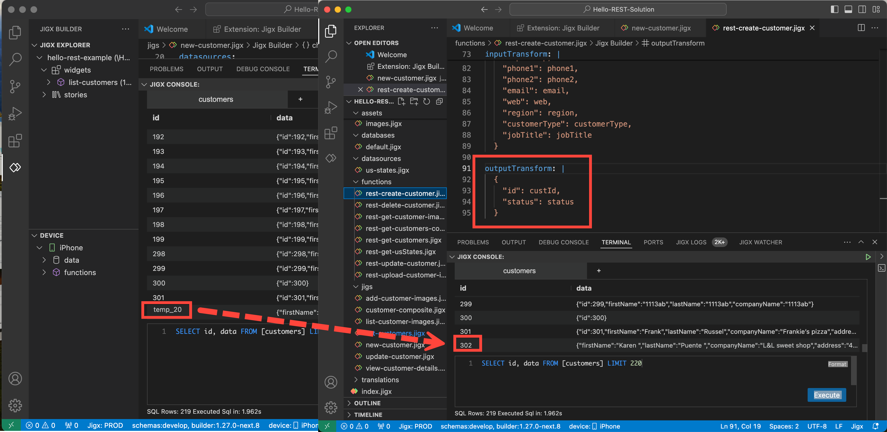

---
layout:
  width: wide
  title:
    visible: true
  description:
    visible: true
  tableOfContents:
    visible: true
  outline:
    visible: true
  pagination:
    visible: true
  metadata:
    visible: true
---

# REST best practice

## Working with REST IDs

* When a REST service returns an id, the Jigx local data provider can automatically be synced with this id, eliminating the need to add a `sync-entities` action to the jig.
* The id property must be added in the `outputTransform` of the REST data provider function.
* This is useful on a POST (create) as a temp\_id is created in the local data provider for the record when it is created. If the id is in the POST function `outputTransform`, the temp\_id is automatically updated with the REST id once it is created on the REST side.
* The below image shows how the local data provider creates a temp\_id when a new customer is added. Then, it is automatically synced with the REST `id` because the `id` is in the function's `outputTransform`.

<figure><figcaption><p>Syncing temp_Id</p></figcaption></figure>


```yaml
provider: DATA_PROVIDER_REST
method: POST # Create new record in the backend
url: https://jigx-training.azurewebsites.net/api/customers
useLocalCall: true

parameters:
  x-functions-key:
    location: header
    required: false
    type: string
    value: #Use manage.jigx.com to define credentials for your solution
  firstName:
    type: string
    location: body
    required: true
  lastName:
    type: string
    location: body
    required: true
  companyName:
    type: string
    location: body
    required: true
  address:
    type: string
    location: body
    required: false
  phone:
    type: string
    location: body
    required: false
  email:
    type: string
    location: body
    required: false

inputTransform: |
  {
    "firstName": firstName,
    "lastName": lastName,
    "companyName": companyName,
    "address": address,
    "phone": phone,
    "email": email
  }
# add the id to the output which ensures the local table,
# is automatically updated with the REST id once it is created.
outputTransform: |
  {
    "id": custId,
    "status": status
  }
```


## Where and when to sync and load data

Knowing when to load and sync data is important as it can impact the apps performance and functionality when the device is offline.

* Load data in the `index.jigx` file by adding an `onFocus`, and `onLoad` for performance. This also ensures that all data is available if the device goes offline.
* Add the `sync-entity` or `sync-entities` action to a [global action](../../../ui/actions.md), to sync the data with the `onFocus` or `onRefresh` events ensuring efficiency and reusability throughout the solution. The global action is referenced in the solution's jigs to sync data from the REST server.
* See [REST syncing & loading local Data](rest-syncing-_-loading-local-data.md) for an in-depth explanation.

## Working with complex REST structures

Working with complex REST objects can be tricky, as they include arrays, nested objects, and other complex data structures. When integrating and manipulating these JSON structures from the REST data provider configure the following:

1. `JsonProperties` in the SQLite query `jsonProperties: - addresses`
2. In the expression used to retrieve the value, specify the exact property in the array or nested object that you require by referencing the `JsonProperty` followed by the property. `description: =@ctx.current.item.addresses[0].city leftElement: element: avatar text: =@ctx.current.item.addresses[0].state`




```json
"customers": [
        {
            "custId": 1,
            "firstName": "Merilyn",
            "lastName": "Bayless",
            "companyName": "20 20 Printing Inc",
            "addresses": [
                {
                    "address": "195 13n N",
                    "city": "Santa Clara",
                    "county": null,
                    "state": "CA",
                    "zip": "95054"
                }
            ],
            "phones": [
                {
                    "mobile": "408-758-5015",
                    "office": "408-758-5015"
                }
            ],
            "email": "merilyn_bayless@cox.net",
            "web": "http://www.printinginc.com",
            "region": "US West",
            "customerType": "Silver",
            "jobTitle": "Project Manager",
            "logo": null
        },
```





```yaml
datasources:
  customers:
    type: datasource.sqlite
    options:
      provider: DATA_PROVIDER_LOCAL

      entities:
        - entity: customers

      query: |
        SELECT 
          cus.id AS id, 
          json_extract(cus.data, '$.firstName') AS firstName, 
          json_extract(cus.data, '$.lastName') AS lastName,
          json_extract(cus.data, '$.companyName') AS companyName,
          json_extract(cus.data, '$.addresses') AS addresses,
          json_extract(cus.data, '$.phones') AS phones,
          json_extract(cus.data, '$.email') AS email,
          json_extract(cus.data, '$.web') AS web,
          json_extract(cus.data, '$.customerType') AS customerType,
          json_extract(cus.data, '$.jobTitle') AS jobTitle
        FROM 
          [customers] AS cus
        ORDER BY 
          json_extract(cus.data, '$.companyName')
      #
      jsonProperties:
        - addresses
        - phones

data: =@ctx.datasources.customers
item:
  type: component.list-item
  options:
    title: =@ctx.current.item.companyName
    subtitle: =@ctx.current.item.firstName & ' ' & @ctx.current.item.lastName
    description: =@ctx.current.item.addresses[0].city
    leftElement:
      element: avatar
      text: =@ctx.current.item.addresses[0].state

    label:
      title: =$uppercase((@ctx.current.item.customerType = 'Silver' ? @ctx.current.item.customerType:@ctx.current.item.customerType = 'Gold' ? @ctx.current.item.customerType:''))
      color:
        - when: =@ctx.current.item.customerType = 'Gold'
          color: color3
        - when: =@ctx.current.item.customerType = 'Silver'
          color: color14
    onPress:
      type: action.go-to
      options:
        linkTo: view-customer
        parameters:
          customer: =@ctx.current.item
```




## Data handling when a device is offline

Dealing with offline remote data is fundamental to ensuring data synchronization and consistency between the mobile app and the remote data source, allowing users to continue using the app and performing actions without interruption. [Offline remote data handling](../../offline-remote-data-handling.md) explains how to configure solutions to deal with data when the device is offline.

## Update multiple records in a single REST call

Updating multiple records in a single REST call helps optimize API usage by reducing the number of requests, which prevents hitting API rate limits and improves performance by minimizing client-server round-trip times. To implement this, use the execute-entities action to call the REST function. There are two configuration methods:

* **functionParameters**: Use this for static values that are consistent across all records.
* **data property**: Use this for dynamic values that vary per record.

For more information see [Update multiple records in a single REST call](https://docs.jigx.com/examples/readme/data-providers/rest/create-an-app-using-rest-apis/update-multiple-records-in-a-single-rest-call).

## Use the $ approach in REST functions

Avoid configuring functions and their parameters on a field level, using the dollar approach caters for maintenance and dynamic inclusion when new fields are added to the REST service. The required fields are specified in the jig's datasource.

```yaml
provider: DATA_PROVIDER_REST
method: GET
url: https://{custom-variable}Appointment
parameters:
  $expand:
    location: query
    required: false
    type: string
    value: Logs
  $filter:
    location: query
    required: true
    type: string
  accessToken:
    location: header
    required: true
    type: token
    value: xxxx
  cloudURL:
    location: path
    required: true
    type: string
outputTransform: $
```

## Using input and output transforms (no fields)&#x20;

Send one message body parameter into a function, this ensures you do not have to modify the input transform when fields change or are added. Create generic functions, that can be reused in multiple scenarios.

## **Limit json\_extract calls in query SELECT statements**

Limit json\_extract calls in query SELECT statements except on key fields for example, when using joins, WHERE, ORDER BY which require you to extract a specific field.&#x20;

* Calling individual field names to bind to components is expensive.&#x20;
* Use JSON properties on data at the root.&#x20;
* InstanceIds - use the name of the data in the schema that comes from the REST service.&#x20;
* Field names - use the name of the data in the schema that you want to send back to the backend system.

## Navigation&#x20;

* Use [New & existing behaviour in go-to action](../../../logic/navigation.md#go-to-using-new-and-existing-behaviour)
* Use InstanceId

## State usage&#x20;

Solution state has a performance impact, use only when necessary.&#x20;

## Use SQL commands for bulk deletes&#x20;

Use SQL commands for bulk deletes rather than `execute-entities` to ensure performance optimization.&#x20;

## Use indexes when joining on json\_extracts

ID fields are indexed when joining an adjacent `json_extracts`, where fields are not indexed SQLite scans through to find the data causing slow performance. Always select id in SELECT statements to ensure optimal performance.

## Where to store settings.

* Use [custom variables](../../../../administration/solutions/solution-settings/custom-variables.md) (solution settings > custom in Management) for settings that hardly ever change, for example, server URLs.&#x20;
* For settings that change frequently use Dynamic Data.

## Establish a naming convention for REST functions and files

* _Improves readability_: Clear names make it easier to understand the purpose of the function or file, e.g., rest-get-appointments.
* _Maintainability:_ Consistent naming simplifies future updates and debugging.&#x20;
* _Collaboration_: Common naming standards help multiple contributors understand and interact with the project seamlessly.

## See Also

* [REST examples](https://docs.jigx.com/examples/readme/data-providers/rest)
