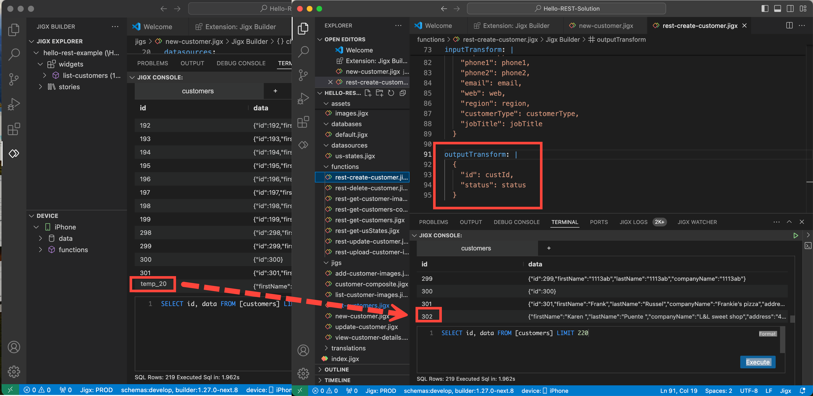

---
layout:
  width: wide
  title:
    visible: true
  description:
    visible: true
  tableOfContents:
    visible: true
  outline:
    visible: true
  pagination:
    visible: true
  metadata:
    visible: true
  tags:
    visible: true
  actions:
    visible: true
---

# REST best practice

## Working with REST IDs

* When a REST service returns an id, the Jigx local data provider can automatically be synced with this id, eliminating the need to add a `sync-entities` action to the jig.
* The id property must be added in the `outputTransform` of the REST data provider function.
* This is useful on a POST (create) as a temp\_id is created in the local data provider for the record when it is created. If the id is in the POST function `outputTransform`, the temp\_id is automatically updated with the REST id once it is created on the REST side.
* The below image shows how the local data provider creates a temp\_id when a new customer is added. Then, it is automatically synced with the REST `id` because the `id` is in the function's `outputTransform`.

<figure><figcaption><p>Syncing temp_Id</p></figcaption></figure>


```yaml
provider: DATA_PROVIDER_REST
method: POST # Create new record in the backend
url: https://jigx-training.azurewebsites.net/api/customers
useLocalCall: true

parameters:
  x-functions-key:
    location: header
    required: false
    type: string
    value: #Use manage.jigx.com to define credentials for your solution
  firstName:
    type: string
    location: body
    required: true
  lastName:
    type: string
    location: body
    required: true
  companyName:
    type: string
    location: body
    required: true
  address:
    type: string
    location: body
    required: false
  phone:
    type: string
    location: body
    required: false
  email:
    type: string
    location: body
    required: false

inputTransform: |
  {
    "firstName": firstName,
    "lastName": lastName,
    "companyName": companyName,
    "address": address,
    "phone": phone,
    "email": email
  }
# add the id to the output which ensures the local table,
# is automatically updated with the REST id once it is created.
outputTransform: |
  {
    "id": custId,
    "status": status
  }
```


## Chaining Calls vs. Automatic Temp-ID Replacement

This pattern differs from the automatic temp-ID replacement performed by `outputTransform`. In simple create scenarios, `outputTransform` can automatically replace temporary IDs with server-generated IDs in queued operations. However, when building workflows that chain multiple calls together — where the result of one call must be explicitly passed to the next — use the `operations` block with the following two steps, in this exact order:

1. **`operation.find-replace` first** — searches the local table and the command queue for the temp ID and replaces it with the server-generated permanent ID. This step must run first because `operation.upsert-merge` locates records by ID. If the local record still holds the temp ID when `upsert-merge` runs, the merge cannot find a matching record and inserts a duplicate instead of updating the existing one.
2. **`operation.upsert-merge` second** — once the local record's ID has been corrected by `find-replace`, merges any additional server-generated values (such as timestamps or computed fields) into that record.

Setting `includeCommandQueue: true` on `find-replace` is equally important: any operations still queued — for example, a follow-up update queued while offline — that still reference the temp ID must also be updated, or they will fail when they execute because the temp ID no longer exists in the local table.



```yaml
# Demonstrates chaining two execute-entity calls to create a customer:
#   1. action.set-jig-state, generates a temp ID and stores it in jig state
#   so all subsequent actions in the sequence can reference it.
#   2. execute-entity (LOCAL),writes the new record immediately to the local SQLite table
#   using the temp ID. This optimistic write means the UI reflects the new record instantly, 
#   even if the device is offline and the REST call is queued for later.
#   3. execute-entity (REST), calls the server to create the record. The temp ID is 
#   passed as a parameter so the function's operations block knows which local record 
#   to update once the permanent ID is returned.
title: Create Customer
type: jig.default

header:
  type: component.jig-header
  options:
    height: small
    children:
      type: component.image
      options:
        source:
          uri: https://www.dropbox.com/scl/fi/ha9zh6wnixblrbubrfg3e/business-5475661_640.jpg?rlkey=anemjh5c9qsspvzt5ri0i9hva&raw=1

datasources:
  # Static datasources provide dropdown values that do not require a server round-trip.
  region:
    type: datasource.static
    options:
      data:
        - id: 1
          region: US Central
        - id: 2
          region: US East
        - id: 3
          region: US West
  customerType:
    type: datasource.static
    options:
      data:
        - id: 1
          type: New
          value: new
        - id: 2
          type: Gold
          value: Gold
        - id: 3
          type: Silver
          value: Silver

children:
  - type: component.form
    instanceId: newCustomer
    options:
      isDiscardChangesAlertEnabled: false
      children:
        - type: component.text-field
          instanceId: companyName
          options:
            label: Company Name
        - type: component.field-row
          options:
            children:
              - type: component.text-field
                instanceId: firstName
                options:
                  label: First Name
              - type: component.text-field
                instanceId: lastName
                options:
                  label: Last Name
        - type: component.text-field
          instanceId: jobTitle
          options:
            label: Job Title
        - type: component.text-field
          instanceId: email
          options:
            label: Email
        - type: component.dropdown
          instanceId: region
          options:
            label: Region
            data: =@ctx.datasources.region
            item:
              type: component.dropdown-item
              options:
                title: =@ctx.current.item.region
                value: =@ctx.current.item.region
        - type: component.dropdown
          instanceId: customerType
          options:
            label: Customer Type
            data: =@ctx.datasources.customerType
            item:
              type: component.dropdown-item
              options:
                title: =@ctx.current.item.type
                value: =@ctx.current.item.value

actions:
  - children:
      - type: action.action-list
        options:
          title: Create Customer
          # isSequential: true guarantees each step completes before the next begins.
          # Step 3 (REST) depends on the local record that Step 2 creates, and both
          # Step 2 and Step 3 depend on the temp ID that Step 1 stores in jig state.
          # Without sequential execution the temp ID may not exist yet when referenced.
          isSequential: true
          actions:
            # Step 1: Generate a temp ID and store it in jig state.
            # Using jig state (rather than a local variable) makes the value 
            # accessible to every subsequent action in this sequence via
            # @ctx.jig.state.tempCustomerId.
            - type: action.set-jig-state
              options:
                changes:
                  tempCustomerId: ="TEMP-" & $floor($random() * 1000000)

            # Step 2: Write the record locally using the temp ID.
            # This is an optimistic write, the customer appears in the UI immediately.
            # If the device is offline, the REST call in Step 3 is queued; the local
            # record exists in the meantime so the app remains fully functional.
            - type: action.execute-entity
              options:
                provider: DATA_PROVIDER_LOCAL
                entity: customers-local
                method: create
                data:
                  id: =@ctx.jig.state.tempCustomerId
                  firstName: =@ctx.components.firstName.state.value
                  lastName: =@ctx.components.lastName.state.value
                  companyName: =@ctx.components.companyName.state.value
                  email: =$lowercase(@ctx.components.email.state.value)
                  region: =@ctx.components.region.state.value
                  jobTitle: =@ctx.components.jobTitle.state.value
                  customerType: =@ctx.components.customerType.state.value

            # Step 3: Call the REST service to create the customer on the server.
            # local_ID passes the temp ID into the function's operations block so
            # find-replace knows what to search for when the server responds.
            # local_ID is NOT sent to the REST endpoint, see the function's 
            # inputTransform, which explicitly excludes it from the request body.
            - type: action.execute-entity
              options:
                title: Sync Customer to Server
                provider: DATA_PROVIDER_REST
                entity: customers
                method: create
                function: create-customer
                parameters:
                  local_ID: =@ctx.jig.state.tempCustomerId
                data:
                  firstName: =@ctx.components.firstName.state.value
                  lastName: =@ctx.components.lastName.state.value
                  companyName: =@ctx.components.companyName.state.value
                  email: =$lowercase(@ctx.components.email.state.value)
                  region: =@ctx.components.region.state.value
                  jobTitle: =@ctx.components.jobTitle.state.value
                  customerType: =@ctx.components.customerType.state.value
```



```yaml
# POSTs a new customer to the REST service.
# When the server responds with a permanent ID, the operations block runs
# two steps in strict order to reconcile the local SQLite table:
#   1. find-replace, swaps the temp ID for the permanent ID in the local table & the command queue BEFORE upsert-merge runs.
#   2. upsert-merge, merges server-generated values into the now-correctly- identified local record.
# Order matters: upsert-merge matches records by ID. If the local record still
# holds the temp ID when upsert-merge runs, no match is found and a duplicate
# record is inserted instead of the existing one being updated.
provider: DATA_PROVIDER_REST
method: POST
url: https://[your_rest_service]/customers
format: json
useLocalCall: true
parameters:
  # local_ID carries the temp ID from the jig into this function.
  # It is declared as a parameter so it is accessible via
  # @ctx.parameters.local_ID in the operations block below.
  # It is intentionally excluded from inputTransform so it is 
  # never forwarded to the REST endpoint.
  local_ID:
    type: string
    location: body
    required: true
  firstName:
    type: string
    location: body
    required: true
  lastName:
    type: string
    location: body
    required: true
  companyName:
    type: string
    location: body
    required: false
  email:
    type: string
    location: body
    required: false
  region:
    type: string
    location: body
    required: false
  jobTitle:
    type: string
    location: body
    required: false
  customerType:
    type: string
    location: body
    required: false

# inputTransform defines exactly what is sent in the POST body.
# local_ID is deliberately absent, it is a local reference only,
# not a field the REST endpoint expects.
inputTransform: |
  ={
    "firstName": firstName,
    "lastName": lastName,
    "companyName": companyName,
    "email": email,
    "region": region,
    "jobTitle": jobTitle,
    "customerType": customerType
  }

operations:
  # Operation 1: find-replace, runs first, before upsert-merge.
  # Finds every occurrence of the temp ID in the customers-local table
  # and replaces it with the permanent ID returned by the server.
  # includeCommandQueue: true extends the replacement to the command queue.
  # Any operations queued while the device was offline (e.g., a follow-up
  # update to this record) will still reference the temp ID. Once find-replace
  # has run in the local table the temp ID no longer exists, so those queued
  # commands would fail, unless includeCommandQueue: true updates them too.
  - type: operation.find-replace
    find: =@ctx.parameters.local_ID
    replace: =@ctx.response.body.id
    tables:
      - customers-local
    includeCommandQueue: true

  # Operation 2: upsert-merge,  runs after find-replace has corrected the ID.
  # Merges the server's full response into the local record, writing back any
  # server-generated values that did not exist at the time of the optimistic
  # local write in the jig (permanent ID, server timestamps, computed fields).
  # Because find-replace has already updated the local record's ID, upsert-merge
  # correctly locates the record and updates it in place rather than inserting
  # a duplicate.
  - type: operation.upsert-merge
    table: customers-local
    records: |
      =@ctx.response.body.{
        "id": id,
        "firstName": firstName,
        "lastName": lastName,
        "companyName": companyName,
        "email": email,
        "region": region,
        "jobTitle": jobTitle,
        "customerType": customerType
      }
```



## Where and when to sync and load data

Knowing when to load and sync data is important as it can impact the apps performance and functionality when the device is offline.

* Load data in the `index.jigx` file by adding an `onFocus`, and `onLoad` for performance. This also ensures that all data is available if the device goes offline.
* Add the `sync-entity` or `sync-entities` action to a [global action](../../../ui/actions.md), to sync the data with the `onFocus` or `onRefresh` events ensuring efficiency and reusability throughout the solution. The global action is referenced in the solution's jigs to sync data from the REST server.
* See [REST syncing & loading local Data](rest-syncing-_-loading-local-data.md) for an in-depth explanation.

## Working with complex REST structures

Working with complex REST objects can be tricky, as they include arrays, nested objects, and other complex data structures. When integrating and manipulating these JSON structures from the REST data provider configure the following:

1. `JsonProperties` in the SQLite query `jsonProperties: - addresses`
2. In the expression used to retrieve the value, specify the exact property in the array or nested object that you require by referencing the `JsonProperty` followed by the property. `description: =@ctx.current.item.addresses[0].city leftElement: element: avatar text: =@ctx.current.item.addresses[0].state`




```json
"customers": [
        {
            "custId": 1,
            "firstName": "Merilyn",
            "lastName": "Bayless",
            "companyName": "20 20 Printing Inc",
            "addresses": [
                {
                    "address": "195 13n N",
                    "city": "Santa Clara",
                    "county": null,
                    "state": "CA",
                    "zip": "95054"
                }
            ],
            "phones": [
                {
                    "mobile": "408-758-5015",
                    "office": "408-758-5015"
                }
            ],
            "email": "merilyn_bayless@cox.net",
            "web": "http://www.printinginc.com",
            "region": "US West",
            "customerType": "Silver",
            "jobTitle": "Project Manager",
            "logo": null
        },
```





```yaml
datasources:
  customers:
    type: datasource.sqlite
    options:
      provider: DATA_PROVIDER_LOCAL

      entities:
        - entity: customers

      query: |
        SELECT 
          cus.id AS id, 
          json_extract(cus.data, '$.firstName') AS firstName, 
          json_extract(cus.data, '$.lastName') AS lastName,
          json_extract(cus.data, '$.companyName') AS companyName,
          json_extract(cus.data, '$.addresses') AS addresses,
          json_extract(cus.data, '$.phones') AS phones,
          json_extract(cus.data, '$.email') AS email,
          json_extract(cus.data, '$.web') AS web,
          json_extract(cus.data, '$.customerType') AS customerType,
          json_extract(cus.data, '$.jobTitle') AS jobTitle
        FROM 
          [customers] AS cus
        ORDER BY 
          json_extract(cus.data, '$.companyName')
      #
      jsonProperties:
        - addresses
        - phones

data: =@ctx.datasources.customers
item:
  type: component.list-item
  options:
    title: =@ctx.current.item.companyName
    subtitle: =@ctx.current.item.firstName & ' ' & @ctx.current.item.lastName
    description: =@ctx.current.item.addresses[0].city
    leftElement:
      element: avatar
      text: =@ctx.current.item.addresses[0].state

    label:
      title: =$uppercase((@ctx.current.item.customerType = 'Silver' ? @ctx.current.item.customerType:@ctx.current.item.customerType = 'Gold' ? @ctx.current.item.customerType:''))
      color:
        - when: =@ctx.current.item.customerType = 'Gold'
          color: color3
        - when: =@ctx.current.item.customerType = 'Silver'
          color: color14
    onPress:
      type: action.go-to
      options:
        linkTo: view-customer
        parameters:
          customer: =@ctx.current.item
```




## Data handling when a device is offline

Dealing with offline remote data is fundamental to ensuring data synchronization and consistency between the mobile app and the remote data source, allowing users to continue using the app and performing actions without interruption. [Offline remote data handling](../../offline-remote-data-handling.md) explains how to configure solutions to deal with data when the device is offline.

## Update multiple records in a single REST call

Updating multiple records in a single REST call helps optimize API usage by reducing the number of requests, which prevents hitting API rate limits and improves performance by minimizing client-server round-trip times. To implement this, use the execute-entities action to call the REST function. There are two configuration methods:

* **functionParameters**: Use this for static values that are consistent across all records.
* **data property**: Use this for dynamic values that vary per record.

For more information see [Update multiple records in a single REST call](https://docs.jigx.com/examples/readme/data-providers/rest/create-an-app-using-rest-apis/update-multiple-records-in-a-single-rest-call).

## Use the $ approach in REST functions

Avoid configuring functions and their parameters on a field level, using the dollar approach caters for maintenance and dynamic inclusion when new fields are added to the REST service. The required fields are specified in the jig's datasource.

```yaml
provider: DATA_PROVIDER_REST
method: GET
url: https://{custom-variable}Appointment
parameters:
  $expand:
    location: query
    required: false
    type: string
    value: Logs
  $filter:
    location: query
    required: true
    type: string
  accessToken:
    location: header
    required: true
    type: token
    value: xxxx
  cloudURL:
    location: path
    required: true
    type: string
outputTransform: $
```

## Using input and output transforms (no fields)&#x20;

Send one message body parameter into a function, this ensures you do not have to modify the input transform when fields change or are added. Create generic functions, that can be reused in multiple scenarios.

## **Limit json\_extract calls in query SELECT statements**

Limit json\_extract calls in query SELECT statements except on key fields for example, when using joins, WHERE, ORDER BY which require you to extract a specific field.&#x20;

* Calling individual field names to bind to components is expensive.&#x20;
* Use JSON properties on data at the root.&#x20;
* InstanceIds - use the name of the data in the schema that comes from the REST service.&#x20;
* Field names - use the name of the data in the schema that you want to send back to the backend system.

## Navigation&#x20;

* Use [New & existing behaviour in go-to action](../../../logic/navigation.md#go-to-using-new-and-existing-behaviour)
* Use InstanceId

## State usage&#x20;

Solution state has a performance impact, use only when necessary.&#x20;

## Use SQL commands for bulk deletes&#x20;

Use SQL commands for bulk deletes rather than `execute-entities` to ensure performance optimization.&#x20;

## Use indexes when joining on json\_extracts

ID fields are indexed when joining an adjacent `json_extracts`, where fields are not indexed SQLite scans through to find the data causing slow performance. Always select id in SELECT statements to ensure optimal performance.

## Where to store settings.

* Use [custom variables](../../../../administration/solutions/solution-settings/custom-variables.md) (solution settings > custom in Management) for settings that hardly ever change, for example, server URLs.&#x20;
* For settings that change frequently use Dynamic Data.

## Establish a naming convention for REST functions and files

* _Improves readability_: Clear names make it easier to understand the purpose of the function or file, e.g., rest-get-appointments.
* _Maintainability:_ Consistent naming simplifies future updates and debugging.&#x20;
* _Collaboration_: Common naming standards help multiple contributors understand and interact with the project seamlessly.

## See Also

* [REST examples](https://docs.jigx.com/examples/readme/data-providers/rest)
