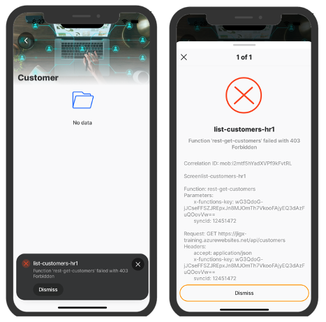
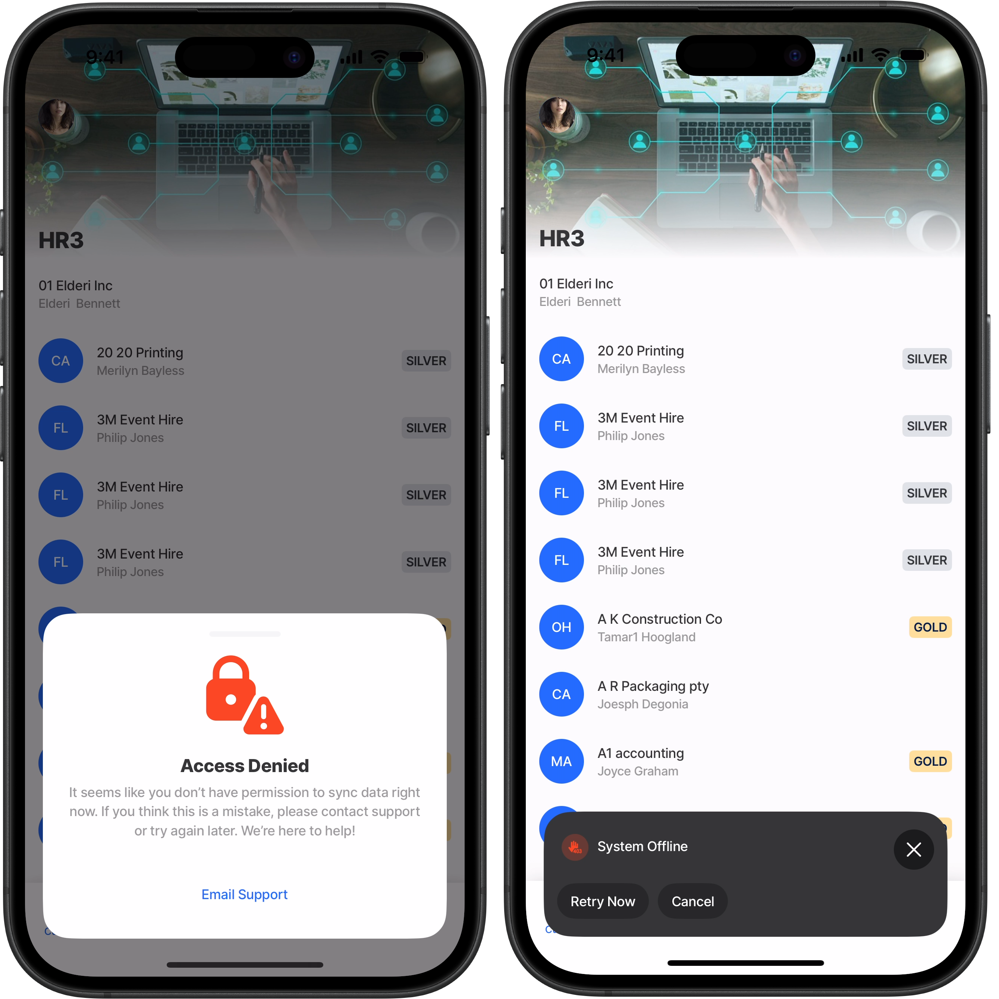
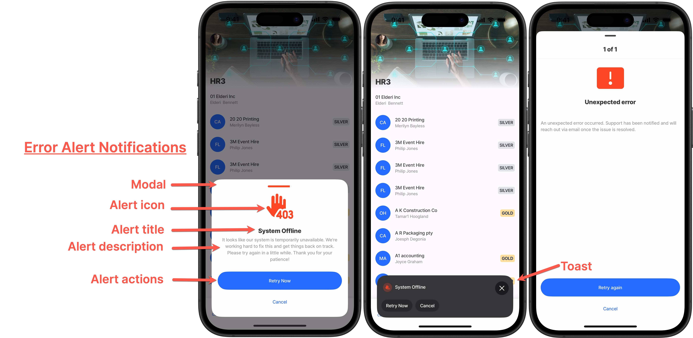

# REST error handling

REST errors returned by the endpoints in an app are often too technical for end-users to comprehend. Jigx allows you to customize these error messages to improve user experience, communicate more effectively, and ensure users understand that errors are not their fault. By configuring custom error handling, you can:

* Suppress or customize default error messages. See [Configuring error alerts](configuring-error-alerts.md).
* Log error details for more effective debugging. See [Error logging and debugging](error-logging-and-debugging.md).
* Create more robust and user-friendly error solutions. See [Working with commandQueue](working-with-commandqueue.md).

## Key features

* **Custom error messages**: Control the message shown to users when a REST error occurs.
* **User-friendly retry options**: Allow users to retry an action when an error occurs.
* By default, Jigx automatically catches any **429 error responses** and retries the request up to three times, with a five-second delay between each attempt.
* By default, Jigx automatically catches any 401 error responses and retries the request up to three times.
* **Error logging**: Automatically log error details for debugging.
* **Dynamic responses**: Build logic to respond to specific errors flexibly.



<figure><figcaption><p>Standard error handling</p></figcaption></figure>



<figure><figcaption><p>Customized error handling with alert</p></figcaption></figure>



### Common Error Scenarios

* Network failures
* Authentication/authorization errors
* Rate limiting
* Server errors vs client errors

## How does it work

In Jigx, REST error handling is configured through an `error` section in the REST function. This allows the system to catch various error responses and act accordingly:

* Multiple error responses can be defined and are evaluated in sequence.
* Error responses can trigger notifications, [log errors](error-logging-and-debugging.md), or provide retry options for users.
* The app supports customized [alert messaging](configuring-error-alerts.md) as a toast or modal for each error type.
* Expressions are supported in functions.

### **High level steps**

Before diving into details, here's what you need:

1. Configure the `error` section in the REST **function**&#x20;
2. Define error conditions with `when`
3. Create a **datasource** for the error table.
4. Configure user [alerts](configuring-error-alerts.md) and/or logging
5. (Optional) - Create a **UI** (jig) for error management, to process the errors in the queue using the [commandQueue](working-with-commandqueue.md) actions.

## Considerations

* By default, Jigx automatically handles `429` (Too Many Requests) error responses for CRUD and sync methods by retrying the request up to three times, with a five-second delay between each attempt. If the request still fails after the third retry, the error is raised in the app. You can customize this behavior by configuring the handling of the 429 status in the `error` property.
* When configuring error handling with `alerts`, ensure that HTTP 200 (success) responses are excluded. If not, the app may treat successful responses as errors, preventing data from loading.
* Errors are automatically grouped by default to prevent alert overload, unless a custom error handler is explicitly configured.&#x20;

## REST Function

In the [Jigx function file](../../../../jigx-builder-code-_editor_/editor.md#solution-scaffolding), configure the `error` section to cater for:

* Customizing the error message.
* Determining if a toast or modal alert notification is required or not.
* Group related alerts to prevent multiple alerts from stacking one after another.
* Writing the context of the error to a table for debugging and configuring actions to fix the error.

Multiple error handlers can be added in the function, which are executed from the top to bottom until one matches. The error section needs to be configured in each of the individual REST function files.

<figure><figcaption><p>Error function alert properties</p></figcaption></figure>

## Configuration properties

The following properties are available for configuration when handling REST errors:

<table><thead><tr><th width="121.34375">Property</th><th>Description</th></tr></thead><tbody><tr><td><code>alert</code></td><td>See <a href="configuring-error-alerts.md">Configuring error alerts</a>.</td></tr><tr><td><code>description</code></td><td><p>Description of the error for logging purposes.</p><p>Provide a detailed message of the error to write to the logs. Defaults to the provider's description if absent. For example, the REST provider uses the HTTP status code and message. The description property supports <a href="../../../../additional-functionality/localization.md">localization</a>. </p></td></tr><tr><td><code>details</code></td><td>Add additional error details for logging purposes. Defaults to the provider's details if absent.</td></tr><tr><td><code>notification</code></td><td>Determines whether the error alert message notification should be shown on the device. (true/false)</td></tr><tr><td><code>operations</code></td><td><p>Additional table operations for the error table. See <a data-mention href="../functions/operations.md">operations.md</a> for more details.</p><ul><li>Specify none or more conditional table operations/transforms. </li><li>Each operation is evaluated in the order specified, if the <code>when</code> condition is met it is executed.</li><li>If a table is not specified, the default table will be used ("{entity}_error").</li><li>If the same table is specified multiple times, then each operation will be executed in order.</li><li><code>table</code>: Define a table where the error information specified in the <code>transform</code> property will be logged to, for example: <code>table: =@ctx.entity &#x26; "_error"</code></li><li><code>records</code>: Specifies the details to log in the table for the error, such as the request, response, and user context, for example: <br><code>'={ "id": @ctx.commandId, "type": "System Offline", "response": @ctx.response, "request": @ctx.request, "user": @ctx.user, "solution": @ctx.solution, "entity": @ctx.entity, "correlationId": @ctx.correlationId}'</code></li></ul></td></tr><tr><td><code>retry</code></td><td>Provides the ability to configure an automatic retry, set a <code>delay</code> time before the retry is executed, and specify the <code>maximum</code> number of retries allowed. By default, Jigx automatically handles <strong>429</strong> (Too Many Requests) error responses for CRUD and sync methods by retrying the request up to three times, with a five-second delay between each attempt. If the request still fails after the third retry, the error is raised in the app. You can customize this behavior by configuring the handling of the 429 status in the <code>error</code> property.</td></tr><tr><td><code>title</code></td><td>Title of the error for logging purposes. Defaults to the provider's title if not provided. The title property supports <a href="../../../../additional-functionality/localization.md">localization</a>.</td></tr><tr><td><code>when</code></td><td><p>Checks if the result of the function is an error, the first one that resolves to true is used. </p><ul><li>The REST provider uses a combination of actual errors encountered and the HTTP status code and message. </li><li>Configure different types of actions depending on the error received, by using multiple <code>when</code> statements. </li><li>If the property is not configured it defaults to the REST provider's default error check.</li></ul></td></tr></tbody></table>

## Basic configuration example


```yaml
# Configure an error section in each function file for REST endpoint,
# where errors can occur.
error:
  # Configure details for each error status code.
  - when: =@ctx.response.status = 403
    # Determine if an alert should be shown to the user.
    notification: true
    # Configure the type, details, and style of the alert to be shown to the user.
    alert:
      title: System Offline
      description: 
        It looks like our system is temporarily unavailable.
        We're working hard to fix this and get things back on
        track. Please try again in a little while. Thank you
        for your patience!
      icon: server-error-403-hand-forbidden
      style:
        isNegative: true
      # Presentation style (overlays the current screen), can be modal or toast.   
      presentAs: toast
      # Grouping allows you to manage multiple alerts under a shared identifier. 
      # This ensures that only one alert from a group is visible at a time
      group:
        id: code403
    # Configure information to be logged in the datasync-error table.  
    title: System Offline
    description: System is temporarily unavailable.
    details: =@ctx.response.body
    # Configure the data operation to be performed on the error table.
    operations:
      - type: operation.upsert-merge
        table: datasync-error
        records: 
          '={ "id": @ctx.parameters.syncId, "type": "System Offline",
          "response": @ctx.response, "request": @ctx.request, "user": @ctx.user, "solution": @ctx.solution,
          "entity": @ctx.entity, "correlationId": @ctx.correlationId}'
    # Set an automatic retry, specify the delay before the retry is actioned,
    # Set the number of retries allowed.
    retry:
      delay: "=(@.response.headers.'retry-after' ? $number(@.response.headers.'retry-after') : 5)*1000"
      maxRetries: 3
```


## Configuring OAuth error messages

* When `useLocalCall: true` is set, functions that rely on secrets or other authentication mechanisms not available locally will not execute.
* For full details on configuring OAuth error messages, see [Configuring OAuth error messages](./#configuring-oauth-error-messages).

## Examples and code snippets

* See [REST error example](../rest-overview.md) to understand how to configure error responses in a REST function, create a error table and use the commandQueue with actions to process the error.
* See [Configuring OAuth error messages](./#configuring-oauth-error-messages) for an example of customizing OAuth error messages.
