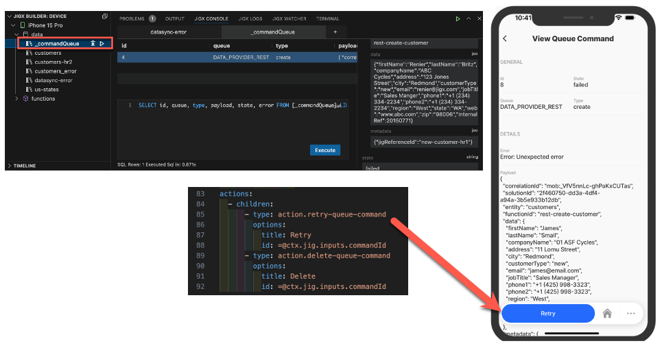
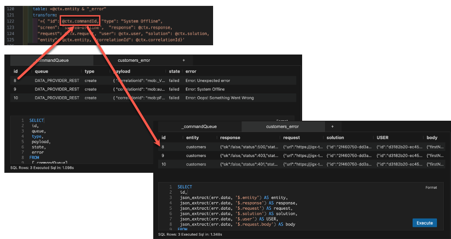

# Working with commandQueue

## commandQueue table

The commandQueue is a system table, when a device is offline items are queued on the table. When the device comes online the items in the queue are processed. However, if items on the queue go into error, they are not processed and remain on the queue. Errors from REST methods, except for `action.sync-entity/entities` are queued in the commandQueue table. The commandQueue is exposed in Jigx Dev tools, allowing you to [debug](../../../../jigx-builder-code-_editor_/debugging.md) . You can expose the commandQueue table in a jig and then use the commandQueue actions to interact with the queued items that are in error state by either performing a retry or delete. Take note that when syncing an item or when the device is offline the `commandId` is not available.

<figure><figcaption><p>commandQueue</p></figcaption></figure>

### commandQueue actions (retry, delete, clear)

There are two actions related specifically to the commandQueue namely:

* `action.retry-queue-command` - executes a retry of the REST function called.
* `action.delete-queue-command` - Only deletes the item from the commandQueue. The record will still be saved locally on the device. You need to provide separately for the deleting of the local data, which can be achieved through an `action.sync-entity/entities` or executing a delete method on the local data provider.
* `action.clear-queue` - Use this action to clear commands from the queue for a specific id.

**Action configuration:**

```yaml
swipeable:
  left:
    - label: Delete
      icon: close
      color: negative
      onPress:
        type: action.delete-queue-command
        options:
          id: =@ctx.current.item.id
    - label: Retry 
      icon: button-refresh-arrow
      color: primary
      onPress:
        type: action.retry-queue-command
        options:
          id: =@ctx.current.item.id
    - label: Clear
      icon: button-refresh-arrow
      color: warning
      onPress:
        type: action.clear-queue
        options:
          id: =@ctx.current.item.id      
```

## &#x20;Batch operations on queue items

### **How to reset multiple queue items at the same time**

When you have a list of commandQueue items to retry (not necessarily all failed items), send the selected item’s `id` from the datasource using `id: =@ctx.datasource.command-queue.id`.

If there are multiple `id` in the response, the action will run through each one in the array.



```yaml
actions:
  - numberOfVisibleActions: 1
    children:
      - type: action.retry-queue-command
        options:
          title: Retry all
          id: =@ctx.datasources.command-queue.id
```



```yaml
type: datasource.sqlite
options:
  provider: DATA_PROVIDER_LOCAL
  entities:
    - _commandQueue
  query: |
    SELECT
      id, queue, type, payload, state, error
    FROM [_commandQueue]
    ORDER BY id;
  jsonProperties:
    - payload
```



## Considerations

* The `commandId` matches the `id` in the error table, this is important when you want to build a jig/UI to deal with the error.
* When using the commandQueue actions the commandQueue id (`commandId`) is required.
* Use the error table to build a jig/UI as there is more data logged to the table than the commandQueue.

<figure><figcaption><p>commandId &#x26; error id</p></figcaption></figure>

* Use the \_commandQueue table as a datasource in your solution. It behaves like a normal entity table with change events and updates.
