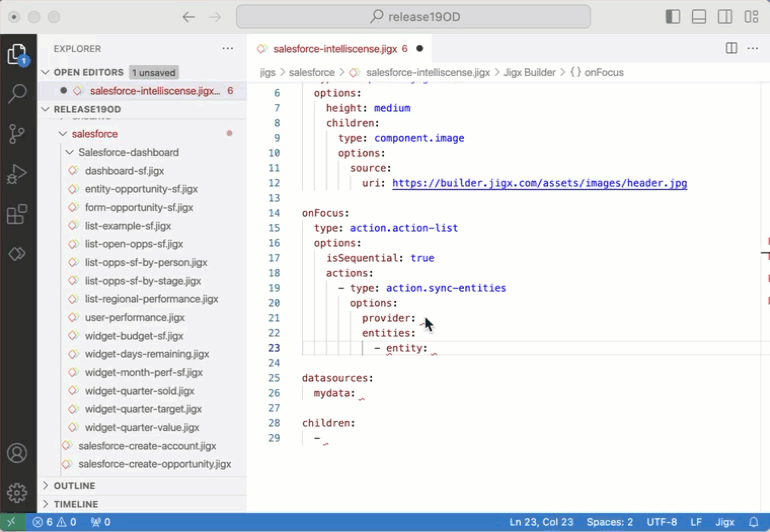
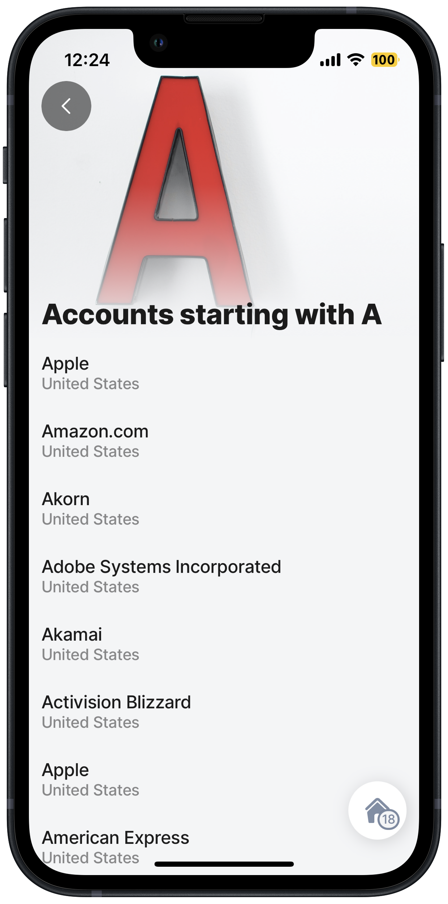

# Using the Salesforce provider

When working with the Salesforce provider, it is helpful to know how to reference more than one Salesforce object at a time, filter the columns you require, join data from different objects, and use it in a jig. Below are code examples of each.

### Using IntelliSense

In the Salesforce provider, use IntelliSense (ctrl+space) in the `entities` properties to select objects from the standard Salesforce objects or start typing the name of the object, and the list will provide you with a selection. When using custom objects, you need to manually type in the name. A blue line will display under the name, this indicates that it is an unknown Salesforce entity, and you can ignore the warning if it is a custom object

<figure><figcaption><p>IntelliSense in Salesforce provider</p></figcaption></figure>

### Referencing multiple objects in a jig

Below is an example of syncing data from six Salesforce objects when the jig is `onFocus`, using `action.sync-entities`.


```yaml
onFocus:
  type: action.action-list
  options:
    actions:
      - type: action.sync-entities
        options:
          provider: DATA_PROVIDER_SALESFORCE
          entities:
            - Account
            - Opportunity
            - OpportunityStage
            - User
            - UserRole
            - Territory
```


### Filtering columns



Below is a simple example of filtering the Account object's name column to only return accounts starting with the letter A.



<figure><figcaption><p>Accounts starting with A</p></figcaption></figure>




```yaml
title: Accounts starting with A
type: jig.list
icon: contact

header:
  type: component.jig-header
  options:
    height: medium
    children:
      type: component.image
      options:
        source:
          uri: https://images.unsplash.com/photo-1577974291737-faf660945d53?ixlib=rb-4.0.3&ixid=M3wxMjA3fDB8MHxwaG90by1wYWdlfHx8fGVufDB8fHx8fA%3D%3D&auto=format&fit=crop&w=2674&q=80

onFocus:
  type: action.action-list
  options:
    actions:
      - type: action.sync-entities
        options:
          provider: DATA_PROVIDER_SALESFORCE
          entities:
            - Account

datasources:
  filter-account:
    type: datasource.sqlite
    options:
      provider: DATA_PROVIDER_LOCAL

      entities:
        - entity: Account
      # filter the account object to return specific columns and a select number of rows
      query: SELECT id, '$.Name', '$.BillingCountry' FROM [Account] WHERE '$.Name' LIKE 'a%'

data: =@ctx.datasources.filter-account
item:
  type: component.list-item
  options:
    title: =@ctx.current.item.Name
    subtitle: =@ctx.current.item.BillingCountry
```


### Joining data

Below is an example of how you join data from multiple objects in Salesforce using SQLite queries. In this example we joining data in the Account and Case objects.


```yaml
query: SELECT id as accid, '$.Name', '$.BillingCountry' FROM [Account]
  LEFT JOIN [Case]
  on AccountId = accid
  group by casepriority = caseprior
```


### Examples and code snippets

The following examples with code snippets are provided:

* [Create records in objects](https://docs.jigx.com/examples/readme/data-providers/salesforce/create-records-in-objects)
* [Delete records in objects](https://docs.jigx.com/examples/readme/data-providers/salesforce/delete-records-in-objects)
* [Save & update records in objects](https://docs.jigx.com/examples/readme/data-providers/salesforce/save-and-update-records-in-objects)
* [List records in objects](https://docs.jigx.com/examples/readme/data-providers/salesforce/list-records-in-objects)
