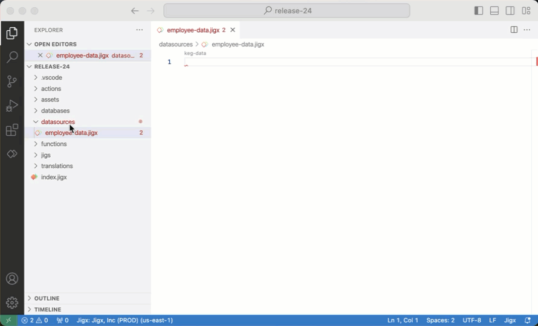
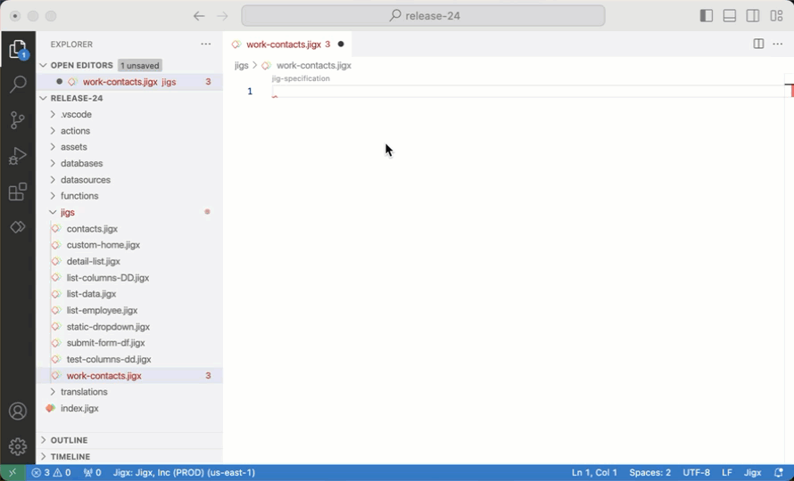

# Datasources

Datasources are sets of data used in Jigx solutions and are used to reference data from the various [Data Providers](data-providers/). When data required by a solution resides in a different solution, [cross-solution datasource access](datasources/cross-solution-data-access.md#cross-package-datasources-and-action-execution) allows you to reference and query that external solution's data directly.

## Types

There are three types of datasources available in Jigx Builder.

1. [sqlite](datasources/sqlite/ "mention")- Using the SQLite datasource provides the ability to write SQL queries to get data from Dynamic Data and local data providers. For code examples and snippets, see [sqlite](https://docs.jigx.com/examples/readme/datasource/sqlite).
2. **Static** - Static lists are typically used when data needs to be accessed but hardly ever changed. Static Data is helpful because it can be created quickly inside the jig, and there is no need to specify any database connections or set up tables. The amount of records that can be created in Static data is unlimited. Static data is commonly used to bind data to the UI components. For code examples and snippets, see [Static](https://docs.jigx.com/examples/readme/datasource/static).
3. **System** - The system datasource is used to get a list of icons for jig components. For code examples and snippets, see [system](https://docs.jigx.com/examples/readme/datasource/system).

## Configuration options

<table><thead><tr><th width="153.67578125">Property</th><th width="323.7421875">Description</th><th>Code Examples</th></tr></thead><tbody><tr><td><code>isDocument</code></td><td>When the <code>isDocument</code> property is set to <code>true</code> on a datasource, the datasource will return as a single record (object) to be displayed on a component instead of an array. The first matching row becomes the datasource without wrapping the array. If there is no match it is NULL. If you want to set the <code>initialValues</code> for a <a href="https://docs.jigx.com/examples/readme/components/form">form</a>, set it on the form level and in the datasource <code>isDocument: true</code>, this way you don't have to set it up in the individual components. It is set up in one place and form will match the components to the column names of the datasource.</td><td><a href="https://docs.jigx.com/examples/readme/components/form#zUejA">new-contact.jigx</a></td></tr><tr><td><code>jsonProperties</code></td><td>Working with complex objects can be tricky, as they include arrays, nested objects, and other complex data structures. When integrating and manipulating these JSON structures you can use <code>jsonProperties</code> to specify the exact property in the array or nested object that you require. See <a href="data-providers/rest/rest-best-practice.md">Working with complex REST structures</a>.</td><td><a href="https://docs.jigx.com/examples/readme/data-providers/rest/create-an-app-using-rest-apis/list-_-view-customers-_get_">view-customer-details.jigx</a></td></tr></tbody></table>

### isDocument example



```yaml
datasources:
  contactData:
    type: datasource.sqlite
    options:
      # The isDocument property for the datasource is set to true.
      # As a result, the datasource will return as a single record to be displayed,
      # instead of an array of records.
      isDocument: true
      provider: DATA_PROVIDER_DYNAMIC
      entities:
        - default/contacts
      query: |
        SELECT 
          id,
          '$.firstName',
          '$.lastName',
          '$.jobTitle',
          '$.companyName',
          '$.phone',
          '$.email' 
        FROM 
          [default/contacts]
        WHERE
          id = @contactId
      queryParameters:
        contactId: =@ctx.jig.inputs.contact.id
```



```json
{
  "contacts": [
    {
      "id": 1,
      "firstName": "Merilyn",
      "lastName": "Bayless",
      "companyName": "20 20 Printing Inc",
      "phone": "408-758-5015",
      "email": "merilyn_bayless@cox.net",
      "web": "http://www.printinginc.com",
      "jobTitle": "Project Manager"
    }
  ]
}
```



```yaml
title: Add new contact A
type: jig.default
icon: book-address

inputs:
  id:
    type: string
    required: true

header:
  type: component.jig-header
  options:
    height: medium
    children:
      type: component.image
      options:
        source:
          uri: https://images.unsplash.com/photo-1517245386807-bb43f82c33c4?ixlib=rb-4.0.3&ixid=MnwxMjA3fDB8MHxwaG90by1wYWdlfHx8fGVufDB8fHx8&auto=format&fit=crop&w=1740&q=80

datasources:
  contactData:
    type: datasource.sqlite
    options:
      # The isDocument property for the datasource is set to true.
      # As a result, the datasource will return as a single record to be displayed,
      # instead of an array of records.
      isDocument: true
      provider: DATA_PROVIDER_DYNAMIC
      entities:
        - default/contacts
      query: |
        SELECT 
          id,
          '$.firstName',
          '$.lastName',
          '$.jobTitle',
          '$.companyName',
          '$.phone',
          '$.email' 
        FROM 
          [default/contacts]
         WHERE
          id = @contactId
      queryParameters:
        contactId: =@ctx.jig.inputs.id

children:
  - type: component.form
    instanceId: new-contact
    options:
      initialValues: =@ctx.datasources.contactData
      isDiscardChangesAlertEnabled: false
      children:
        - type: component.avatar-field
          instanceId: employee-photo
          options:
            label: Photo
        - type: component.section
          options:
            title: Personal information
            children:
              - type: component.text-field
                instanceId: firstName
                options:
                  label: First name
              - type: component.text-field
                instanceId: lastName
                options:
                  label: Last name
              - type: component.email-field
                instanceId: email
                options:
                  label: Email
                  icon: email
              - type: component.number-field
                instanceId: phone
                options:
                  label: Phone number
                  icon: phone
        - type: component.section
          options:
            title: Business information
            children:
              - type: component.text-field
                instanceId: jobTitle
                options:
                  label: Position
              - type: component.text-field
                instanceId: companyName
                options:
                  label: Company Name

actions:
  - children:
      - type: action.execute-entity
        options:
          title: Create Record
          provider: DATA_PROVIDER_DYNAMIC
          entity: default/contacts
          method: create
          data:
            firstName: =@ctx.components.firstName.state.value
            lastName: =@ctx.components.lastName.state.value
            email: =@ctx.components.email.state.value
            phone: =@ctx.components.phone.state.value
            jobTitle: =@ctx.components.jobTitle.state.value
            companyName: =@ctx.components.companyName.state.value
```



### jsonProperties example



```yaml
datasources:
  customers:
    type: datasource.sqlite
    options:
      provider: DATA_PROVIDER_LOCAL

      entities:
        - entity: customers

      query: |
        SELECT 
          cus.id AS id, 
          json_extract(cus.data, '$.firstName') AS firstName, 
          json_extract(cus.data, '$.lastName') AS lastName,
          json_extract(cus.data, '$.companyName') AS companyName,
          json_extract(cus.data, '$.addresses') AS addresses,
          json_extract(cus.data, '$.phones') AS phones,
          json_extract(cus.data, '$.email') AS email,
          json_extract(cus.data, '$.web') AS web,
          json_extract(cus.data, '$.customerType') AS customerType,
          json_extract(cus.data, '$.jobTitle') AS jobTitle
        FROM 
          [customers] AS cus
        ORDER BY 
          json_extract(cus.data, '$.companyName')
      # Specify the exact property in the array or nested object that you require.
      jsonProperties:
        - addresses
        - phones

data: =@ctx.datasources.customers
item:
  type: component.list-item
  options:
    title: =@ctx.current.item.companyName
    subtitle: =@ctx.current.item.firstName & ' ' & @ctx.current.item.lastName
    description: =@ctx.current.item.addresses[0].city
    leftElement:
      element: avatar
      text: =@ctx.current.item.addresses[0].state

    label:
      title: =$uppercase((@ctx.current.item.customerType = 'Silver' ? @ctx.current.item.customerType:@ctx.current.item.customerType = 'Gold' ? @ctx.current.item.customerType:''))
      color:
        - when: =@ctx.current.item.customerType = 'Gold'
          color: color3
        - when: =@ctx.current.item.customerType = 'Silver'
          color: color14
    onPress:
      type: action.go-to
      options:
        linkTo: view-customer
        parameters:
          customer: =@ctx.current.item
```



```json
"customers": [
        {
            "custId": 1,
            "firstName": "Merilyn",
            "lastName": "Bayless",
            "companyName": "20 20 Printing Inc",
            "addresses": [
                {
                    "address": "195 13n N",
                    "city": "Santa Clara",
                    "county": null,
                    "state": "CA",
                    "zip": "95054"
                }
            ],
            "phones": [
                {
                    "mobile": "408-758-5015",
                    "office": "408-758-5015"
                }
            ],
            "email": "merilyn_bayless@cox.net",
            "web": "http://www.printinginc.com",
            "region": "US West",
            "customerType": "Silver",
            "jobTitle": "Project Manager",
            "logo": null
        },
```



## Where and how to use datasources

### In a Global file

Datasources are defined once and are available throughout your solution to be reused in multiple jigs. Adding a global datasource improves performance as the data is retrieved once rather than multiple times.

<figure><figcaption><p>Global datasource</p></figcaption></figure>

1. Open your solution in Jigx Builder and navigate to the **datasources** folder of your solution.
2. Create a new file called _\<your\_datasource\_name>.jigx._
3. Invoke IntelliSense (ctrl+space) for the list of available datasources.
4. Select the datasource you want to use and configure the properties with values. When choosing Dynamic Data or SQL data, you can write SQL queries to return the data you want to use in the solution.
5. Next, open the jigs where you want to use the data, use expressions with the datasource option to reference the global datasource file, for example, `=@ctx.datasources.employee`.

### Global Datasource Inputs

This feature extends the global datasource system to support **input passing**, allowing a single global datasource to be instantiated multiple times within a jig with different input values per instance. This mirrors the existing input pattern available in [custom components](../ui/custom-components-_alpha_/inputs-_-outputs-_alpha_.md). Each reference to a global datasource can supply its own `inputs` block, creating an isolated local instance of that datasource scoped to the values provided.

* If you have required parameters you have to use datasource to be able to validate that they exist. If you do not have required parameters you can choose to not use input definitions (within the datasource) and just use normal inputs.

#### How It Works

When a Jig references a global datasource, the runtime now:

1. Detects that the datasource reference points to a global configuration.
2. Retrieves the global datasource configuration.
3. Wraps it in an `InputContext` containing the supplied `inputs`.
4. Creates a local datasource instance the same mechanism used when providing a full inline configuration.

This means two references to the same global datasource with different inputs are completely independent instances at runtime.

#### Configuration

Define the global datasource under the `datasources` folder. Configure the following properties:

<table><thead><tr><th width="160.3515625">Field</th><th>Description</th></tr></thead><tbody><tr><td><code>datasourceId</code></td><td>The ID of the global datasource file to reference. This is referenced in multiple jigs using <code>datasource.reference</code>. </td></tr><tr><td><code>inputs</code></td><td>Key-value pairs passed into the global datasource. Values can be static or dynamic expressions.</td></tr></tbody></table>



<pre class="language-yaml"><code class="lang-yaml">type: datasource.sqlite
# Provide a reference
datasourceId: contactsDatasource
options:
  provider: DATA_PROVIDER_DYNAMIC
  entities:
    - default/contacts
  query: |
    SELECT 
      id,
      '$.firstName',
      '$.lastName',
      '$.jobTitle',
      '$.companyName',
      '$.phone',
      '$.email' 
    FROM 
      [default/contacts]
    WHERE
      id = @contactId or @contactId IS NULL
  queryParameters:
    # Access the global data inputs
    contactId: =@ctx.inputs.contactId
<strong># Define the inputs 
</strong>inputs:
  contactId:
    type: string
    required: false
</code></pre>



```yaml
datasources:
  first:
    datasourceId: global-static
    inputs:
      name: John
      surname: Smith
  second:
    datasourceId: global-static
    inputs:
      name: Vallarie
      surname: =@ctx.components.surname.state.value
```



Inside the global datasource file, inputs are accessed using the standard `ctx.inputs` context,  the same pattern used in custom components.

```yaml
# In global-static datasource configuration
=@ctx.inputs.name
=@ctx.inputs.surname
```

In the jigs' referencing the global datasource use the `datasource.reference` with the `datasourceId`.

```yaml
datasources:
  contactData:
    type: datasource.reference
    datasourceId: contactsDatasource
```

### Naming: `datasourceId` vs `instanceId`

The codebase distinguishes more clearly between two related but different concepts:

<table><thead><tr><th width="156.875">Term</th><th>Meaning</th></tr></thead><tbody><tr><td><code>datasourceId</code></td><td>The identifier of the <strong>datasource file</strong> (analogous to <code>JigId</code> or <code>ComponentId</code>). Used to locate or reference the global configuration on disk.</td></tr><tr><td><code>instanceId</code></td><td>The identifier of a <strong>specific instantiation</strong> of a datasource within a Jig. </td></tr></tbody></table>

### Local within a jig

The data sets are defined in the datasources inside the individual jig generally under the `datasources:` property. Use datasources locally if you only need the data in that specific jig.

<figure><figcaption><p>Local datasource</p></figcaption></figure>

1. Open your solution in Jigx Builder and navigate to the jig.
2. Under the `datasources:` property, replaces the `mydata:` property with a unique name for the data set.
3. Invoke IntelliSense (ctrl+space) next to the `mydata:` property for the list of available datasources.
4. Select the datasource you want to use and configure the properties with values. When choosing Dynamic Data or SQL data, you can write SQL queries to return the data you want to use in the jig. _Tip_: only return the specific data you need in the datasource.
5. The data is now available to use in that jig by using expressions with the datasource option to reference the local datasource using the unique name you gave it, for example, `=@ctx.datasources.contact`.

### See Also

* [static](https://docs.jigx.com/examples/readme/datasource/static) datasource examples
* [sqlite](https://docs.jigx.com/examples/readme/datasource/sqlite) datasource examples
* [system](https://docs.jigx.com/examples/readme/datasource/system)
* [File handling](file-handling.md)
