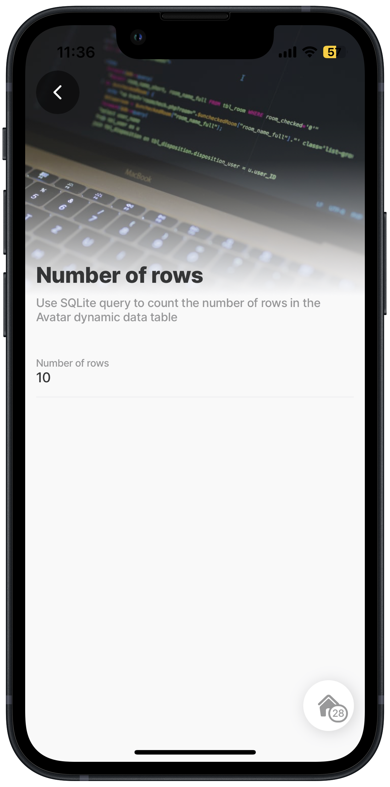
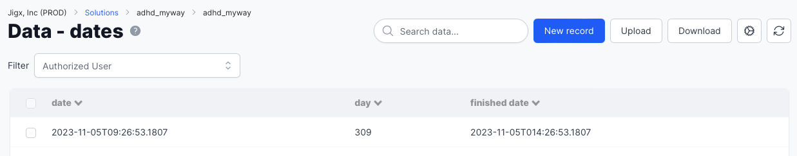
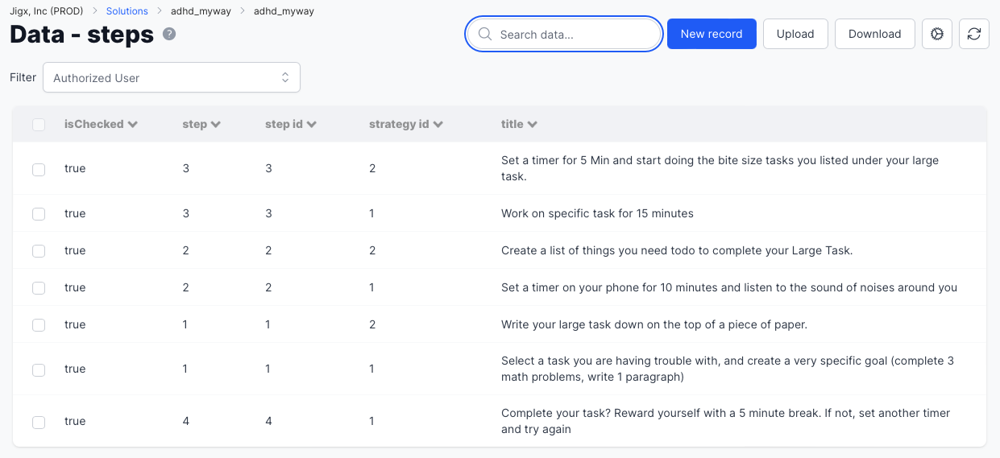
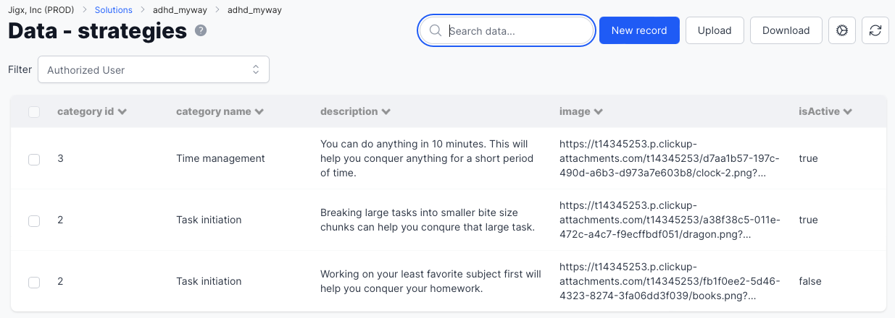
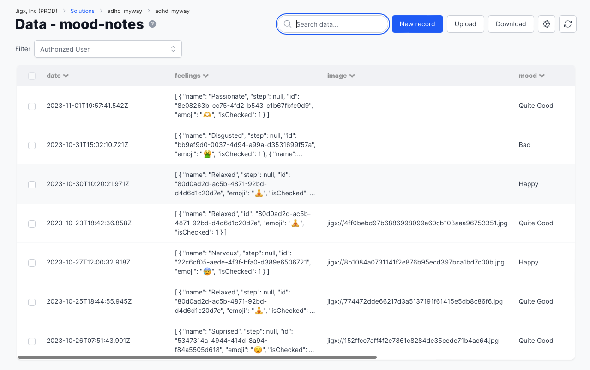
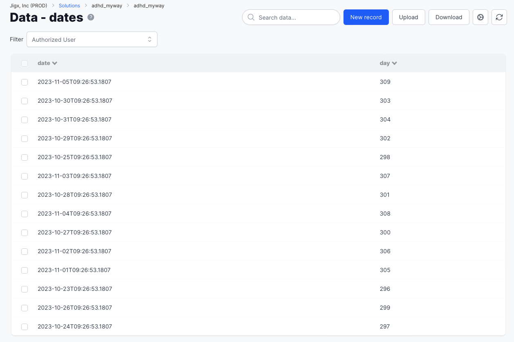

# SQLite cheatsheet

## Count rows in the table



In this example a SQLite query is used to count the rows in the **avatar** table.



<figure><figcaption><p>Count rows</p></figcaption></figure>





```yaml
# count rows in a table
datasources:  
  row_count:
    type: datasource.sqlite
    options:
      provider: DATA_PROVIDER_DYNAMIC
  
      entities:
        - default/avatar
  
      query: |
        SELECT COUNT(*) AS row_count
        FROM [default/avatar] 
```



```yaml
title: Number of rows 
description: Use SQLite query to count the number of rows in the Avatar dynamic data table
type: jig.default

header:
  type: component.jig-header
  options:
    height: medium
    children:
      type: component.image
      options:
        source:
          uri: https://images.unsplash.com/photo-1489875347897-49f64b51c1f8?auto=format&fit=crop&q=60&w=800&ixlib=rb-4.0.3&ixid=M3wxMjA3fDB8MHxzZWFyY2h8MXx8c3FsJTIwcXVlcnl8ZW58MHx8MHx8fDA%3D

# count rows in a table
datasources:  
  row_count:
    type: datasource.sqlite
    options:
      provider: DATA_PROVIDER_DYNAMIC
  
      entities:
        - default/avatar
  
      query: |
        SELECT COUNT(*) AS row_count
        FROM [default/avatar] 
children:
  - type: component.entity
    options:
      children:
        - type: component.entity-field
          options:
            label: Number of rows
            value: =@ctx.datasources.row_count.row_count
```



## Converting dates

Here is an example of using a SQLite query to convert dates in a dynamic data table.

<figure><figcaption><p>SQLite - Converting dates</p></figcaption></figure>


```yaml
datasources:  
  actualDay:
    type: datasource.sqlite
    options:
      provider: DATA_PROVIDER_DYNAMIC
  
      entities:
        - default/dates
  
      query: 
        SELECT 
        id, 
        STRFTIME('%d', json_extract(data, '$.date')) AS date,
        STRFTIME('%d.%m', json_extract(data, '$.finished_date')) AS finished_date,
        FROM [default/dates]
```


## Joining data from tables and using subquery

Using a SQLite query, one can join data from different tables by utilizing subqueries. This allows for the combination of information from multiple tables based on specified conditions. By employing subqueries, one can retrieve and manipulate data ensuring accurate and comprehensive results. Below is an example of joining tables and then using a subquery.

<figure><figcaption></figcaption></figure>

<figure><figcaption></figcaption></figure>


```yaml
datasources
  strategies-with-steps:
    type: datasource.sqlite
    options:
      provider: DATA_PROVIDER_LOCAL

      entities:
        - entity: default/steps
        - entity: default/strategies

      query: |
        SELECT
          a.id AS id,
          json_extract(a.data, '$.name') AS name,
          json_extract(a.data, '$.strategy_id') AS strategy_id,
          json_extract(a.data, '$.isActive') AS isActive,
          json_extract(b.data, '$.step') AS step_title,
          json_extract(b.data, '$.step') AS step,
          (
          SELECT COUNT(*)
          FROM [default/steps] s
          WHERE json_extract(s.data, '$.strategy_id') = json_extract(a.data, '$.strategy_id')
          ) AS total_steps,
        FROM [default/strategies] a
        LEFT JOIN [default/steps] b ON json_extract(a.data, '$.strategy_id') = json_extract(b.data, '$.strategy_id')
```


## Joining tables

Often you want to use data in your solution but the data is stored in different tables. Use a SQLite query to join the data from tables and extract the exact information you want to use. When joining two tables there must be the same identifier in both tables. In the example below both tables has a `$.date` column. _**Result**_: The result of the example below is date: 5 finished\_date: 5.11

<figure><figcaption></figcaption></figure>

<figure><figcaption></figcaption></figure>


```yaml
datasources:  
  mood-stats:
    type: datasource.sqlite
    options:
      provider: DATA_PROVIDER_LOCAL

      entities:
        - entity: default/mood-notes
        - entity: default/dates

      query: |
        SELECT
          a.id AS id,
            STRFTIME('%d.%m', json_extract(a.data, '$.date')) AS date,
            json_extract(a.data, '$.day') AS numberOfDay,
            STRFTIME('%d', json_extract(a.data, '$.date')) AS day,
            json_extract(b.data, '$.mood') AS mood,
            json_extract(a.data, '$.date') AS dayDate
        FROM [default/dates] a
        LEFT JOIN [default/mood-notes] b ON STRFTIME('%d.%m', json_extract(a.data, '$.date')) = STRFTIME('%d.%m', json_extract(b.data, '$.date'))
        ORDER BY numberOfDay
```


## JSON array length

The query below provides the JSON array length from a table called battles.

<figure><figcaption></figcaption></figure>


```yaml
--  array length if there is an array in the coloumn

datasources:
  battle-dynamic: 
    type: datasource.sqlite
    options:
      provider: DATA_PROVIDER_DYNAMIC
  
      entities:
        - default/battles
  
      query: |
        SELECT 
          id, 
          '$.name',
          '$.result_km',
          json_array_length(json_extract(data, '$.friends')) AS num_friends 
        FROM [default/battles] 
```

