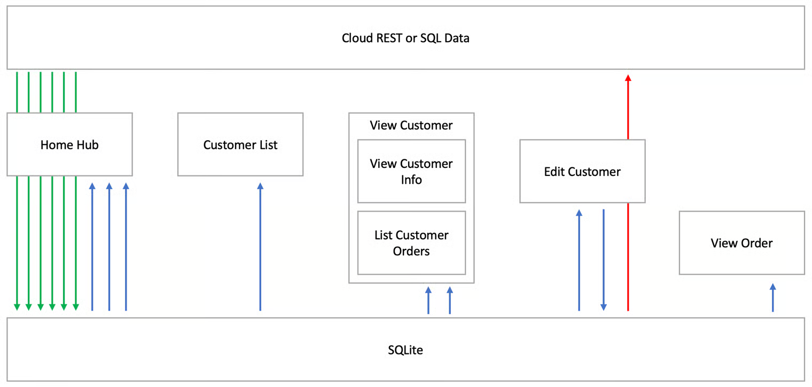
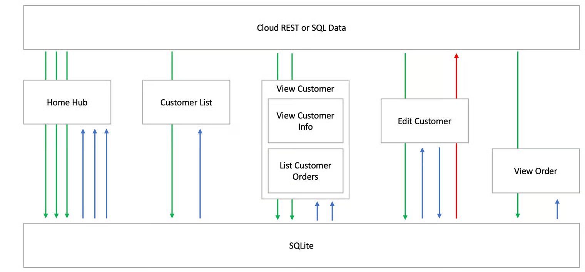

# When to load data

### Sync data when the solution loads or gets focus

**Benefits:**

* The app is robust for offline scenarios.
* Jig rendering and interaction are very fast.
* There are only 2 distinct cloud interaction cycles in the example below: once when all data is synced and once when an update is sent to the cloud.

This is the recommended pattern when designing a Jigx solution.

**Drawbacks:**

* Initial app load time is slightly longer and heavier.
* Doesn’t work for all scenarios where the app depends on up-to-date data from the cloud when a jig is displayed.

<figure><figcaption>
Solution data sync
</figcaption></figure>

### Sync just in time when a jig is used

**Benefits:**

* Initial load is lighter.
* Only the data needed per screen is synced to the device.

Elements of this approach can be combined with the recommended approach above.

**Drawbacks:**

* The solution cannot robustly go offline.
* The data might not be available for the jig when the app is offline.
* The user might experience a slower performance of jigs because of just-in-time cloud operations.
* There are 9 (8 reads and one update) cloud operations throughout the UI cycles at 5 different distinct stages.

<figure><figcaption>
Sync data just in time
</figcaption></figure>

### Dynamically syncing data

When building a solution, the number of entities to sync and the parameters for each are not always known; for example, when syncing the attachments for a message, there can be zero, one or more attachments, or files/documents stored in a OneDrive directory. It is necessary to dynamically specify a list of the entities and function+parameters to return from the database using an expression. See [Dynamically sync multiple entities](https://docs.jigx.com/examples/sync-entities#6vfAn) for more information.
