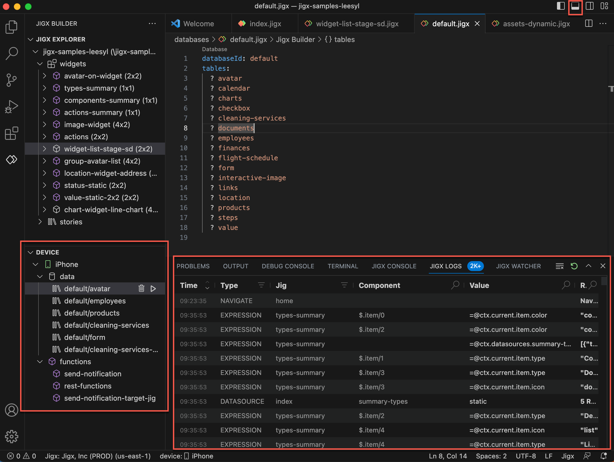

# Debugging

Jigx Builder provides debugging capabilities in VS Code to identify and fix YAML, SQLite, and app problems and errors. Connect your phone using the debugging QR code to troubleshoot a solution directly from the Jigx App. Quickly locate and resolve issues preventing the application from functioning correctly or as intended. Examine your code, write and test SQL queries in the debug tool, trace program execution, and analyze error messages or unexpected behaviors to pinpoint the root cause of the problem. You can improve an application's reliability, performance, and functionality by debugging an application.

<figure><figcaption>
Jigx Dev Tools
</figcaption></figure>

### Debugging capabilities

* Auto-sensing of code issues
* Detailed debug console
* Separate testing environment
* Hot reload to the connected device
* Live updates as code changes

### Connecting your device to Jigx Dev Tools

Enable Jigx Dev Tools by following these steps:

<figure><figcaption>
Enabling Jigx Dev Tools
</figcaption></figure>

1. Open the solution you want to debug in Jigx Builder.
2. Click on the Jigx Builder icon in the activity bar.
3. In the sidebar, click the **+** next to CONNECT TO DEVICE. Enter your Jigx user name and password if prompted.
4. Now scan the **QR code** with your mobile device; you can open the QR code in full size if you having issues scanning the code. If you are using a branded app, see [Settings](settings.md) to ensure the QR code is generated for the correct app.
5. On your device, tap **Enable** on the Jigx Dev tools message.
6. The solution opens in the Jigx App.
7. Your device will show in Jigx Builder in the sidebar, with a data and functions node.
8. Ensure that the VS Code panel is open.

### Debugging Tools

There are four main tools in the Jigx Dev Tool set that specifically target debugging Jigx solutions. Each tool is described below:

#### Problems

Jigx validates the structure and values in the `.jigx` YAML files and shows the issues that you need to fix in the **Problems tab** of the Jigx Dev tools pane.

* The pane shows the .jigx file, the area in the YAML that has the issue, and a badge count of the number of issues in that file, for example, _all-orders.jigx datasources 2._
* Drill down into the list of issues to see the short descriptions and the location.
* Clicking on the issue will take you to the line of YAML code in the file.
* Hover over the issue to see the popup that offers validation assistance and a quick-fix link if applicable.

<figure><figcaption>
Problems pane
</figcaption></figure>

#### Jigx console

Use the Jigx Console to debug your data and functions.

**Debugging data:**

<figure><figcaption>
Debugging data in Jigx Console
</figcaption></figure>

1. [Connect your device to Jigx Dev Tools](https://docs.jigx.com/debugging#p8neI)
2. Under the **Device** node, click on the **data** node and select the SQLite data table.
3. Use the **▷** icon to run the SQL query in the Jigx Console.
4. You can run multiple SQLite queries and functions simultaneously, as each one opens in a new tab in the console panel.
5. The data table entries are listed.
6. Drill down into the data entries by clicking on an item in the list, the data object is displayed in the right-hand panel.
7. You can test your data by writing queries in the query editor and press the **Execute** button to test what is being returned from the SQL table. Once you have the correct SQL query, copy it to the jig or file where needed.
8. Click Format to auto-format your query ready for copying into your YAML code.

**Debugging functions:**

<figure><figcaption>
Debugging functions in Jigx Console
</figcaption></figure>

1. [Connect your device to Jigx Dev Tools](https://docs.jigx.com/debugging#p8neI)
2. Under the **Device** node, click on the **functions** node and select the function to debug.
3. The _function_.jigx file will open above the Jigx Console panel.
4. Use the **▷** icon to run the function in the Jigx Console.
5. You can run multiple functions and SQL queries simultaneously, as each one opens in a new tab in the console panel.
6. The function parameters are shown.
7. Click **Execute** to run the function and see the data in the console panel.
8. Drill down into the data entries that are returned by clicking on an item in the list, the data is displayed in the right-hand panel.
9. Click **Clear** in the right corner of the parameter panel to clear the parameters, to test your function parameteters add new values for the parameters and press the **Execute** button to test what data is being returned.
10. Required parameters are indicated with an \*.
11. The data type is shown next to the parameter, e.g., string, or array.

#### Jigx Logs

Jigx Logs records your interactions with the solution on the device when connected to the Jigx Dev Tools.

<figure><figcaption>
Jigx logs
</figcaption></figure>

The following is logged:

* Datasource
* Error
* Execute
* Expression
* Navigate
* State
* Warning

**Ordering** - By default the oldest interaction is at the top, and the latest at the bottom. Order the list from latest at the top and the oldest at the bottom by clicking the up-arrow (**⋀**) in the Time column.

**Filtering** - You can filter by type or by jig, click on the filter icon next to Type or Jig. Select the options you want to display. The badges next to each option shows the number of entries in the log for that option. Once selected click the filter button.

**Searching** - All columns except Time can be searched using the search field.

**Detail** - Drill into each record by clicking on the item in the list. The full details for that item displays in the right hand panel.

**Clear the log** - Use the Clear logs icon to clear the log entries. As soon as you interact with the solution on the device while connected to Jigx Dev Tools the log will start populating again.

#### Jigx watcher

As you building out your solution in Jigx Builder you can monitor expressions and SQL queries to see the results as you navigate the app on the device.

<figure><figcaption>
Jigx watcher
</figcaption></figure>

1. [Connect your device to Jigx Dev Tools](https://docs.jigx.com/debugging#p8neI)
2. Open a `.jigx` file in Jigx Builder.
3. Locate the expression or SQL query in the YAML code.
4. Right click on the expression/SQL query and choose **Add to Jigx Watcher**. The Jigx Watcher opens in the panel below and shows the type, value and result. The result field is populated when you use the expression or SQL Query in a solution on your device.
5. Use the **Show logs** button to open the entry in Jigx Logs and view additional detail for the expression/ SQL query.
6. Use the **Remove** button to remove a single item. Click **Clear** in the right corner of the Jigx Watcher panel to clear all items in the list.
