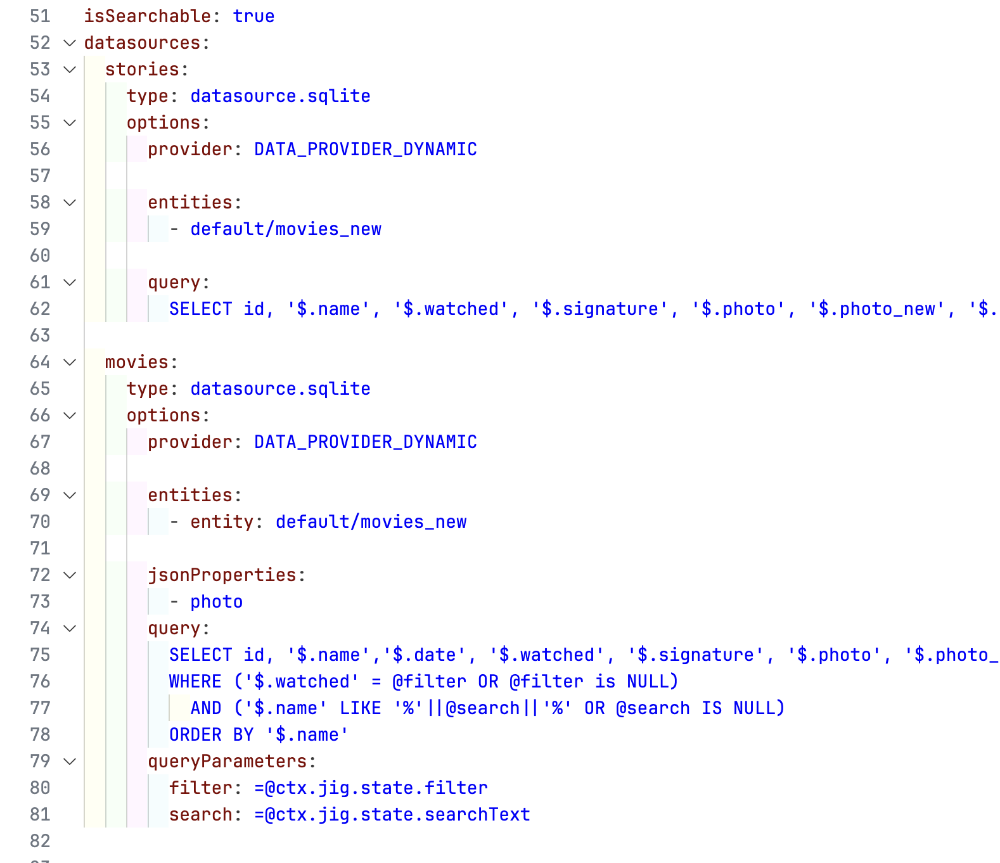
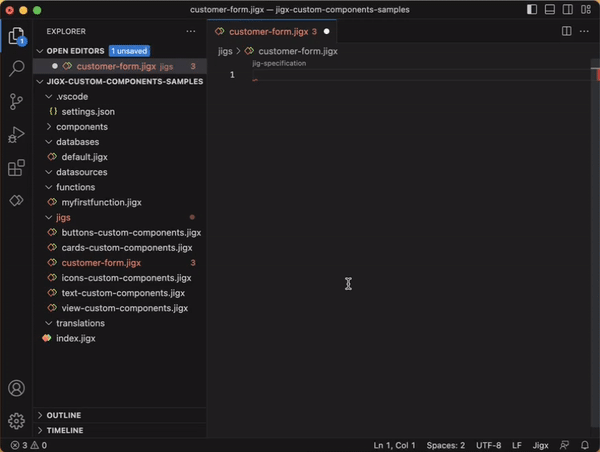
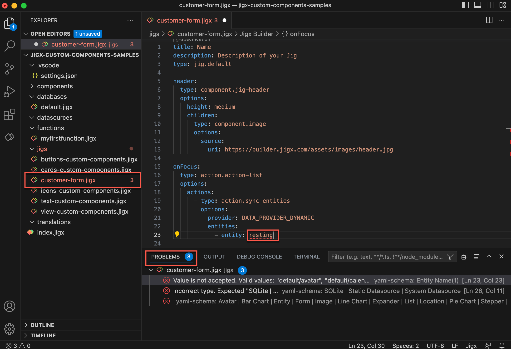
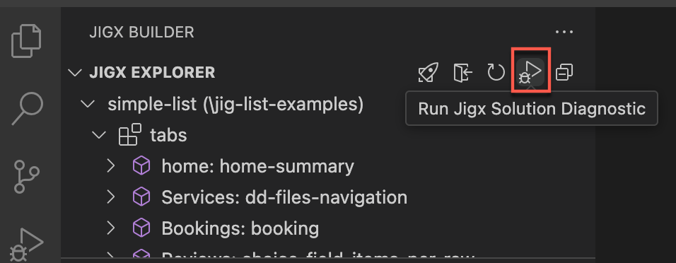
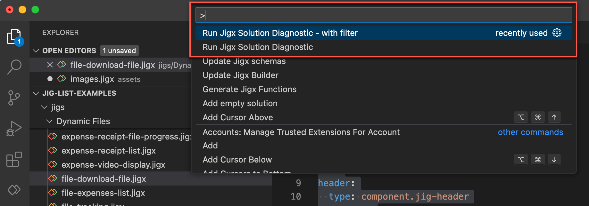
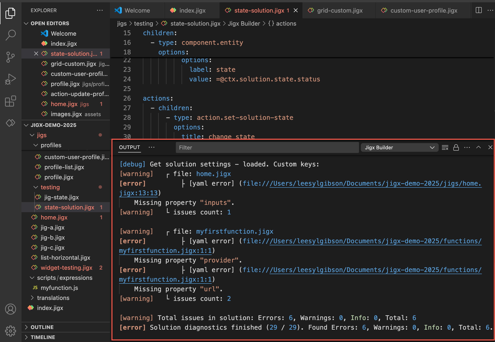
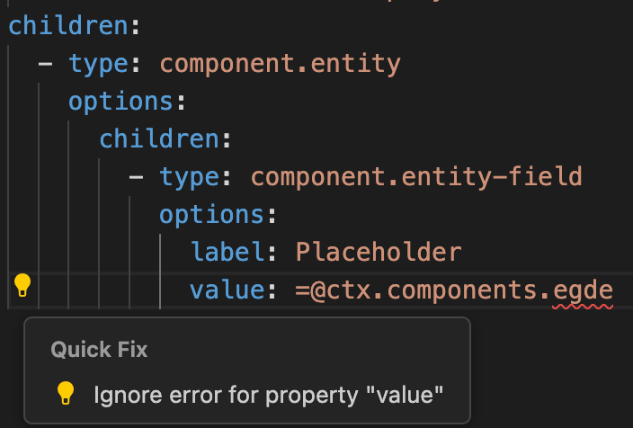

# Editor

To accelerate the build experience, Jigx Builder has a YAML editor that includes IntelliSense for code completion, predefined code snippets, and preloads with scaffolding ready to add your Jigx files in the correct structure needed to build app solutions.

## Solution scaffolding

By default Jigx creates scaffolding when loading a new project in Jigx Builder. We recommend avoiding naming new files with the same name in the scaffolding. Words used by the Jigx system include actions, components, jig, databases, datasources, functions, and index.

<table><thead><tr><th width="155.66796875">Folder</th><th width="171.30859375">Default File</th><th>Description</th></tr></thead><tbody><tr><td>.vscode</td><td>settings.json</td><td>Relates to your Jigx solution and contains internal parameter settings required by Jigx Builder runtime. This file's scope is local (workspace) and applies to the current solution. For more information, see .</td></tr><tr><td>actions</td><td></td><td>Actions refer to specific controls or operations responding to an event or input. Create under the actions folder to define actions once and reuse them multiple times in different jigs.</td></tr><tr><td>assets</td><td></td><td>The solution's images and icons defined under the folder will preload and cache when the solution downloads or updates in the app. Allows images and icons to display when the app is offline and improves the app's performance.</td></tr><tr><td>databases</td><td>default.jigx</td><td>You can use the <code>default.jigx</code> file to define the tables in the Provider.</td></tr><tr><td>datasources</td><td></td><td>Create global data files with .jigx extension- these are available for use in your whole solution to any of the jigs.</td></tr><tr><td>functions</td><td>myfirstfunction.jigx</td><td>You can build logic into your solution by adding functions to get or update data from a remote service, such as or <a href="../../administration/solutions/sql-functions.md">SQL Functions</a>.</td></tr><tr><td>jigs</td><td>myfirstjig.jigx</td><td>The jigs folder is where you create all the files used to configure the screens for the app on your mobile device. You can create sub-folders inside the jigs folder for categorization. All files in the jigs folder must have the <code>.jigx</code> extension, e.g., leave-form.jigx</td></tr><tr><td>translations</td><td></td><td>Create files for various languages using localization, then reference the file in your jig using the <code>Text Locale</code> property with <code>id: file name</code>. For more information, see .</td></tr><tr><td></td><td>index.jigx</td><td>The index.jigx file is the app's home screen. It uses bottom tabs to determine the layout. See and <a href="../ui/home-hub/index-settings.md">Index settings</a> for more information.</td></tr><tr><td>
scripts/

expressions
</td><td></td><td>Create .js files to define your that can be used in <a href="../logic/expressions.md">expressions</a>.</td></tr></tbody></table>

## IntelliSense

To invoke IntelliSense, simultaneously press the control and spacebar (ctrl+space) keys. The code popup displays only valid options in the current cursor context. Selecting an option from the IntelliSense menu will load the code snippet with the necessary properties for that option.



## YAML indentation

In Jigx Builder the YAML code snippets use indentation. The nested structure of the YAML is visible with spaces, not tabs, and is used for indentation. Each nested level is indented further than its parent, illustrating the hierarchical structure of the YAML file. Line numbers are visible on the left side, and your cursor blinks at one of the lines. You can use a VS Code plugin to highlight the indention levels in different colors. One such plugin is [Indent-Rainbow](https://marketplace.visualstudio.com/items?itemName=oderwat.indent-rainbow).

<figure><figcaption>
Indentation levels in color
</figcaption></figure>

## Code snippets

Code snippets are there to help you develop quicker by providing you with recommended properties to use for a jig type, component, action, or widget. You do not need to use all the code snippets provided; you can remove the unwanted properties.

<figure><figcaption>
IntelliSense &#x26; code snippets
</figcaption></figure>

## Validation

Jigx validates the structure and values in the `.jigx` YAML files and shows the issues that you need to fix.

<figure><figcaption>
Validation
</figcaption></figure>

Validation issues are shown in:

* The **file name** in the side bar will be red, with the number of issues in the file shown by a red number on the right of the file name.
* **Red squiggles** appear under the YAML. Hover over the YAML for more information, if we can detect what the value should be we offer a quick-fix link. Clicking on the link will fix the issue and resolve the validation.
* In the **Problems tab** of the Jigx Dev tools window, the file and a description of the issue is shown. Click on the item to go to the exact ssue in the file.


Validation does not always prevent you from publishing your solution. The solution on the mobile app might not function as expected if the validation issues are not resolved.


## Validation - Solution Diagnostics

**Jigx Solution Diagnostics** is a built-in analysis tool that helps you identify and troubleshoot issues across your entire Jigx solution or a subset of files in the solution. It detects project build errors, missing references, and scans your source code for programmatic errors, warnings, and overall solution health.

### Running Solutions Diagnostics

You can access the Jigx Solution Diagnostics tool through the **Jigx Explorer** by clicking the diagnostics icon, or by using the VS code command-palette accessed by fn+F1 / command+shift+P / ⇧⌘P / alt+shift+P and selecting **Run Jigx Solution Diagnostics**.

<figure><figcaption>
Diagnostics icon
</figcaption></figure>

To run the tool on a subset of files, use the VS code comman-palette accessed by fn+F1 / command+shift+P /⇧⌘P / alt+shift+P and select **Run Jigx Solution Diagnostics – with filter**. Then, provide a regular expression (regex) to filter and analyze only the matching files, for example an expression for all files is `/jigs/.*`.

<figure><figcaption>
Diagnostics commands
</figcaption></figure>

### Solutions Diagnostics progress

The progress is shown as a **notification** in the bottom-right of the VS code window.

<figure><figcaption>
Solution Diagnostics notifications
</figcaption></figure>

When the diagnostics run is complete, the results are displayed in the **Jigx Output** panel. The output includes the file path, a description of the issue, and the number of issues found in each file. You can navigate to the relevant file to review and resolve the errors.


The URL to open the file in the Jigx ouput panel will not work if the folder contains spaces.


<figure><figcaption>
Jigx output
</figcaption></figure>

## Quick-fix validation



The **quick-fix validation popup** in VS Code helps you identify and resolve issues in your code or configuration files quickly and efficiently. When a validation error or warning is detected (such as a missing property, invalid value, or syntax issue), a lightbulb icon appears next to the line.



<figure><figcaption></figcaption></figure>



**How to Use It:**

1. **Hover or place your cursor** on the line showing the issue or on the highlighted error squiggle.
2. Press `Cmd + .` (Mac) or `Ctrl + .` (Windows/Linux) to open the **quick-fix popup**.
3. A list of suggested fixes or options will appear. These may include:
   * Adding missing fields or properties
   * Correcting values
   * Applying code suggestions
   * Ignoring the issue
4. **Select a fix** from the list using your arrow keys and press Enter to apply it.

## Navigating code definitions & references

This feature is particularly useful in large projects or when working with unfamiliar codebases, as it helps you understand how and where certain pieces of code are implemented without manually searching through files. If the code has multiple definitions or references, VS Code presents a list of all these instances, allowing you to choose the one you're interested in.

The following code definitions and references can be navigated:

* fileId references
  * jigs
  * linkTo, jigId
  * datasources
  * ctx.datasources.datasourceName
  * functions
  * components
  * actions
* entity references
  * databases/default.jigx
  * entity, entities
* components references
  * instanceId, @ctx.components.componentInstanceId...
* script references
  * JavaScript functions

### Definition (F12)

<figure><figcaption></figcaption></figure>

Place your cursor on the code and press **F12** or right-click and select **Go to Definition** from the menu options, VS Code displays a preview window that lists all the lines of code in your project where that code is used, either in the same jig or another file in the project. VS Code will open the file where that code is defined and move the cursor to the definition's location.

### References (shift+F12)

<figure><figcaption></figcaption></figure>

Place your cursor on the code and press **Shift + F12** or right-click and select **Go to References** from the menu options, VS Code displays a preview window that lists all the lines of code in your project where that code is used or referenced. If there are multiple references, you can click on any of the listed references in the preview window to go directly to that location in the code.
