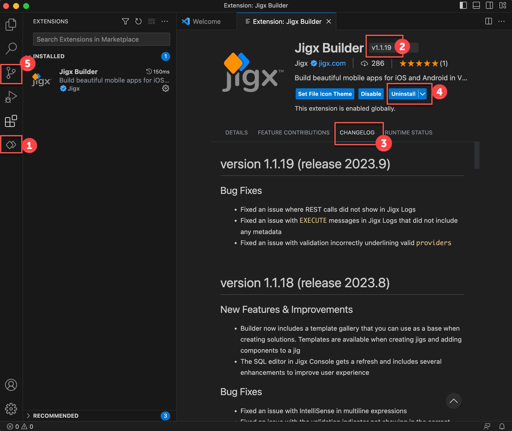
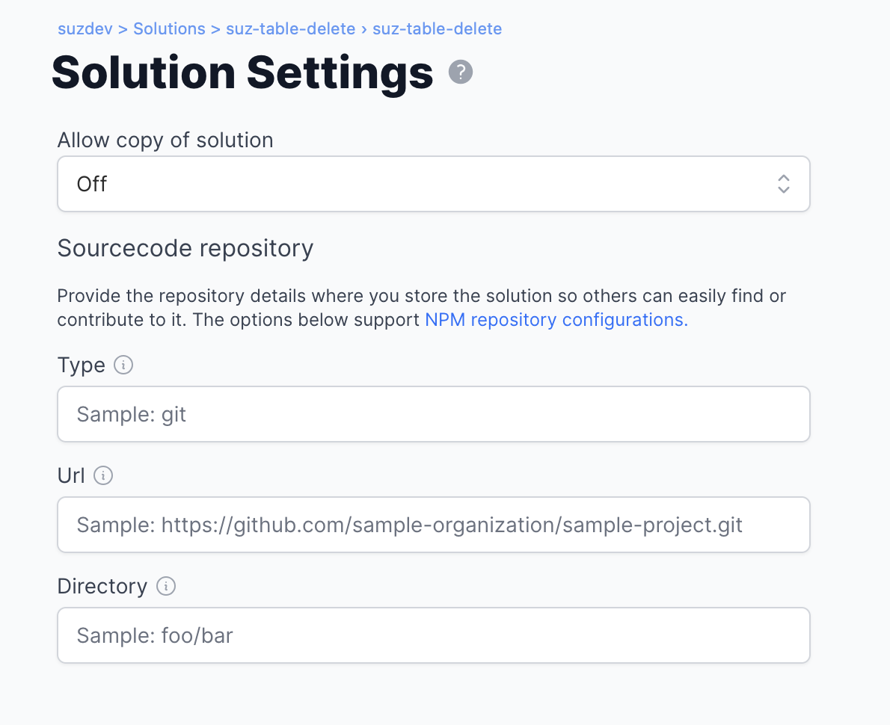

---
layout:
  width: wide
  title:
    visible: true
  description:
    visible: true
  tableOfContents:
    visible: true
  outline:
    visible: true
  pagination:
    visible: true
  metadata:
    visible: true
---

# Install

This section covers installing the Jigx Builder extension, versions, updates, uninstalling, and the recommended source control. The numbered image below indicates each of these areas in the Jigx Builder.

<figure><figcaption>
Jigx Builder installed
</figcaption></figure>

## 1. Install steps

1. Start by downloading and installing VS Code on your development machine. The download is available from [https://code.visualstudio.com/download](https://code.visualstudio.com/download).
2. The Jigx Builder extension is in the [Microsoft Visual Studio Marketplace](https://marketplace.visualstudio.com/items?itemName=Jigx.jigx-builder). Click on the VS Code extension icon in the left navigation bar and search for Jigx Builder.
3. Click the blue **install** button.
4. The Jigx Builder now appears under your list of installed extensions, and is automatically added to the side bar, and is identifiable by its unique icon.

## 2. Versions

The current version of the Jigx Builder extension is shown at the top of the _Extension: Jigx Builder_ screen. When a new version is available VS Code automatically installs the latest version and prompts you to reload VS Code.

## 3. Updates

When a new version is available VS Code automatically installs the latest version and prompts you to reload VS Code. Refer to the changelog tab in the _Extension: Jigx Builder_ screen to see what changes are included in the new version. If you prefer to manually update the extension see [VS Code documentation - Manage extensions](https://code.visualstudio.com/docs/editor/extension-marketplace#_manage-extensions).

## 4. Uninstall steps

1. To uninstall the Jigx Builder, click on the extensions icon in VS Code.
2. Click the blue **Uninstall** button in the _Extension: Jigx Builder_ screen.
3. You can also uninstall the extension by clicking on the **Manage** gear icon at the top right of the extension and selecting **Uninstall.**
4. Reload VS Code.

## 5. Source Control

Manage your Jigx solutions with Git integration in VS Code. See using [Git source control in VS Code](https://code.visualstudio.com/docs/sourcecontrol/overview) for more information. When a solution in Jigx Builder is connected to a Git repository the files in the side bar will show in green when a new file is added, yellow for files that have been modified, when there are validation issues that need to be addressed, or _white_ when files are commited.



In Jigx Management under [Solution Settings](../../administration/solutions/solution-settings/solution-settings.md) you can store the details of your Jigx solution's sourcecode repository, allowing people to easily find the details and contribute to the solution.



<figure><figcaption>
Sourcecode details
</figcaption></figure>


