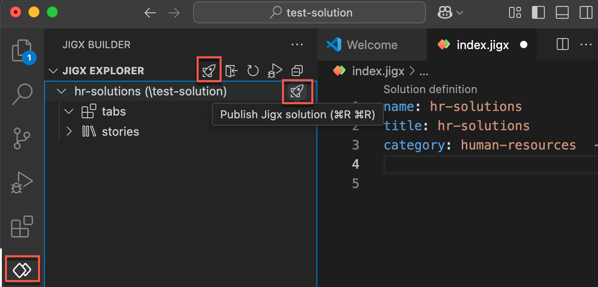
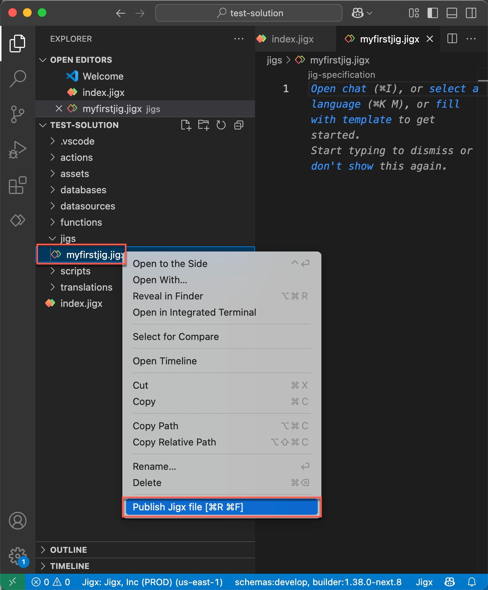
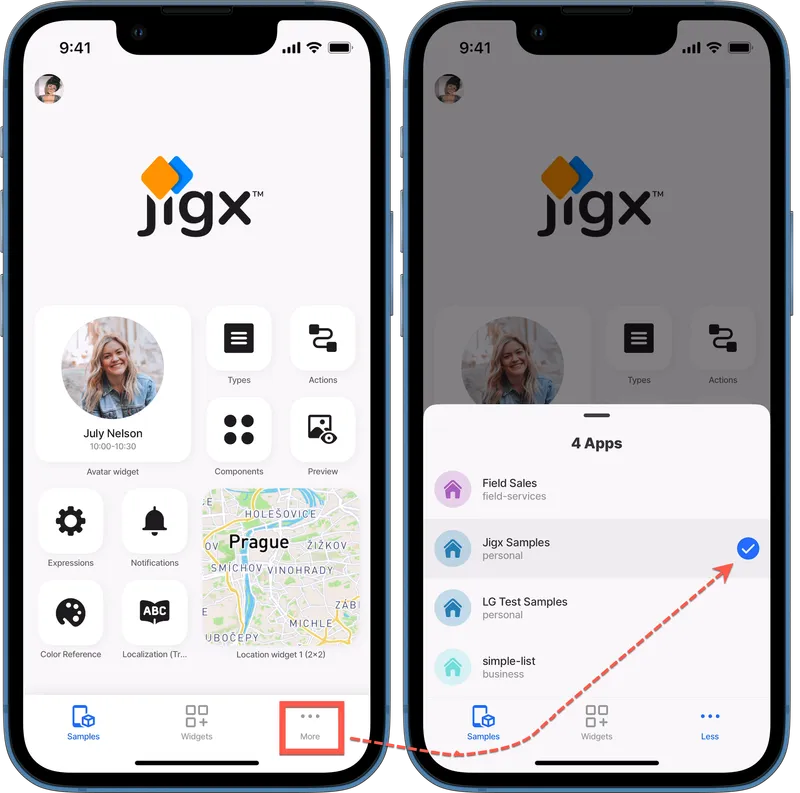

# Publishing a solution

After building the solution in Jigx Builder, you publish the solution to Jigx Cloud. The solution is immediately available in the Jigx App.

You can publish the full solution or choose to publish a single file. Publishing the full solution is required on the first publish. Single file publishing is useful if you made a change to only one file and want to publish the changes or you working on a solution with multiple developers and you only want to publish your changes. Note that the index.jigx file is a shared file that people all work on, so the last updates on the server get published.

## Permissions

When a solution is published, the solution is automatically added to [Solutions](../../administration/solutions/solutions.md) in Jigx Management. The creator of the solution is given Owner permissions and can give users access to the solution in Jigx Management, define their role in the solution scope, and assign `Solution Group` membership for the visibility of widgets.

## Publishing steps

### Full solution

To publish the **entire** solution, follow the steps below:

1. In VS Code click on the Jigx Builder **icon** in the left navigation bar.
2. In the Jigx Explorer hover over the solution node till you see the **publish icon (rocket)**.\
   \
   &#x20;
3. Click on the icon to start the publishing process.
4. On a new solution you will be asked to enter your Jigx username and password, organization and region.
5. If you are already logged in, the solution will publish without having to sign in again. The solution's name and organization are displayed in the VS Code status bar.
6. The publishing process starts and the progress shows in the bottom right corner of the VS Code editor. A message displays when the solution is successfully published.

### Single files

To publish a **single** file in the solution follow the steps below:

1. In Jigx Builder locate the file in the side bar explorer that you want to publish.
2. Right-click on the file and click **Publish Jigx file**. If you not signed in you will be asked to enter your Jigx username and password, organization and region. Alternatively you can use the shortcut keys given below. \
   \

## Publishing shortcuts

<table><thead><tr><th width="257.83203125">Shortcuts</th><th>Mac</th><th>Windows</th></tr></thead><tbody><tr><td>Publish all files in Jigx solution</td><td>⌘R⌘R</td><td>Alt+R Alt+R</td></tr><tr><td>Publish an individual file</td><td>⌘R⌘F</td><td>Alt+R Alt+F</td></tr></tbody></table>

## Viewing published solutions in the app


{% column width="41.66666666666667%" %}
With Jigx, you can build and publish multiple solutions to your mobile app.

You can switch between them by tapping the _More_ (ellipsis) icon in the navigation bar and selecting the solution you want to use.

The currently active solution is highlighted with a _checkmark_ icon.

If only one solution is available, the &#x4D;_&#x6F;re_ icon is hidden.


{% column width="58.33333333333333%" %}
<figure><figcaption></figcaption></figure>


