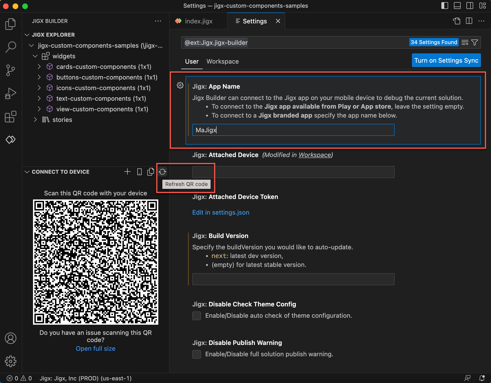
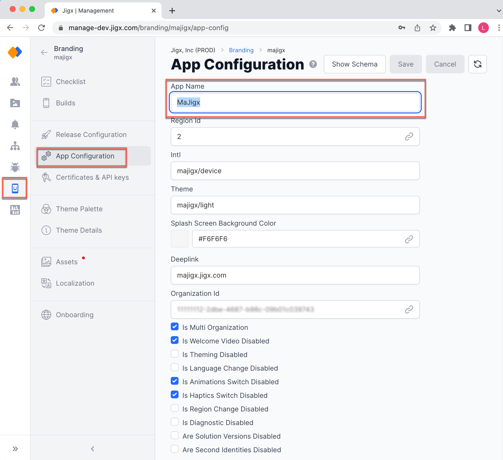

# Settings

The Jigx _Extension Settings_, accessed via the _manage ge&#x61;_&#x72; icon, contain many options that can be modified. For Jigx, there is one main option to modify; the remaining options can be left unchanged. This is the **Jigx: App name** setting, which determines which Jigx App on a device must be connected when [debugging](debugging.md) a solution in Jigx Builder. There are two main types of apps, namely:

1. Jigx App- downloaded from the Play or App stores.
2. Jigx branded apps - a Jigx App that has been branded for your organization in [Jigx Management](../../administration/organization-settings/organization-settings.md), and added to the Play or App stores.

It is important to configure which app you want to connect to as the [debugging](debugging.md) Jigx Dev tools QR code is generated using the **Jigx: App name** setting.

<figure><figcaption>
Jigx extension settings
</figcaption></figure>

To configure the **Jigx: App name** setting follow the steps below:

1. When connecting to the Jigx App available from the Play or App stores leave the setting empty.
2. When connecting to a Jigx branded app, go to Jigx Management / Branding/ App configuration and copy the **App Name**, then paste the name in the **Jigx: App name** setting in Jigx Builder. \
   
3. Regenerate the QR code when changing app names in settings by clicking the **Refresh QR code** icon in Jigx Dev tools - **Connect to Device** pane.


You can check which app your Jigx Dev Tools will connect to by hovering over the QR code and look for the _appname_ in the string, if it is blank you connecting to the Jigx App.

